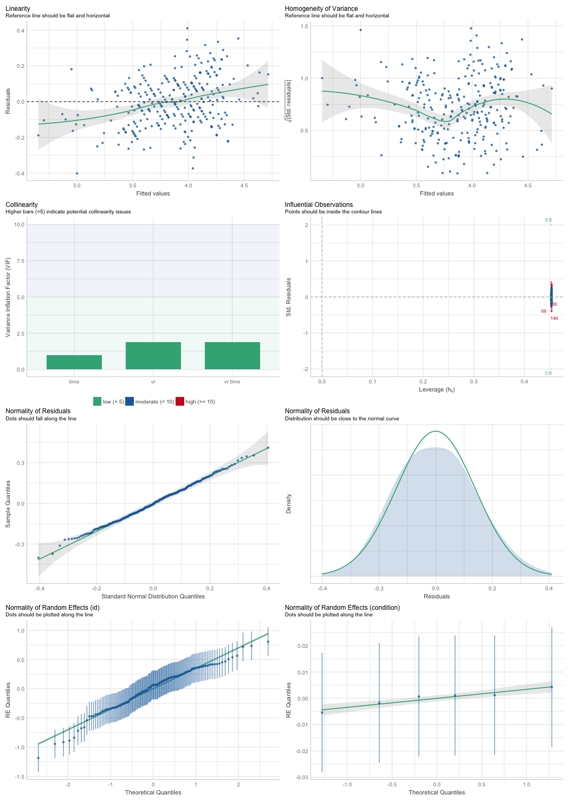

# Setup

Install / load packages needed:

```{r setup, include=FALSE}
knitr::opts_chunk$set(echo = TRUE)
if (!require("pacman")) install.packages("pacman")
p_load(tidyverse, lme4, lmerTest, mvoutlier, nlme, multcomp, lsmeans, xtable, jtools, tikzDevice, gmodels, parallel, performance, optimx, tidylog)
#pacman::p_load_gh("jaredhuling/jcolors")
#jcolors::jcolors("default")
#ggplot <- function(...) ggplot2::ggplot(...) + scale_color_brewer(palette=jcolors::jcolors()) + scale_fill_brewer(palette=jcolors::jcolors()) + #ggplot2::scale_colour_brewer(palette=jcolors::jcolors()) + ggplot2::scale_color_discrete(palette=jcolors::jcolors()) #+ ggplot2::scale_fill_discrete(palette=jcolors::jcolors())
```

## Load Data
```{r load data}
data <- read_csv("data/cleanData.csv") 
#data <- data %>% dplyr::select(
#  id, time, iat, ccs, nr, nep, ipq, sod, ses, age, edu, sex, pol, vr_exp, vr_eval1, vr_eval2, vr_eval3,
#  vr_eval4, vr_eval5, span, seen, condition, starts_with("Frage"), hr_mean, Leiter, Anmerkungen, Zeit
#)

head(data)

# factor for vr or not
data <- data %>% group_by(id) %>% 
  mutate(
    vr = ifelse(condition %in% c("a", "b", "c"), TRUE, FALSE), 
    condition = factor(condition, levels = c("b", "a", "c", "video", "text.bild", "text"))
  )


```
Keep in mind the conditions coding: 

a == abstract

b == realistic

c == realistic but badly so


## Check for multivariate outlier

```{r, eval = FALSE}
# mvoutlier::chisq.plot(data[,c(3:6)])
# [1] 124 162 161  29  54

# removing three most extreme cases
rmId <- data$id[c(124, 161, 162)]

data <- data %>% filter(!id %in% rmId)

```

```{r}
data$id[c(142,144,275)]

```


# Descriptives


## Reliability

```{r}
vars <- names(data)

ccs.vars <- vars[startsWith(vars, "ccs")]
nr.vars <- vars[startsWith(vars, "nr")]
nep.vars <- vars[startsWith(vars, "nep")]
ipq.vars <- vars[startsWith(vars, "ipq")]
sod.vars <- vars[startsWith(vars, "sod")]

vars.list1 <- list(ccs.vars, nr.vars, nep.vars)
vars.list2 <- list(ipq.vars, sod.vars)

#remove overall score (shortest name)
# this is a bit more robust compared to simply removing the last item
remove_overall <- function(char.vec){
 nm <- char.vec[which.min(nchar(char.vec))]
 char.vec <- char.vec[-which.min(nchar(char.vec))]
 char.vec
}

vars.list1 <- lapply(vars.list1, remove_overall)
vars.list2 <- lapply(vars.list2, remove_overall)


reliable <- function(data, vars){
  alph <- psych::alpha(data[vars], title = vars[1])

  #omeg <- psych::omega(data[vars], plot = FALSE)
 df <- data.frame(alpha = alph$total$raw_alpha, ci.low = alph$total$raw_alpha - 1.96 * alph$total$ase, ci.up = alph$total$raw_alpha + 1.96 * alph$total$ase)
 df <- round(df, 3)
 df$var = vars[1]
 df
}


# measures which are measured twice
alpha.1 <- lapply(vars.list1, function(x) reliable(data = data, x))
# measures which are measured only once (sod and ipq)
alpha.2 <- lapply(vars.list2, function(x) reliable(data = data %>% filter(time == 1), x))

alphas <- c(alpha.1, alpha.2)

(alpha.df <- do.call("rbind", alphas) %>%
  dplyr::select(var, alpha, ci.low, ci.up))
```
cronbach alpha of nep is relatively small. 
What would mcdonalds omega look like for nep?
```{r}
psych::omega(data[vars.list1[[3]]], nfactors = 1)
```

Omega Total 0.71 seems ok.


For the following analysis we reduce the dataframe.

```{r}
data <- data %>% dplyr::select(
  id, time, vr, condition, iat, ccs, nr, nep, ipq, sod, ses, age, edu, sex, pol, vr_exp, vr_eval1, vr_eval2, vr_eval3,
  vr_eval4, vr_eval5, span, seen, starts_with("Frage"), hr_mean, Leiter, Anmerkungen, Zeit
)
```


# Principal component analysis

We try to find an acceptable model for each DV. 


First, I would like to calculate a principal component of all dependent variables (dvs)
```{r}
df_env <- data[c("iat", "ccs", "nr", "nep")]
psych::fa.parallel(df_env)
prc_env <- princomp(df_env, cor = TRUE)
# Seems like one factor might just be enough. However, this may be more revealing when done
# on raw data
summary(prc_env)
data$env_pc <- prc_env$scores[,1]
```

Unidimensionality could be assumed. 
The scores of the first principal component were stored in `data$env_pc`.
This vector can now be used as a dependent variable in further exploratory analyses. 

```{r, include = FALSE}

#Some look at the data, e.g. how does the variation within person compare to the variation between people. 
#Based on PC1.
data <- as.data.frame(data)
data_grouped <- 
  groupedData(formula = env_pc ~ time | id,
              data = data)
plot(data_grouped, grid = F)
```
This plot is not very useful I guess. Too crowded.


# Check Intervention

This section is concerned only with the VR conditions a, b, c.
Specifically with the variables vr_eval 1:5 and with the sod and presence scale IPQ.

Check for outliers on these scales:
```{r}
#check.data <- data %>% dplyr::filter((vr == T & time == 1 ) & !is.na(ipq))
check.data <- data %>% dplyr::filter((time == 1 ) & !is.na(ipq))

#outlier.data <- data %>% ungroup() %>% dplyr::filter(vr == T & time == 1) %>% dplyr::select(starts_with("vr_eval"), sod, ipq) %>%
# drop_na()
#mvoutlier::chisq.plot(check.data %>% ungroup() %>% dplyr::select(starts_with("vr_eval"), sod, ipq))
# remove: 38  1 63
# which corresponds to the ids:
#remove.ids <- check.data$id[c(38,  1, 63)]
# "44466757" "32504483" "80688810"
```

```{r, include = FALSE}
pacman::p_load(gtable, cowplot)

shift_legend <- function(p){

  # check if p is a valid object
  if(!"gtable" %in% class(p)){
    if("ggplot" %in% class(p)){
      gp <- ggplotGrob(p) # convert to grob
    } else {
      message("This is neither a ggplot object nor a grob generated from ggplotGrob. Returning original plot.")
      return(p)
    }
  } else {
    gp <- p
  }

  # check for unfilled facet panels
  facet.panels <- grep("^panel", gp[["layout"]][["name"]])
  empty.facet.panels <- sapply(facet.panels, function(i) "zeroGrob" %in% class(gp[["grobs"]][[i]]))
  empty.facet.panels <- facet.panels[empty.facet.panels]
  if(length(empty.facet.panels) == 0){
    message("There are no unfilled facet panels to shift legend into. Returning original plot.")
    return(p)
  }

  # establish extent of unfilled facet panels (including any axis cells in between)
  empty.facet.panels <- gp[["layout"]][empty.facet.panels, ]
  empty.facet.panels <- list(min(empty.facet.panels[["t"]]), min(empty.facet.panels[["l"]]),
                             max(empty.facet.panels[["b"]]), max(empty.facet.panels[["r"]]))
  names(empty.facet.panels) <- c("t", "l", "b", "r")

  # extract legend & copy over to location of unfilled facet panels
  guide.grob <- which(gp[["layout"]][["name"]] == "guide-box")
  if(length(guide.grob) == 0){
    message("There is no legend present. Returning original plot.")
    return(p)
  }
  gp <- gtable_add_grob(x = gp,
                        grobs = gp[["grobs"]][[guide.grob]],
                        t = empty.facet.panels[["t"]],
                        l = empty.facet.panels[["l"]],
                        b = empty.facet.panels[["b"]],
                        r = empty.facet.panels[["r"]],
                        name = "new-guide-box")

  # squash the original guide box's row / column (whichever applicable)
  # & empty its cell
  guide.grob <- gp[["layout"]][guide.grob, ]
  if(guide.grob[["l"]] == guide.grob[["r"]]){
    gp <- gtable_squash_cols(gp, cols = guide.grob[["l"]])
  }
  if(guide.grob[["t"]] == guide.grob[["b"]]){
    gp <- gtable_squash_rows(gp, rows = guide.grob[["t"]])
  }
  gp <- gtable_remove_grobs(gp, "guide-box")

  return(gp)
}
```
## Plot
```{r}
vars <-c("vr_eval1", "vr_eval2", "vr_eval3", "vr_eval4", "vr_eval5", "ipq", "sod")

desc_plot_data <- gather(data, specific, value, vars) %>%
 # filter(!is.na(ipq)) %>%
  arrange(id, specific) %>%
  mutate(specific = ifelse(specific=="vr_eval1", "excitement",
                        ifelse(specific=="vr_eval2", "graphically pleasing",
                               ifelse(specific=="vr_eval3", "pleasant",
                                      ifelse(specific=="vr_eval4", "realistic", 
                                             ifelse(specific=="vr_eval5", "enjoyment", specific))))),
         VRE = ifelse(condition == "b", "R+",
                      ifelse(condition=="c", "R-",
                             ifelse(condition=="a", "A+", condition)))) %>%
  dplyr::select(specific, value, id, VRE)


(vr_eval_plot <- ggplot(data = desc_plot_data, aes(x = VRE, y = value, color = VRE)) +
  facet_wrap( ~specific, nrow = 2)+
  geom_violin(draw_quantiles = .5) + #, position = position_jitterdodge(dodge.width = 0.8, jitter.width = 0, jitter.height = 0))+
  geom_point(alpha = .3, position = "jitter")+#, position = position_jitterdodge(dodge.width = 0, jitter.width = .2, jitter.height = .3)) +
  ggthemes::theme_tufte() +
  ylab("value") +
  xlab("question")+
  #labs(title="Evaluation of Virtual Environments")+
  scale_y_continuous(breaks = c(1,3,5,7)) +
  theme(legend.position = "bottom") )


ipq_sod_plot_data <- gather(data, scale, value, c("ipq", "sod")) %>%
  filter(time==1, condition %in% c("a", "b", "c", "video")) %>%
  arrange(id, scale) %>%
  mutate(VRE = ifelse(condition == "b", "R+",
                      ifelse(condition=="c", "R-", 
                             ifelse(condition == "a", "A+", condition)))) %>%
  dplyr::select(scale, value, id, VRE)


ipq_sod_plot <- ggplot(data = ipq_sod_plot_data, aes(x = VRE, y = value, color = VRE)) +
  facet_wrap(~scale, ncol = 2)+
  geom_violin(draw_quantiles = .5, position = position_jitterdodge(dodge.width = 0.8, jitter.width = 0, jitter.height = 0))+
  geom_point(alpha = .3, position = position_jitterdodge(dodge.width = 0.8, jitter.width = .2, jitter.height = .1)) +
  ggthemes::theme_tufte() +
  ylab("scores") +
  xlab("scale")+
  #labs(title="Presence (IPQ) and Suspension of Disbelief (SOD)")+
  scale_y_continuous(breaks = c(1,3,5,7), limits = c(1,7)); ipq_sod_plot

```


# HLM 


So we will create two models for each dependent variables: 

First, the model will have the formula: 

`dv ~ condition * time + (time | id)`

This will be simplified to the following model if model fit is singular:

`dv ~ condition * time + (1 | id)`

This will estimate a random intercept for each participant. 
This model will only take as input the vr conditions (`a`, `b` & `c`), or: `vr == TRUE`.

The second model will have the formula: 

`dv ~ vr * time + (time | condition) + (1 | id)`

Where a random slope for time is estimated per condition. 
Further, there is a random intercept per condition, and per id. 

Should model fit be singular, we would simplify the model to: 

`dv ~ vr * time + (1 | condition) + (1 | id)`

If still singular, we would simplify to: 

`dv ~ vr * time + (1 | id)`


## Helping function 

```{r}
fit.lme <- function(form, dat){
  lme4::lmer(formula = form, data = dat)
  #lme4::lmer(formula = form, data = dat, 
  #           control = lmerControl(optimizer = "optimx", optCtrl = list(method = "nlminb", starttests = FALSE, kkt = FALSE))) # alternative optimizer
}
```

```{r}

fit_models <- function(dv, dat){
# this function returns a function which fits a model based on a formula minus the predictors. 
# This function can be used in the next function which implements the conditions for reducing model complexity if model fit is singular.
  
  function(predictors){
    form <- formula(paste(dv, predictors, sep = " ~ "))
    print(form)
    fit <- fit.lme(form = form, dat = dat)
  }
}
```


```{r}
predictors.vr <-  c("condition * time + (time | id)", "condition * time + (1 | id)")
predictors.all <- c("vr * time + (time | condition) + (1 | id)", "vr * time + (-1 + time | condition) + (1 | id)", "vr * time + (1 | id)")
predictors.all2 <- c("vr * time + (time | condition) + (1 | id)", "vr * time + (1 | condition) + (1 | id)", "vr * time + (1 | id)")
# function to fit various models based on different inputs of predictors
fit_many <- function(pred.vector, dat, dv){
  fit_model <- fit_models(dv, dat)
  
  sing <- TRUE
  i <- 1
  while((sing) & i<=length(pred.vector)){
    model <- try(fit_model(pred.vector[i])) 
    
    if(class(model)!="try-error"){
      sing <- isSingular(model)
    } 
    
    i <- i + 1
  }
  print(paste("is model singular: ", sing))
  model
}
```


Vector containing name of all dv's
```{r}
dvs <-  c("iat", "ccs", "nr", "nep", "env_pc")
```


```{r}
# split data frame:
data.vr <- data %>% dplyr::filter(vr) 
```

Contrast:
We want the effect of "time" to be the average effect over all conditions.
Therefore we set the contrast of the condition variable to `contr.sum` in accordance with https://stats.oarc.ucla.edu/r/library/r-library-contrast-coding-systems-for-categorical-variables/#DEVIATION.
This is sometimes called `unweighted effect coding` or `deviation coding`.


```{r}
data.vr$condition <-droplevels(data.vr$condition)
contrasts(data.vr$condition) <- contr.sum(3)

contrasts(data$vr) <- contr.sum(2)
```


## Initial model fitting


```{r}
vr.models <- lapply(dvs, FUN = function(dv) fit_many(pred.vector = predictors.vr, dat = data.vr, dv = dv))
```


```{r}
all.models  <-  lapply(dvs, FUN = function(dv) fit_many(pred.vector = predictors.all, dat = data, dv = dv))
```


```{r, include = FALSE}
all.models2  <-  lapply(dvs, FUN = function(dv) fit_many(pred.vector = predictors.all2, dat = data, dv = dv))
```


```{r, include = FALSE}
#NEP
anova(all.models2[[4]], all.models[[4]])

all.models2[[4]]
all.models[[4]]
```


## Model diagnostics

I save model diagnostics as pdfs separately, for visibility reasons.

```{r}
plot_diagn <- function(model){
  
  filename <- paste( model@call$formula[2], sub("\\ .*", "", model@call$formula[3]), sep = "_")
  png(filename = paste("analysisOutputs/diagnostics/", filename, ".png", sep = ""),   # The directory you want to save the file in
    #paper = "a3",
    height = 5900/4,
    width = 4200/4
    )

  print(performance::check_model(model)  )

  dev.off()
}

```
```{r, eval = TRUE}
lapply(vr.models, FUN = plot_diagn)
lapply(all.models, FUN = plot_diagn)

```


I focus model diagnostic on the vr models.
They include all data. 
Residuals are slightly left skewed. 
However, this does not yet warrant a transformation of the dv in my opinion.


### IAT
```{r, include=TRUE, fig.align="center", fig.cap=c("iat_vr_diagnostics"), echo=FALSE, fig.height=5.9*4,fig.width=4.2*4}
knitr::include_graphics("analysisOutputs/diagnostics/iat_vr.png")
```
Some thoughts: 
Band of residuals increases as fitted values increase. 
Homogeneity of variance seems acceptable. 
Random effects appear normal. 

### CCS
```{r, include=TRUE, fig.align="center", fig.cap=c("ccs_vr_diagnostics"), echo=FALSE, fig.height=5.9*4,fig.width=4.2*4}
knitr::include_graphics("analysisOutputs/diagnostics/ccs_vr.png")
```

Some thoughts: 
Homogeneity of variance appears implausible.
Residual variance increases with larger fitted values.

Residuals are also not normally distributed. 
Random effects do not appear normal. 

The reason for this unexpected behaviour may well be the floor-effect of the dv ccs. 
There was generally a very low ccs score for participants. 
This is due to the relatively extreme nature of climate change scepticism, especially in a relatively well educated sample. 


Maybe a boxcox transformation may help:

```{r, fig.height=5.9*4,fig.width=4.2*4}
#estimate lambda of the boxcox transformation
bc <- boxcox(ccs ~ vr * time, data = data)
lambda_ccs <- bc$x[which.max(bc$y)]

# transform data according to the transformation
data <- data %>% 
  mutate(ccs_bc = (ccs^lambda_ccs-1)/lambda_ccs)


# refit the model
all.ccs2 <- fit_many(pred.vector = predictors.all, dat = data, dv = "ccs_bc")
performance::check_model(all.ccs2)
```

The situation has improved!
All model assumptions appear plausible. 

```{r}
all.models[[2]] <- all.ccs2
```


For within the VE:

```{r, include=TRUE, fig.align="center", fig.cap=c("ccs_condition_diagnostics"), echo=FALSE, fig.height=5.9*4,fig.width=4.2*4}

```


And based on the transformed ccs:

```{r, fig.height=5.9*4,fig.width=4.2*4}
data.vr <- data.vr %>% 
  mutate(ccs_bc = (ccs^lambda_ccs-1)/lambda_ccs)

vr.ccs2 <- fit_many(pred.vector = predictors.vr, dat = data.vr, dv = "ccs_bc")
performance::check_model(vr.ccs2)
```

```{r}
vr.models[[2]] <- vr.ccs2
```
### NR

```{r, include=TRUE, fig.align="center", fig.cap=c("nr_vr_diagnostics"), echo=FALSE, fig.height=5.9*4,fig.width=4.2*4}
knitr::include_graphics("analysisOutputs/diagnostics/iat_vr.png")
```

Model assumptions are not too far off: 
Slight slope in the "fitted vs residuals". 
Homogeneity assumption is appropriate. 
Residual distribution is slightly skewed with a heavy left tail. 
ID intercept distribution is not quite normal, but not far from it. 
Slightly skewed as well. 

Overall assumptions seem acceptable and warrant no further action.

### NEP

```{r, include=TRUE, fig.align="center", fig.cap=c("nep_vr_diagnostics"), echo=FALSE, fig.height=5.9*4,fig.width=4.2*4}

```
Model assumptions are not too far off: 
Slight slope in the "fitted vs residuals". 
Residuals appear normally distributed, slightly skewed to the right.

Overall assumptions seem acceptable and warrant no further action.


### Principal component

```{r, include=TRUE, fig.align="center", fig.cap=c("env_pc_vr_diagnostics"), echo=FALSE, fig.height=5.9*4,fig.width=4.2*4}
knitr::include_graphics("analysisOutputs/diagnostics/env_pc_vr.png")
```

```{r}
min(data$env_pc)
data$env_pc2 <- data$env_pc + 6

#estimate lambda of the boxcox transformation
bc <- boxcox(env_pc2 ~ vr * time, data = data)
lambda_pc <- bc$x[which.max(bc$y)]

# transform data according to the transformation
data <- data %>% 
  mutate(env_pc_bc = (env_pc2^lambda_pc-1)/lambda_pc)


# refit the model
all.env_pc2 <- fit_many(pred.vector = predictors.all, dat = data, dv = "env_pc_bc")
performance::check_model(all.env_pc2)
```

Transformation does not help much here. Lets not do it. 


But let us save the final model diagnostics plots as well.
```{r, eval = TRUE}
lapply(vr.models, FUN = plot_diagn)
lapply(all.models, FUN = plot_diagn)

```

## Inference

### vr vs control

```{r}
lapply(vr.models, FUN = lmerTest:::summary.lmerModLmerTest)
```
contrast analysis:

```{r}
# iat
contrast( emmeans(vr.models[[1]],  ~ time | condition))
# ccs
contrast( emmeans(vr.models[[2]],  ~ time | condition))
# nr
contrast( emmeans(vr.models[[3]],  ~ time | condition))
# nep
contrast( emmeans(vr.models[[4]],  ~ time | condition))
```


### Within the VEs (condition)
```{r}
lapply(all.models, FUN = lmerTest:::summary.lmerModLmerTest)
```
Follow up tests: 

```{r}
# iat
contrast( emmeans(all.models[[1]],  ~ time | vr))
# ccs
contrast( emmeans(all.models[[2]],  ~ time | vr))
# nr
contrast( emmeans(all.models[[3]],  ~ time | vr))
# nep
contrast( emmeans(all.models[[4]],  ~ time | vr))
```

#### Model comparisons


For the three VE conditions we need ot test the predictor `condition` with model comparisons.


```{r}
compare.models <- function(model){
  model0 <- update(model, .~. - time:condition)
  anova(model0, model)
}

lapply(vr.models, compare.models)
```

The condition:time interaction did not significantly add to the explained variance.


<!-- # old code -->

<!-- #### HLM helper -->
<!-- ```{r} -->

<!-- rmlm <- function(dv, condition = "condition", cov = NULL, ...){ -->
<!--   ########## -->
<!--   #dv <- "nep" -->
<!--   #condition = "vr" -->
<!--   #cov = c("age", "gender") -->
<!--   ########## -->

<!--   iv <- numeric(4) -->
<!--   iv[1] <- "1" -->
<!--   iv[2] <- "time" -->
<!--   iv[3] <- paste(iv[2], condition, sep = " + ") -->
<!--   iv[4] <- paste(iv[3], paste("time", condition, sep = ":"), sep = " + ") -->

<!--   if(!is_null(cov)){ -->
<!--     models <- paste(paste(dv, " ~ ", sep = ""), iv," + ", paste(cov, collapse = " + ")," + (1|id)", sep = "") -->

<!--   } else { -->
<!--     if(condition == "vr"){ -->
<!--       models <- paste(paste(dv, " ~ ", sep = ""), iv," + (1|id) + (1|condition)", sep = "") -->
<!--     } else {models <- paste(paste(dv, " ~ ", sep = ""), iv," + (1|id)", sep = "")} -->
<!--     } -->

<!--   models <- lapply(models, as.formula) -->

<!--   fits <- lapply(models, fit.lme, ...) -->
<!--   names(fits) <- models -->

<!--   summaries <- lapply(fits, summary) -->
<!--   names(summaries) <- models -->

<!--   anova.list <- anova(fits[[1]], fits[[2]], fits[[3]], fits[[4]]) -->

<!--   ret.list <- list("fits" = fits, "summaries" = summaries, "model.comp" = anova.list) -->

<!--   return(ret.list) -->
<!-- } -->
<!-- ``` -->

<!-- ```{r} -->
<!-- # get model comp -->
<!-- get.comp <- function(rmlm.list, type = "comp"){ -->
<!--   if(type == "comp"){ -->

<!--     for(i in 1:length(rmlm.list)){ -->
<!--       print(rmlm.list[[i]]$model.comp) -->
<!--     } -->
<!--   } -->

<!--   if(type == "fit"){ -->

<!--     models <- list() -->
<!--     for(i in 1:length(rmlm.list)){ -->
<!--       models[[i]] <- rmlm.list[[i]]$fits -->
<!--     } -->
<!--     return(models) -->
<!--   } -->

<!-- } -->
<!-- ``` -->


<!-- ### Fit -->
<!-- Here, we will see a lot of model comparisons. -->
<!-- This indicates, whether including the interaction effect makes sense and thus whether there was an effect of `condition` on the dv. -->

<!-- #### Separate for vr == TRUE -->
<!-- ```{r} -->
<!-- dvs <-  c("iat", "ccs", "nr", "nep", "env_pc") -->

<!-- vr.res <- lapply(dvs, rmlm, dat = data %>% filter(vr == TRUE)) -->

<!-- get.comp(vr.res) -->
<!-- ``` -->
<!-- So what we saw here:  -->
<!-- *IAT* -->
<!-- Df    AIC    BIC  logLik deviance  Chisq Chi Df Pr(>Chisq) -->
<!-- iat ~ time + condition + (1 | id) -->
<!-- 6 167.01 184.49 -77.508   155.01 7.8935      2    0.01932 -->

<!-- *CCS* -->
<!-- ccs ~ 1 + (1 | id) -->
<!-- 3 104.85 113.59 -49.427   98.853   -->

<!--  *NEP* -->
<!-- nep ~ time + (1 | id) -->
<!-- 4 74.880  86.530 -33.440   66.880 8.3113      1    0.00394 -->

<!--  *NR* -->
<!-- nr ~ time + condition + (1 | id) -->
<!-- 6  91.087 108.56 -39.543   79.087 12.7669      2   0.001689  -->

<!-- There seems to be no significant interaction effect between condition and time. -->

<!-- ```{r} -->
<!-- control.res <- lapply(dvs, rmlm, dat = data %>% filter(vr == FALSE)) -->
<!-- get.comp(control.res) -->
<!-- ``` -->
<!-- RM-Anova shows that for all dependent variables, the control group conditions likely did not have any effect.  -->
<!-- This result is without including any covariates.  -->
<!-- #### Effect of VR -->
<!-- ```{r} -->
<!-- ## VR vs non-VR -->
<!-- vr.vs.nonvr.res <- lapply(dvs, rmlm, dat = data, condition = "vr") -->
<!-- lapply(vr.vs.nonvr.res[[2]]$fits, anova) -->
<!-- get.comp(vr.vs.nonvr.res) -->
<!-- ``` -->

<!-- When looking at the IAT and the first component score, the interaction of time and VR might have an effect.  -->
<!-- However, this is without adjusting for multiple testing and again without incorporating covariates. -->


<!-- ## Best models: -->
<!-- ```{r} -->
<!-- # first for condition: -->
<!-- cond.models <- lapply(dvs, rmlm, dat = data) -->
<!-- vr.models <- lapply(dvs, rmlm, dat = data, cond = "vr") -->


<!-- # best models according to get.comp(cond.models) -->
<!-- best.cond <- list("IAT" = cond.models[[1]]$fits[[2]], "CCS" = cond.models[[2]]$fits[[1]], "NEP" = cond.models[[3]]$fits[[1]], "NR" = cond.models[[4]]$fits[[2]]) -->


<!-- # best models according to get.comp(vr.models) -->
<!-- best.vr <- list("IAT" = vr.models[[1]]$fits[[3]], "CCS" = vr.models[[2]]$fits[[1]], "NEP" = vr.models[[3]]$fits[[1]], "NR" = vr.models[[4]]$fits[[1]]) -->

<!-- best.models <- list("Condition" = best.cond, "VR" = best.vr) -->
<!-- ``` -->


<!-- # Some Plots -->

<!-- ```{r} -->
<!-- data <- data %>%  -->
<!--   group_by(id) %>%  -->
<!--   mutate(iat_diff = iat[time == 2]- iat[time == 1], -->
<!--          ccs_diff = ccs[time == 2]- ccs[time == 1], -->
<!--          nep_diff = nep[time == 2]- nep[time == 1], -->
<!--          nr_diff  = nr [time == 2]- nr [time == 1] -->
<!--          ) -->


<!-- data.plot <- data %>%  -->
<!--   gather(key = dv, value = value, iat_diff:nr_diff) %>% -->
<!--   filter(time == 1) -->


<!-- label <- paste(rep(c("ccs", "iat", "nep", "nr"), each = 2), c(" 2D", " vr"), sep = "") -->
<!-- ggplot(data = data.plot, aes(y = value, x = interaction(vr, dv), col = vr, shape = vr)) + -->
<!--   geom_jitter(width = .05) +  -->
<!--   geom_boxplot() + -->
<!--   scale_x_discrete(labels  =  label) -->
<!-- ``` -->

<!-- ```{r} -->
<!-- data.plot2 <- data %>%  -->
<!--   filter(time == 1) -->

<!-- plotcond <- function(dv, data2 = data.plot2){ -->
<!--   #data2 <- data.plot2 -->
<!--   data2$dv <- data2[[dv]] -->
<!--   ggplot(data = data2, aes(y = `$`(data2, dv), x = condition, col = condition, shape = vr)) + -->
<!--   geom_jitter(width = .05) +  -->
<!--   geom_boxplot(fill = NA)+ -->
<!--   geom_abline(intercept = 0, slope = 0, size = .1)+ -->
<!--   ylab(dv) +  -->
<!--   ggthemes::theme_tufte() +  -->
<!--   ggtitle(paste("Difference of ", dv, " values by condition", sep = "")) -->

<!--   } -->

<!-- diff_dvs <- colnames(data %>% dplyr::select(ends_with("diff")))[-1] -->

<!-- lapply(diff_dvs, plotcond) -->
<!-- ``` -->


# Export
## Tables for models

First, we define a couple of helping functions
```{r}


make.x.table <- function(lmermods, save = TRUE, add = ""){
  lapply(lmermods, function(x) formula(x)[2])
  dvs <- as.character(lapply(lmermods, function(x) as.character(formula(x)[2])))
  iv <- sub("\\ .*", "", lmermods[[1]]@call$formula[3])

  
  
  helpf <- function(x){
    # get fixed effects table
    fix.temp <- round(as.data.frame(summary(x)$coefficients), 3)

    # calculate and round confidence intervals
    conf.temp <- as.data.frame(confint(x, method = "profile"))
    conf.temp <- round(conf.temp, 3)
    conf.temp$CI <- paste("[", conf.temp[,1], "; ", conf.temp[,2],"]", sep = "")

    # put together
    fix.temp$CI <- conf.temp$CI[!startsWith(rownames(conf.temp), ".")]

   fix.temp["DV"] <- ""
   #fix.temp[paste(dv, " ~", sep = "")][1,] <-paste(formula(x))[3]
   fix.temp["DV"][1,] <- "deleteme"


    fix.temp <- rownames_to_column(fix.temp, var = "Coef")
    fix.temp <- fix.temp[, c(6, 1, 2, 5, 3, 4)]


    # return value
    return(fix.temp)
  }
  
  
  
  # confidence intervals:
  fixed.effects.list <- lapply(lmermods, FUN = helpf)


  fixed.effects.df <- do.call("rbind", fixed.effects.list)
  fixed.effects.df$DV[fixed.effects.df$DV=="deleteme"] <- dvs
  
  #l.temp <- length(rownames(fixed.effects.df))
  #cond <- toupper(strsplit(rownames(fixed.effects.df)[l.temp], split = " ")[[1]][5])

  rownames(fixed.effects.df) <- NULL
  tabl <- xtable(fixed.effects.df[-6],
                 caption = paste(toupper(iv), "Models",  add),
                 label = paste("tab:",add , iv, "-models", sep = ""))

  if(save){

  print.xtable(tabl, file = paste("analysisOutputs/tables/", add, iv, "-modeltable.tex", sep = ""),
               include.rownames=FALSE,
               hline.after = c(-1, c(which(fixed.effects.df[1]!="")-1), nrow(tabl))#,
               #add.to.row = list(list(-1), c(paste("\\hspace{-3mm}", toupper(dv), "$\\sim$%")))
               )
  }else{
  print.xtable(tabl, #file = paste("analysisOutputs/tables/", add, dv, "-by", cond, "-modeltable.tex", sep = ""),
               include.rownames=FALSE,
               hline.after = c(-1, c(which(fixed.effects.df[1]!="")-1), nrow(tabl))#,
               #add.to.row = list(list(-1), c(paste("\\hspace{-3mm}", toupper(dv), "$\\sim$%")))
               )}

  # which(fixed.effects.df[2]!="")-1
  # this saves directly into my .tex folder
}
```

Then we create and save the tables: 
```{r}
make.x.table(all.models, save = FALSE)
make.x.table(vr.models, save = FALSE)
```

```{r}
make.x.table(all.models, save = TRUE)
make.x.table(vr.models, save = TRUE)
```


## Plots


<!-- ```{r} -->
<!-- # make anova table for latex -->
<!-- make.x.table.anova <- function(anv.comp, add = ""){ -->

<!-- # get dependent variable name and condition name -->
<!-- lng <- length(attributes(anv.comp)$heading) -->
<!-- attributes(anv.comp)$heading[c(3:lng)] -->
<!-- strg.temp <- attributes(anv.comp)$heading[lng] -->
<!-- strg.temp.2 <- strsplit(strg.temp, " ", fixed = FALSE, perl = FALSE, useBytes = FALSE)[[1]] -->
<!-- dv <- strg.temp.2[2] -->
<!-- cond <- strg.temp.2[6] -->


<!-- # save some strings for later use -->
<!-- lab <- paste( add, dv, "-by-", cond, "-anova", sep = "") -->
<!-- label <- paste("tab:",lab, sep = "") -->
<!-- tex.file <- paste(lab, ".tex", sep = "") -->


<!-- # make attributes nicer, so the table looks good in the end. Especially the rownames.  -->
<!-- attr(anv.comp, which = "row.names") <- c(strg.temp.2[4], paste(strg.temp.2[4:6], collapse = ""), paste(strg.temp.2[4], "*", strg.temp.2[6], sep = "")) -->

<!-- # make xtable -->
<!-- xtab <- xtable(anv.comp, -->
<!--              label = label, -->
<!--              caption = paste( -->
<!--                "Model comparison table for", -->
<!--                toupper(dv), -->
<!--                "for the predictor", -->
<!--                toupper(cond), -->
<!--                add, -->
<!--                sep = " ")) -->


<!-- # one other version of the table, not so good maybe -->
<!-- #print.xtable(xtab,  -->
<!-- #             add.to.row = list(list(0, c(0,1,2)), c(paste("\\hline", dv, "\\\\"), "\\hspace{3mm}"))) -->


<!-- # save this one -->
<!-- print.xtable(xtab, -->
<!--              add.to.row = list(list(-1), c(paste("\\hspace{-3mm}", toupper(dv), "$\\sim$%"))), -->
<!--              file = paste("../tex/tables/", tex.file, sep = ""))  -->
<!-- # return this one (sometimes maybe) -->
<!-- #print.xtable(xtab, -->
<!-- #             add.to.row = list(list(-1), c(paste("\\hspace{-3mm}", toupper(dv), "$\\sim$%")))) -->
<!-- } -->
<!-- ``` -->

<!-- Make xtable latex table for the best models only. -->
<!-- ```{r create model table} -->
<!-- #x <- lmermods[[2]]$IAT -->
<!-- create.model.table <- function(x){ -->
<!--     # get fixed effects table -->
<!--     fix.temp <- round(as.data.frame(summary(x)$coefficients), 3) -->

<!--     # calculate and round confidence intervals -->
<!--     conf.temp <- as.data.frame(confint(x, method = "profile")) -->
<!--     conf.temp <- round(conf.temp, 3) -->
<!--     conf.temp$CI <- paste("[", conf.temp[,1], "; ", conf.temp[,2],"]", sep = "") -->


<!--     # put together -->
<!--       conf.temp <- conf.temp[!(startsWith(rownames(conf.temp), ".")),] -->
<!--     fix.temp$CI <- conf.temp$CI -->

<!--     fix.temp <- rownames_to_column(fix.temp, var = " ") -->
<!--     fix.temp <- fix.temp[, c(1, 2, 5, 3, 4)] -->


<!--     # return value -->
<!--     return(fix.temp) -->

<!--   } -->
<!-- ``` -->


<!-- ```{r final models x table} -->
<!-- #lmermods <- best.models -->
<!-- make.best.x.table <- function(lmermods, save = T){ -->

<!--   overnames <- names(lmermods) -->
<!--   dvs <- names(lmermods[[overnames[1]]]) -->
<!--   fixed.effects.list <- list() -->


<!--   for(i in 1:length(overnames)){ -->
<!--   # confidence intervals: -->
<!--   fixed.effects.list[[overnames[i]]] <- lapply(lmermods[[i]], FUN = create.model.table) -->
<!--   } -->


<!--   fixed.effects.df.list <- list() -->

<!--   for(i in overnames){ -->
<!--   fixed.effects.df.list[[i]] <- do.call("rbind", fixed.effects.list[[i]]) -->
<!--   fixed.effects.df.list[[i]] <- fixed.effects.df.list[[i]] %>%  -->
<!--     rownames_to_column(var = "DV") %>% -->
<!--     mutate(DV = ifelse(endsWith(DV, suffix = ".1"), DV, "")) -->
<!--   } -->

<!--   f.e <- do.call("rbind", fixed.effects.df.list) -->


<!--   after <- lapply(fixed.effects.df.list, nrow) -->
<!--   after.names <- names(after) -->
<!--   #names(after) <- NULL -->


<!--   caption <- "Best fitting models" -->
<!--   label <- "tab:best-models" -->
<!--   x.f.e <- xtable(f.e, -->
<!--                   label = label,  -->
<!--                   caption = caption) -->

<!--   after$VR <- after$Condition  -->
<!--   after$Condition <- 0 -->
<!--   text.after <- paste("\\hline", "\\hspace{-5mm}", after[[1]],"\\\\" ) -->


<!--   tex.file <- "best.models.tex" -->
<!--   print.xtable(x.f.e, include.rownames = F, hline.after = c(-1, c(which(f.e["DV"]!="")-1), nrow(f.e)), -->
<!--                add.to.row = list(after, text.after), -->
<!--                file = paste("../tex/tables/", tex.file, sep = "")) -->
<!-- } -->

<!-- ``` -->


<!-- ```{r} -->
<!-- cond.res  <- lapply(dvs, rmlm, dat = data) -->
<!-- res.only.vr <- lapply(dvs, rmlm, dat = subset(data, subset = vr==TRUE)) -->
<!-- ``` -->


<!-- ```{r, eval = F} -->
<!-- make.best.x.table(best.models) -->
<!-- for(i in 1:4){ -->
<!--   print("jetzt less ppl ") -->
<!--  print(res.only.vs[i][[1]]$model.comp) -->
<!--  print("jetzt all ppl ") -->
<!--   print(cond.res[i][[1]]$model.comp) -->
<!-- } -->

<!-- for( i in 1:4){ -->
<!--   # VR vs NON-VR -->
<!--   print(i) -->
<!--   make.x.table(vr.vs.nonvr.res[i][[1]]$fits) -->
<!--   make.x.table.anova(vr.vs.nonvr.res[i][[1]]$model.comp) -->

<!--   # various conds -->
<!--   make.x.table(cond.res[i][[1]]$fits) -->
<!--   make.x.table.anova(cond.res[i][[1]]$model.comp) -->

<!--   # only vr==TRUE participants -->
<!--   make.x.table(res.only.vr[i][[1]]$fits, "only-intervention") -->
<!--   make.x.table.anova(res.only.vr[i][[1]]$model.comp, "only-intervention") -->
<!-- } -->
<!-- ``` -->


<!-- ```{r} -->
<!-- best.cond.onlyvr <- list("IAT" = res.only.vr[[1]]$fits[[2]], "CCS" = res.only.vr[[2]]$fits[[1]], "NEP" = res.only.vr[[3]]$fits[[1]], "NR" = res.only.vr[[4]]$fits[[2]]) -->
<!-- ``` -->


<!-- ```{r, eval = F} -->
<!-- best.onlyvr.cond.xtable <- function(lmermods){ -->


<!--   dvs <- names(lmermods) -->
<!--   # confidence intervals: -->
<!--   fixed.effects.list <- lapply(lmermods, FUN = create.model.table) -->
<!--   f.e <- do.call("rbind", fixed.effects.list) -->
<!--   f.e <- f.e %>% rownames_to_column(var = "dv") %>% -->
<!--     mutate(dv = ifelse(endsWith(dv, ".1"), gsub("\\..*","", dv ), "")) -->

<!--   which.first <- which(f.e$dv!="")-1 -->
<!--   which.first.list <- as.list(which.first) -->
<!--   f.e$dv <- NULL -->


<!--   caption <- "Best fitting models for VR conditions" -->
<!--   label <- "tab:best-models-only-vr" -->
<!--   x.f.e <- xtable(f.e, -->
<!--                   label = label,  -->
<!--                   caption = caption) -->

<!--   addtorow.text <- paste("\\hline \\\\ \\hspace{-5mm}", dvs, "$\\sim$ \\\\ ", c("%", "", "", "")) -->

<!--   tex.file <- "only-vr.best.models.tex" -->
<!--   print.xtable(x.f.e, include.rownames = F, -->
<!--                add.to.row = list(which.first.list, addtorow.text)#, -->

<!--                #file = paste("../tex/tables/", tex.file, sep = "") -->
<!--                ) -->
<!-- } -->


<!-- best.onlyvr.cond.xtable(best.cond.onlyvr) -->
<!-- ``` -->
<!-- # For Publication -->
<!-- ## Some descr. stats -->
<!-- ```{r} -->
<!-- data$span -->
<!-- ``` -->

I would like to get a table / data structure that gives me the mean values for each combination of relevant time and condition
### CI plot helping functions
```{r}
ci.plot <- function(colorby = "condition"){
#colorby = "condition"
#df <- vr.res.md.comp.mean
  pos <- ifelse(colorby=="condition", "dodge2", "identity")

  function(df){
    df$cond <- df[[colorby]]

  if(colorby != "condition"){
    df <- df %>% dplyr::filter(condition=="a"|condition=="text" )

  }

    ggplot(df, aes(x = time, y = ml.value, color = cond)) +
      facet_wrap(~dv, scales = "free") +

      geom_line(position = position_jitterdodge(dodge.width = 0.2, jitter.width = 0, jitter.height = 0)) +
      geom_point(position = position_jitterdodge(dodge.width = 0.2, jitter.width = 0, jitter.height = 0)) +

      geom_errorbar(aes(ymin = df$`2.5 %`, ymax = df$`97.5 %`), position = "dodge2", width = 0.2) +
      ggthemes::theme_tufte() +
      scale_x_discrete() +
      xlim(c("before", "after"))
    }
}

ci.plot.vr <- ci.plot("vr")
ci.plot.condition <- ci.plot("condition")

#ci.plot.condition(vr.res.md.comp.mean)
#ci.plot.vr(vr.nonvr.mean)

```


<!-- ## Example DV -->
<!-- lets do IAT -->
<!-- not very good. -->
<!-- ```{r} -->
<!-- summary.function <- function(x){ -->
<!--   res <- numeric(3) -->
<!--   res[1] <- mean(x) -->
<!--   res[2] <- sd(x) -->
<!--   res[3] <- median(x) -->
<!--   names(res) <- c("mean", "sd", "median") -->

<!--   return(res) -->
<!-- } -->


<!-- sds <- unlist(tapply(data$iat, interaction(data$time, data$condition), mean, simplify = T)) -->
<!-- sdss <- sds -->
<!-- dim(sds) <- c(2, 6) -->
<!-- data$condition -->
<!-- sds <- as.data.frame(sds, row.names = c("t1", "t2"), col.names = c("a", "b", "c", "text", "text.bild", "video")) -->
<!-- ``` -->

```{r, eval = FALSE, include= FALSE}
md <- best.cond.onlyvr$IAT
levels(as.factor(data$condition))

df.predicted <- data.frame(
  id = rep(as.factor(1:6), each = 2),
  time = rep(1:2, times = 6),
  condition = rep(levels(as.factor(data$condition)), each = 2),
  vr = rep(c(T, F), each = 6)
)


#predict_merMod(md, newdata =  data.pred[data.pred$vr,], allow.new.levels = T, boot = T)
#df.predicted <- data.frame(person = NA, x = obs.points)


predict.fun <- function(my.lmm) {
  predict(my.lmm, newdata = df.predicted[df.predicted$vr,], re.form = NA)   # This is predict.merMod
}

df.predicted$ml.value <- predict.fun(md)

# Make predictions in 100 bootstraps of the LMM. Use these to get confidence
# intervals.
lmm.boots <- bootMer(md, predict.fun, nsim = 100, parallel = "multicore", ncpus = (detectCores(all.tests = FALSE, logical = TRUE)-1))
df.pred <- cbind(df.predicted, confint(lmm.boots))

#df.pred


cbind(confint(md, parm = 3:(length(fixef(md))+2)), fixef(md))
```

```{r cond mean function}
cond.mean.ci <- function(data.temp){
  predict.fun <- function(my.lmm) {
   # my.lmm <- md
  #data.temp <- df.predicted.vr
    predict(my.lmm, newdata = data.temp, re.form = NA)   # This is predict.merMod
    #data.temp$x <- x
    #data.temp$y <- rep(x[data.temp$time==1]-x[data.temp$time==2], each = 2)
    #y <- x
  }

  function(md){
    data.temp$ml.value <- predict.fun(md)
    # Make predictions in 100 bootstraps of the LMM. Use these to get confidence
    # intervals.
    dv <- as.character(formula(md))[2]
    lmm.boots <- bootMer(md, predict.fun, nsim = 1000,
                         #parallel = "multicore",
                         ncpus = (detectCores(all.tests = FALSE, logical = TRUE)-1),
                         type = "semiparametric",
                         use.u = T)


    data.temp <- cbind("dv" = dv, data.temp, confint(lmm.boots))
    return(data.temp)
  }
}
```

```{r}
df.predicted.all <- data.frame(
  id = rep(as.factor(1:6), each = 2),
  time = rep(1:2, times = 6),
  condition = rep(levels(as.factor(data$condition)), each = 2),
  vr = rep(c(T, F), each = 6)
)

df.predicted.vr <- df.predicted.all %>% filter(vr)
```

Create function for each option:
```{r}
cond.mean.ci.all <- cond.mean.ci(data = df.predicted.all)
cond.mean.ci.vr <- cond.mean.ci(data = df.predicted.vr)
```

<!-- ## For most complex Models -->

<!-- ```{r} -->
<!-- vr.res.md <- get.comp(vr.res, type = "fit") -->
<!-- vr.res.md.comp <- list(vr.res.md[[1]][[4]], vr.res.md[[2]][[4]], vr.res.md[[3]][[4]], vr.res.md[[4]][[4]]) -->

<!-- ``` -->


<!-- ```{r} -->
<!-- vr.res.md.comp.mean.list <- lapply(vr.res.md.comp, cond.mean.ci.vr) -->
<!-- vr.res.md.comp.mean <- do.call("rbind", vr.res.md.comp.mean.list) -->
<!-- ``` -->

<!-- ```{r} -->
<!-- ci.plot.condition(vr.res.md.comp.mean) -->
<!-- ``` -->

<!-- ## All models together -->
### Creating the plots

First comparing VE to control conditions
```{r}
# Bootstrap CI's
vr.nonvr.mean.list <- lapply(all.models[1:4], cond.mean.ci.all)
vr.nonvr.mean <- do.call("rbind", vr.nonvr.mean.list)
```

<!-- ```{r, include = FALSE} -->
<!-- vr.nonvr.mean.table <- vr.nonvr.mean %>% filter(vr.nonvr.mean$condition %in% c("a", "text")) %>% -->
<!--   dplyr::select(!c(id, condition)) %>% -->
<!--   group_by(dv, vr) %>% -->
<!--   mutate(diff = ml.value[time == 2]-ml.value[time==1]) %>% -->
<!--   ungroup %>% -->
<!--   group_by(dv, time) %>% -->
<!--   mutate(diffdiff = diff[vr == F]-diff[vr==T]) -->

<!-- vr.nonvr.mean.table[,4:7] <- round(vr.nonvr.mean.table[,4:7], 3) -->
<!-- vr.nonvr.mean.table -->
<!-- ``` -->


```{r}
(vr.ci.plot <- ci.plot.vr(vr.nonvr.mean) +
  guides(color=guide_legend(title="VR")))
```

Then for only between the VE conditions:
```{r}
onlyvr.cond.mean.list <- lapply(vr.models[1:4], cond.mean.ci.vr)
onlyvr.cond.mean <- do.call("rbind", onlyvr.cond.mean.list)
```

```{r}
(cond.ci.plot <- ci.plot.condition(onlyvr.cond.mean))
```

save plots
```{r}
pdf(file = "analysisOutputs/plots/vr_ci_plot.pdf", width = 7, height = 5)
vr.ci.plot
dev.off()
```

```{r}
pdf(file = "analysisOutputs/plots/cond_ci_plot.pdf", width = 7, height = 5)
cond.ci.plot
dev.off()
```
<!-- ```{r} -->
<!-- confint(vr.vs.nonvr.res[[3]]$fits$`nr ~ time + vr + time:vr + (1 | id) + (1 | condition)`) -->
<!-- ``` -->


<!-- IAT vr-vs-nonvr Table -->
<!-- ```{r} -->
<!-- table.me <- function(dv){ -->
<!--   dv <- "iat" -->
<!--   tmp <- vr.nonvr.mean[vr.nonvr.mean$dv == dv,] -->
<!--   tmp[,6:8] <- round(tmp[,6:8], 3) -->
<!--   tmp["str"] <- paste(tmp[,6], ", CI[", tmp[,7], ";",tmp[,8],"]", sep = "") -->
<!--   tmp <- tmp %>% dplyr::filter(tmp$condition %in% c("a", "text")) -->

<!--   xt <- xtabs(tmp, formula = ml.value ~ vr + time) -->
<!--   as.character(xt) == "0.302" -->
<!--   for(i in 1:length(unique(tmp$vr))){ -->

<!--   } -->


<!-- } -->

<!-- ``` -->


<!-- ```{r} -->
<!-- desc_plot_data <- gather(data, specific, value, vr_eval1:vr_eval5) %>% -->
<!--   filter(time==1) %>% -->
<!--   arrange(id, specific) %>% -->
<!--   mutate(specific = ifelse(specific=="vr_eval1", "excitement", -->
<!--                         ifelse(specific=="vr_eval2", "graphically pleasing", -->
<!--                                ifelse(specific=="vr_eval3", "pleasant", -->
<!--                                       ifelse(specific=="vr_eval4", "realistic", "enjoyment")))), -->
<!--          VRE = ifelse(condition == "b", "R+", -->
<!--                       ifelse(condition=="c", "R-", condition))) %>% -->
<!--   dplyr::select(specific, value, id, VRE, vr) %>% -->
<!--   ungroup() -->


<!-- vr_eval_plot_all <- ggplot(data = desc_plot_data, aes(x = specific, y = value, color = VRE, fill = vr)) + -->
<!--   geom_violin(draw_quantiles = .5, position = position_jitterdodge(dodge.width = 0.8, jitter.width = 0, jitter.height = 0))+ -->
<!--   geom_point(alpha = .3, position = position_jitterdodge(dodge.width = 0.8, jitter.width = .2, jitter.height = .3)) + -->
<!--   ggthemes::theme_tufte() + -->
<!--   ylab("value") + -->
<!--   xlab("question")+ -->
<!--   #labs(title="Evaluation of Virtual Environments")+ -->
<!--   scale_y_continuous(breaks = c(1,3,5,7)) + -->
<!--   theme(legend.position = "bottom"); vr_eval_plot_all -->

<!-- ipq_sod_plot_data <- gather(data, scale, value, c("ipq", "sod")) %>% -->
<!--   filter(time==1,  !id %in% remove.ids, !condition %in% c("text", "text.bild")) %>% -->
<!--   arrange(id, scale) %>% -->
<!--   mutate(VRE = ifelse(condition == "b", "R+", -->
<!--                       ifelse(condition=="c", "R-", -->
<!--                              ifelse(condition == "a", "A+", condition)))) %>% -->
<!--   dplyr::select(scale, value, id, VRE) -->


<!-- ipq_sod_plot_all <- ggplot(data = ipq_sod_plot_data, aes(x = scale, y = value, color = VRE)) + -->
<!--   geom_violin(draw_quantiles = .5, position = position_jitterdodge(dodge.width = 0.8, jitter.width = 0, jitter.height = 0))+ -->
<!--   geom_point(alpha = .3, position = position_jitterdodge(dodge.width = 0.8, jitter.width = .2, jitter.height = .1)) + -->
<!--   ggthemes::theme_tufte() + -->
<!--   ylab("scores") + -->
<!--   xlab("scale")+ -->
<!--   #labs(title="Presence (IPQ) and Suspension of Disbelief (SOD)")+ -->
<!--   scale_y_continuous(breaks = c(1,3,5,7), limits = c(1,7)); ipq_sod_plot_all -->
<!-- ``` -->
```{r}
# save the plots
tikz(file = "analysisOutputs/plots/check.tex", width = 7, height = 5)
grid::grid.draw(shift_legend(vr_eval_plot))

dev.off()
```
<!-- tikz(file = "../tex/plots/ipqsod_all.tex", width = 7, height = 5) -->
<!-- ipq_sod_plot_all -->
<!-- dev.off() -->


<!-- tikz(file = "../tex/plots/vr_eval.tex", width = 7, height = 5) -->
<!-- vr_eval_plot -->
<!-- dev.off() -->

<!-- tikz(file = "../tex/plots/ipqsod.tex", width = 7, height = 5) -->
<!-- ipq_sod_plot -->
<!-- dev.off() -->
<!-- ``` -->
<!-- stats: -->

```{r}
contrasts(data$vr) <- NULL
contrasts(data$condition) <- NULL
class(data$vr)
data.desc <- data %>% filter(vr == TRUE, time == 1) %>%
  ungroup()


scls <- c("excitement", "graphically pleasing", "pleasant", "realistic", "enjoyment")


forms <- paste("vr_eval",1:5, " ~ condition", sep = "")
vr_evals <- list()
for(i in 1:5){
  paste("vr_eval", i, " ~ condition", sep = "")
  formul <- as.formula(paste("vr_eval", i, " ~ condition", sep = ""))
  vr_evals[["lm"]][[paste("vr_eval", i, ": ", scls[i])]] <- lm.temp <- lm(data.desc, formula  = formul)
  vr_evals[["comparisons"]][[scls[i]]] <- anova(lm.temp)

}
vr_evals

summary(vr_evals$lm$`vr_eval 2 :  graphically pleasing`)
summary(vr_evals$lm$`vr_eval 4 :  realistic`)
```

Here we see that only the realism was rated clearly differently between the conditions, although excitement and graphical pleasantness are borderline.


### Now sod and presence
```{r}
vars <- c("sod", "ipq")

forms <- paste(vars, " ~ condition", sep = "")
sod_ipq_list <- list()
for(i in 1:2){
  formul <- as.formula(forms[i])
  sod_ipq_list[["lm"]][[vars[i]]] <- lm.temp <- lm(data.desc, formula  = formul)
  sod_ipq_list[["comparisons"]][[scls[i]]] <- anova(lm.temp)

}
sod_ipq_list
```

Now comparing vr to non-vr

```{r}
vars <- c("sod", "ipq")

forms <- paste(vars, " ~ vr", sep = "")
sod_ipq_vr_list <- list()
for(i in 1:2){
  formul <- as.formula(forms[i])
  sod_ipq_vr_list[["lm"]][[vars[i]]] <- lm.temp <- lm(data, formula  = formul, subset = time == 1)
  sod_ipq_vr_list[["comparisons"]][[scls[i]]] <- anova(lm.temp)

}
sod_ipq_vr_list
```


```{r}


data.desc.all <- subset(data, subset = time==1) %>%
  ungroup()


scls <- c("excitement", "graphically pleasing", "pleasant", "realistic", "enjoyment")


forms <- paste("vr_eval",1:5, " ~ condition", sep = "")
vr_evals_all <- list("lm" = list(), "comparisons" = list())
for(i in 1:5){
#i <- 1
    paste("vr_eval", i, " ~ condition", sep = "")
  formul <- as.formula(paste("vr_eval", i, " ~ vr + (1|condition)", sep = ""))
  vr_evals_all[["lm"]][[scls[i]]] <- mem.temp <- lmer(data.desc.all, formula  = formul)
  vr_evals_all[["comparisons"]][[scls[i]]] <- anova(mem.temp)

}

summary(lm(data.desc.all, formula = ipq ~ vr))
summary(lm(data.desc.all, formula = sod ~ vr))
```
Looks like VR has an impact on enjoyment and on excitement.
It seems to be a positive impact!
VR also leads to larger presence, but not to larger suspension of disbelief than video.


<!-- # Bayes analysis (not ready) -->
<!-- ```{r} -->
<!-- priors <- c(prior(normal(200, 1), class = Intercept), # intercept prior -->
<!--             prior(normal(0, 10), class = b), # slope prior -->
<!--             prior(normal(0, 100), class = sigma), # population variance -->
<!--             prior(normal(0, 10), class = sd) # tau0, group variance -->
<!--             ) -->

<!-- # Fit model -->
<!-- model <- brm(iat ~ 1 + condition*time + (1|id), -->
<!--              data = data %>% dplyr::filter(vr==T), -->
<!--              prior = priors, -->
<!--              family = gaussian(), -->
<!--              warmup = 1000, # burn-in -->
<!--              iter = 5000, # number of iterations -->
<!--              chains = 2,  # number of MCMC chains -->
<!--              control = list(adapt_delta = 0.95)) # advanced MC settings -->

<!-- model2 <- brm(iat ~ 1 + condition + time + (1|id), -->
<!--              data = data %>% dplyr::filter(vr==T), -->
<!--              prior = priors, -->
<!--              family = gaussian(), -->
<!--              warmup = 1000, # burn-in -->
<!--              iter = 5000, # number of iterations -->
<!--              chains = 2,  # number of MCMC chains -->
<!--              control = list(adapt_delta = 0.95)) # advanced MC settings -->


<!-- loo_compare(model, model2) -->

<!-- # Example summary                      -->
<!-- summary(model) -->


<!-- posterior_summary(model) -->


<!-- ``` -->