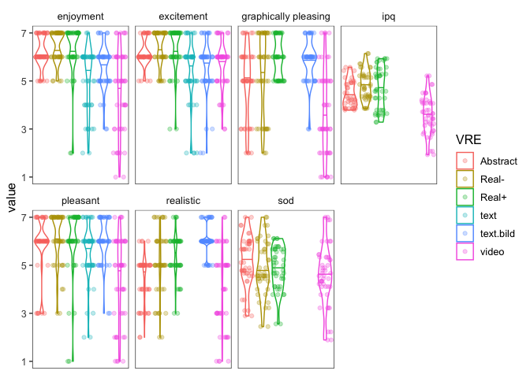
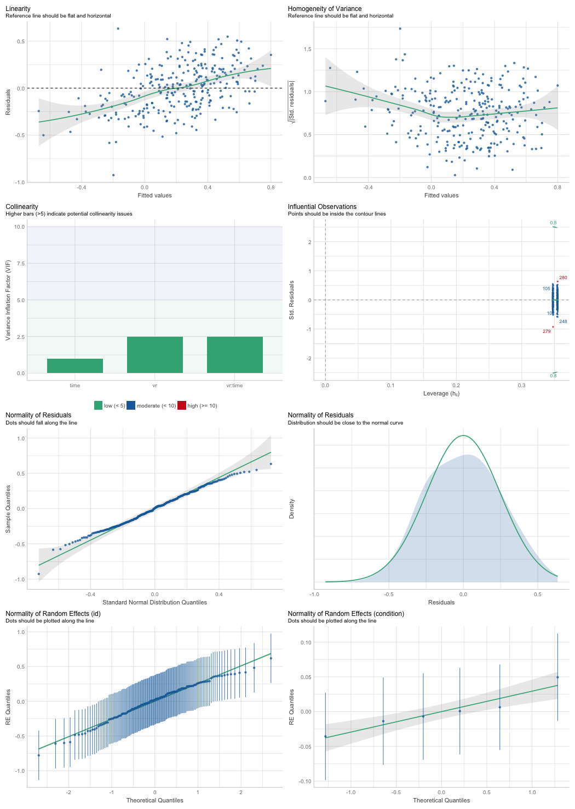
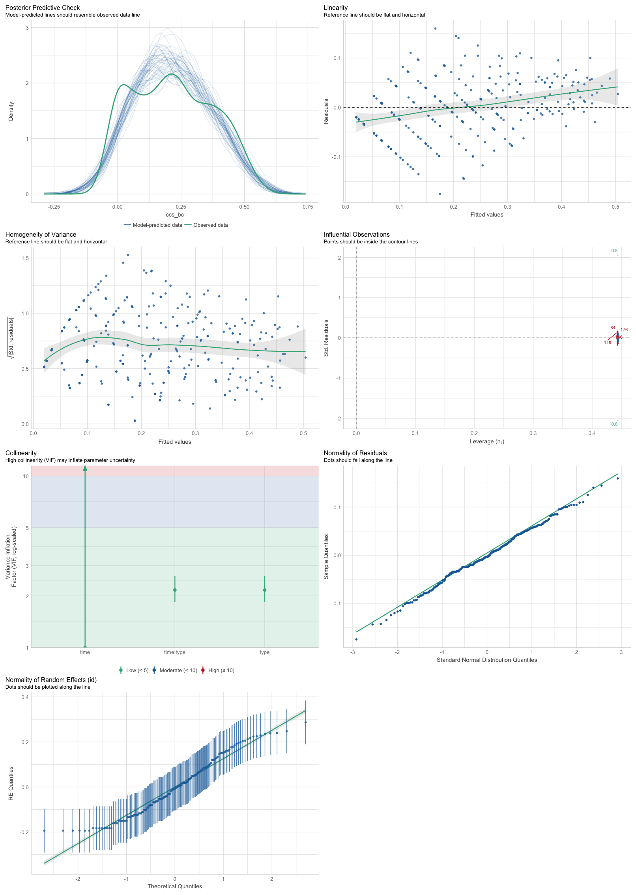
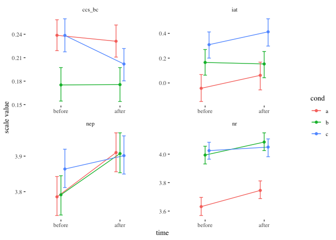

Analysis
================
Stefan P. Thoma
3/10/2020

# Setup

Install / load packages needed:

``` r
knitr::opts_chunk$set(echo = TRUE)
if (!require("pacman")) install.packages("pacman")
```

    ## Loading required package: pacman

``` r
p_load(tidyverse, lme4, lmerTest, mvoutlier, nlme, multcomp, lsmeans, xtable, jtools, tikzDevice, gmodels, parallel, performance, optimx, tidylog)
#pacman::p_load_gh("jaredhuling/jcolors")
#jcolors::jcolors("default")
#ggplot <- function(...) ggplot2::ggplot(...) + scale_color_brewer(palette=jcolors::jcolors()) + scale_fill_brewer(palette=jcolors::jcolors()) + #ggplot2::scale_colour_brewer(palette=jcolors::jcolors()) + ggplot2::scale_color_discrete(palette=jcolors::jcolors()) #+ ggplot2::scale_fill_discrete(palette=jcolors::jcolors())
```

``` r
sessionInfo()
```

    ## R version 4.2.1 (2022-06-23)
    ## Platform: x86_64-apple-darwin17.0 (64-bit)
    ## Running under: macOS Big Sur ... 10.16
    ## 
    ## Matrix products: default
    ## BLAS:   /Library/Frameworks/R.framework/Versions/4.2/Resources/lib/libRblas.0.dylib
    ## LAPACK: /Library/Frameworks/R.framework/Versions/4.2/Resources/lib/libRlapack.dylib
    ## 
    ## locale:
    ## [1] en_US.UTF-8/en_US.UTF-8/en_US.UTF-8/C/en_US.UTF-8/en_US.UTF-8
    ## 
    ## attached base packages:
    ## [1] parallel  stats     graphics  grDevices utils     datasets  methods  
    ## [8] base     
    ## 
    ## other attached packages:
    ##  [1] tidylog_1.0.2       optimx_2022-4.30    performance_0.9.2  
    ##  [4] gmodels_2.18.1.1    tikzDevice_0.12.3.1 jtools_2.2.0       
    ##  [7] xtable_1.8-4        lsmeans_2.30-0      emmeans_1.8.0      
    ## [10] multcomp_1.4-20     TH.data_1.1-1       MASS_7.3-57        
    ## [13] survival_3.3-1      mvtnorm_1.1-3       nlme_3.1-157       
    ## [16] mvoutlier_2.1.1     sgeostat_1.0-27     lmerTest_3.1-3     
    ## [19] lme4_1.1-30         Matrix_1.4-1        forcats_0.5.2      
    ## [22] stringr_1.4.1       dplyr_1.0.10        purrr_0.3.4        
    ## [25] readr_2.1.2         tidyr_1.2.1         tibble_3.1.8       
    ## [28] ggplot2_3.3.6       tidyverse_1.3.2     pacman_0.5.1       
    ## 
    ## loaded via a namespace (and not attached):
    ##  [1] fs_1.5.2            lubridate_1.8.0     insight_0.18.2     
    ##  [4] httr_1.4.4          numDeriv_2016.8-1.1 tools_4.2.1        
    ##  [7] backports_1.4.1     utf8_1.2.2          R6_2.5.1           
    ## [10] DBI_1.1.3           colorspace_2.0-3    withr_2.5.0        
    ## [13] tidyselect_1.2.0    compiler_4.2.1      cli_3.4.1          
    ## [16] rvest_1.0.3         xml2_1.3.3          sandwich_3.0-2     
    ## [19] scales_1.2.1        DEoptimR_1.0-11     robustbase_0.95-0  
    ## [22] digest_0.6.29       minqa_1.2.4         rmarkdown_2.16     
    ## [25] pkgconfig_2.0.3     htmltools_0.5.3     dbplyr_2.2.1       
    ## [28] fastmap_1.1.0       rlang_1.0.6         readxl_1.4.1       
    ## [31] rstudioapi_0.14     generics_0.1.3      zoo_1.8-10         
    ## [34] jsonlite_1.8.1      gtools_3.9.3        googlesheets4_1.0.1
    ## [37] magrittr_2.0.3      Rcpp_1.0.9          munsell_0.5.0      
    ## [40] fansi_1.0.3         lifecycle_1.0.3     stringi_1.7.8      
    ## [43] yaml_2.3.5          grid_4.2.1          gdata_2.18.0.1     
    ## [46] crayon_1.5.2        lattice_0.20-45     haven_2.5.1        
    ## [49] splines_4.2.1       pander_0.6.5        hms_1.1.2          
    ## [52] knitr_1.40          pillar_1.8.1        boot_1.3-28        
    ## [55] estimability_1.4.1  clisymbols_1.2.0    codetools_0.2-18   
    ## [58] reprex_2.0.2        glue_1.6.2          evaluate_0.16      
    ## [61] modelr_0.1.9        vctrs_0.4.2         nloptr_2.0.3       
    ## [64] tzdb_0.3.0          cellranger_1.1.0    gtable_0.3.1       
    ## [67] assertthat_0.2.1    xfun_0.33           broom_1.0.1        
    ## [70] coda_0.19-4         filehash_2.4-3      googledrive_2.0.0  
    ## [73] gargle_1.2.0        ellipsis_0.3.2

## Load Data

``` r
data <- read_csv("data/cleanData.csv") 
```

    ## Rows: 284 Columns: 131
    ## ── Column specification ────────────────────────────────────────────────────────
    ## Delimiter: ","
    ## chr    (9): id, sex, condition, Frage1, Frage2, Frage3, Leiter, Anmerkungen,...
    ## dbl  (121): time, iat, ccs1, ccs2, ccs3, ccs4, ccs5, ccs6, ccs7, ccs8, ccs9,...
    ## dttm   (1): StartDate
    ## 
    ## ℹ Use `spec()` to retrieve the full column specification for this data.
    ## ℹ Specify the column types or set `show_col_types = FALSE` to quiet this message.

``` r
#data <- data %>% dplyr::select(
#  id, time, iat, ccs, nr, nep, ipq, sod, ses, age, edu, sex, pol, vr_exp, vr_eval1, vr_eval2, vr_eval3,
#  vr_eval4, vr_eval5, span, seen, condition, starts_with("Frage"), hr_mean, Leiter, Anmerkungen, Zeit
#)

head(data)
```

    ## # A tibble: 6 × 131
    ##   id        time    iat StartDate  ccs1  ccs2  ccs3  ccs4  ccs5  ccs6
    ##   <chr>    <dbl>  <dbl> <dttm>    <dbl> <dbl> <dbl> <dbl> <dbl> <dbl>
    ## 1 28287312     1  0.179 NA            1     1     2     1     1     1
    ## 2 28287312     2  0.409 NA            1     1     1     1     1     1
    ## 3 77995467     1 -0.496 NA            1     1     1     1     1     1
    ## 4 77995467     2 -0.362 NA            1     1     1     1     1     1
    ## 5 43795961     1  0.517 NA            2     1     1     1     2     1
    ## 6 43795961     2  0.634 NA            2     1     1     1     2     1
    ## # … with 121 more variables: ccs7 <dbl>, ccs8 <dbl>, ccs9 <dbl>, ccs10 <dbl>,
    ## #   ccs11 <dbl>, ccs12 <dbl>, nr1 <dbl>, nr2 <dbl>, nr3 <dbl>, nr4 <dbl>,
    ## #   nr5 <dbl>, nr6 <dbl>, nr7 <dbl>, nr8 <dbl>, nr9 <dbl>, nr10 <dbl>,
    ## #   nr11 <dbl>, nr12 <dbl>, nr13 <dbl>, nr14 <dbl>, nr15 <dbl>, nr16 <dbl>,
    ## #   nr17 <dbl>, nr18 <dbl>, nr19 <dbl>, nr20 <dbl>, nr21 <dbl>, nep1 <dbl>,
    ## #   nep2 <dbl>, nep3 <dbl>, nep4 <dbl>, nep5 <dbl>, nep6 <dbl>, nep7 <dbl>,
    ## #   nep8 <dbl>, nep9 <dbl>, nep10 <dbl>, nep11 <dbl>, nep12 <dbl>, …

``` r
# factor for vr or not
data <- data %>% group_by(id) %>% 
  mutate(
    vr = ifelse(condition %in% c("a", "b", "c"), TRUE, FALSE), 
    type = factor(ifelse(vr, "vr", "control")),
    condition = factor(condition, levels = c("b", "a", "c", "video", "text.bild", "text"))
  )
```

    ## group_by: one grouping variable (id)
    ## mutate (grouped): converted 'condition' from character to factor (0 new NA)
    ##                   new variable 'vr' (logical) with 2 unique values and 0% NA
    ##                   new variable 'type' (factor) with 2 unique values and 0% NA

Keep in mind the conditions coding:

a == abstract

b == realistic

c == realistic but badly so

<!-- ## Check for multivariate outlier -->
<!-- ```{r, eval = FALSE} -->
<!-- # mvoutlier::chisq.plot(data[,c(3:6)]) -->
<!-- # [1] 124 162 161  29  54 -->
<!-- # removing three most extreme cases -->
<!-- rmId <- data$id[c(124, 161, 162)] -->
<!-- data <- data %>% filter(!id %in% rmId) -->
<!-- ``` -->
<!-- ```{r} -->
<!-- data$id[c(142,144,275)] -->
<!-- ``` -->

# Descriptives

## IAT validity

Does IAT correlate to the other measures?

``` r
cor(data %>% ungroup() %>% dplyr::select(iat, nep, ccs, nr), use = "pairwise.complete.obs")
```

    ## ungroup: no grouping variables

    ##             iat        nep         ccs         nr
    ## iat  1.00000000  0.1390394 -0.05361938  0.1366695
    ## nep  0.13903938  1.0000000 -0.37813922  0.3584078
    ## ccs -0.05361938 -0.3781392  1.00000000 -0.2009210
    ## nr   0.13666952  0.3584078 -0.20092101  1.0000000

``` r
cor.test.f <- Vectorize(FUN = function(var){
  cor.test(data$iat, data[[var]], arg = "two.sided")
})

cor.test.f(c("nep", "ccs", "nr"))
```

    ##             nep                                   
    ## statistic   2.35777                               
    ## parameter   282                                   
    ## p.value     0.01906812                            
    ## estimate    0.1390394                             
    ## null.value  0                                     
    ## alternative "two.sided"                           
    ## method      "Pearson's product-moment correlation"
    ## data.name   "data$iat and data[[var]]"            
    ## conf.int    numeric,2                             
    ##             ccs                                   
    ## statistic   -0.9017197                            
    ## parameter   282                                   
    ## p.value     0.3679753                             
    ## estimate    -0.05361938                           
    ## null.value  0                                     
    ## alternative "two.sided"                           
    ## method      "Pearson's product-moment correlation"
    ## data.name   "data$iat and data[[var]]"            
    ## conf.int    numeric,2                             
    ##             nr                                    
    ## statistic   2.316811                              
    ## parameter   282                                   
    ## p.value     0.0212306                             
    ## estimate    0.1366695                             
    ## null.value  0                                     
    ## alternative "two.sided"                           
    ## method      "Pearson's product-moment correlation"
    ## data.name   "data$iat and data[[var]]"            
    ## conf.int    numeric,2

The IAT scores correlated significantly with the nr scores (r = 0.137, p
= 0.021) and with the nep scores (r = 0.139, p = 0.019) but not
significantly with ccs scores (r = -0.054, p = .368). The signs of the
correlations were as expected.

## Reliability

``` r
vars <- names(data)

ccs.vars <- vars[startsWith(vars, "ccs")]
nr.vars <- vars[startsWith(vars, "nr")]
nep.vars <- vars[startsWith(vars, "nep")]
ipq.vars <- vars[startsWith(vars, "ipq")]
sod.vars <- vars[startsWith(vars, "sod")]

vars.list1 <- list(ccs.vars, nr.vars, nep.vars)
vars.list2 <- list(ipq.vars, sod.vars)

#remove overall score (shortest name)
# this is a bit more robust compared to simply removing the last item
remove_overall <- function(char.vec){
 nm <- char.vec[which.min(nchar(char.vec))]
 char.vec <- char.vec[-which.min(nchar(char.vec))]
 char.vec
}

vars.list1 <- lapply(vars.list1, remove_overall)
vars.list2 <- lapply(vars.list2, remove_overall)


reliable <- function(data, vars){
  alph <- psych::alpha(data[vars], title = vars[1])

  #omeg <- psych::omega(data[vars], plot = FALSE)
 df <- data.frame(alpha = alph$total$raw_alpha, ci.low = alph$total$raw_alpha - 1.96 * alph$total$ase, ci.up = alph$total$raw_alpha + 1.96 * alph$total$ase)
 df <- round(df, 3)
 df$var = vars[1]
 df
}


# measures which are measured twice
alpha.1 <- lapply(vars.list1, function(x) reliable(data = data, x))
# measures which are measured only once (sod and ipq)
alpha.2 <- lapply(vars.list2, function(x) reliable(data = data %>% filter(time == 1), x))
```

    ## filter (grouped): removed 142 rows (50%), 142 rows remaining
    ## filter (grouped): removed 142 rows (50%), 142 rows remaining

``` r
alphas <- c(alpha.1, alpha.2)

(alpha.df <- do.call("rbind", alphas) %>%
  dplyr::select(var, alpha, ci.low, ci.up))
```

    ##     var alpha ci.low ci.up
    ## 1  ccs1 0.845  0.819 0.871
    ## 2   nr1 0.840  0.813 0.866
    ## 3  nep1 0.686  0.632 0.739
    ## 4  ipq1 0.826  0.785 0.867
    ## 5 sod_1 0.805  0.759 0.852

cronbach alpha of nep is relatively small. What would mcdonalds omega
look like for nep?

``` r
psych::omega(data[vars.list1[[3]]], nfactors = 1)
```

    ## Loading required namespace: GPArotation

    ## Omega_h for 1 factor is not meaningful, just omega_t

    ## Warning in schmid(m, nfactors, fm, digits, rotate = rotate, n.obs = n.obs, :
    ## Omega_h and Omega_asymptotic are not meaningful with one factor

    ## Omega 
    ## Call: omegah(m = m, nfactors = nfactors, fm = fm, key = key, flip = flip, 
    ##     digits = digits, title = title, sl = sl, labels = labels, 
    ##     plot = plot, n.obs = n.obs, rotate = rotate, Phi = Phi, option = option, 
    ##     covar = covar)
    ## Alpha:                 0.7 
    ## G.6:                   0.73 
    ## Omega Hierarchical:    0.7 
    ## Omega H asymptotic:    0.99 
    ## Omega Total            0.71 
    ## 
    ## Schmid Leiman Factor loadings greater than  0.2 
    ##          g  F1*   h2   u2 p2
    ## nep1  0.31      0.10 0.90  1
    ## nep2  0.38      0.15 0.85  1
    ## nep3  0.59      0.35 0.65  1
    ## nep4  0.44      0.20 0.80  1
    ## nep5  0.55      0.30 0.70  1
    ## nep6            0.03 0.97  1
    ## nep7  0.41      0.17 0.83  1
    ## nep8  0.21      0.04 0.96  1
    ## nep9            0.01 0.99  1
    ## nep10 0.46      0.21 0.79  1
    ## nep11 0.27      0.07 0.93  1
    ## nep12 0.48      0.23 0.77  1
    ## nep13 0.29      0.08 0.92  1
    ## nep14 0.32      0.10 0.90  1
    ## nep15 0.56      0.31 0.69  1
    ## 
    ## With eigenvalues of:
    ##   g F1* 
    ## 2.4 0.0 
    ## 
    ## general/max  1.878568e+16   max/min =   1
    ## mean percent general =  1    with sd =  0 and cv of  0 
    ## Explained Common Variance of the general factor =  1 
    ## 
    ## The degrees of freedom are 90  and the fit is  0.94 
    ## The number of observations was  284  with Chi Square =  261.23  with prob <  1.3e-18
    ## The root mean square of the residuals is  0.08 
    ## The df corrected root mean square of the residuals is  0.09
    ## RMSEA index =  0.082  and the 10 % confidence intervals are  0.071 0.094
    ## BIC =  -247.18
    ## 
    ## Compare this with the adequacy of just a general factor and no group factors
    ## The degrees of freedom for just the general factor are 90  and the fit is  0.94 
    ## The number of observations was  284  with Chi Square =  261.23  with prob <  1.3e-18
    ## The root mean square of the residuals is  0.08 
    ## The df corrected root mean square of the residuals is  0.09 
    ## 
    ## RMSEA index =  0.082  and the 10 % confidence intervals are  0.071 0.094
    ## BIC =  -247.18 
    ## 
    ## Measures of factor score adequacy             
    ##                                                  g F1*
    ## Correlation of scores with factors            0.87   0
    ## Multiple R square of scores with factors      0.75   0
    ## Minimum correlation of factor score estimates 0.51  -1
    ## 
    ##  Total, General and Subset omega for each subset
    ##                                                  g F1*
    ## Omega total for total scores and subscales    0.71 0.7
    ## Omega general for total scores and subscales  0.70 0.7
    ## Omega group for total scores and subscales    0.00 0.0

Omega Total 0.71 seems ok.

### Check NEP structure

``` r
psych::principal(r = data[nep.vars[-length(nep.vars)]])
```

    ## Principal Components Analysis
    ## Call: psych::principal(r = data[nep.vars[-length(nep.vars)]])
    ## Standardized loadings (pattern matrix) based upon correlation matrix
    ##        PC1    h2   u2 com
    ## nep1  0.38 0.146 0.85   1
    ## nep2  0.46 0.209 0.79   1
    ## nep3  0.65 0.418 0.58   1
    ## nep4  0.52 0.273 0.73   1
    ## nep5  0.60 0.365 0.63   1
    ## nep6  0.21 0.045 0.95   1
    ## nep7  0.48 0.230 0.77   1
    ## nep8  0.27 0.071 0.93   1
    ## nep9  0.11 0.012 0.99   1
    ## nep10 0.52 0.275 0.72   1
    ## nep11 0.34 0.114 0.89   1
    ## nep12 0.55 0.297 0.70   1
    ## nep13 0.36 0.128 0.87   1
    ## nep14 0.39 0.155 0.84   1
    ## nep15 0.62 0.384 0.62   1
    ## 
    ##                 PC1
    ## SS loadings    3.13
    ## Proportion Var 0.21
    ## 
    ## Mean item complexity =  1
    ## Test of the hypothesis that 1 component is sufficient.
    ## 
    ## The root mean square of the residuals (RMSR) is  0.1 
    ##  with the empirical chi square  583.99  with prob <  2e-73 
    ## 
    ## Fit based upon off diagonal values = 0.68

For the following analysis we reduce the dataframe.

``` r
data <- data %>% dplyr::select(
  id, time, vr, type, condition, iat, ccs, nr, nep, ipq, sod, ses, age, edu, sex, pol, vr_exp, vr_eval1, vr_eval2, vr_eval3, vr_eval4, vr_eval5, span, seen, starts_with("Frage"), hr_mean, Leiter, Anmerkungen, Zeit
)
```

# Principal component analysis

We try to find an acceptable model for each DV.

First, I would like to calculate a principal component of all dependent
variables (dvs)

``` r
df_env <- data[c("iat", "ccs", "nr", "nep")]
psych::fa.parallel(df_env)
```

<!-- -->

    ## Parallel analysis suggests that the number of factors =  1  and the number of components =  1

``` r
prc_env <- princomp(df_env, cor = TRUE)
# Seems like one factor might just be enough. However, this may be more revealing when done
# on raw data
summary(prc_env)
```

    ## Importance of components:
    ##                           Comp.1    Comp.2    Comp.3    Comp.4
    ## Standard deviation     1.2980576 0.9835519 0.8829992 0.7536475
    ## Proportion of Variance 0.4212384 0.2418436 0.1949219 0.1419962
    ## Cumulative Proportion  0.4212384 0.6630819 0.8580038 1.0000000

``` r
data$env_pc <- prc_env$scores[,1]
```

Unidimensionality could be assumed. The scores of the first principal
component were stored in `data$env_pc`. This vector can now be used as a
dependent variable in further exploratory analyses.

This plot is not very useful I guess. Too crowded.

# Check Intervention

This section is concerned only with the VR conditions a, b, c.
Specifically with the variables vr_eval 1:5 and with the sod and
presence scale IPQ.

Check for outliers on these scales:

``` r
#check.data <- data %>% dplyr::filter((vr == T & time == 1 ) & !is.na(ipq))
check.data <- data %>% dplyr::filter((time == 1 ) & !is.na(ipq))

#outlier.data <- data %>% ungroup() %>% dplyr::filter(vr == T & time == 1) %>% dplyr::select(starts_with("vr_eval"), sod, ipq) %>%
# drop_na()
#mvoutlier::chisq.plot(check.data %>% ungroup() %>% dplyr::select(starts_with("vr_eval"), sod, ipq))
# remove: 38  1 63
# which corresponds to the ids:
#remove.ids <- check.data$id[c(38,  1, 63)]
# "44466757" "32504483" "80688810"
```

## Plot

``` r
vars <-c("vr_eval1", "vr_eval2", "vr_eval3", "vr_eval4", "vr_eval5", "ipq", "sod")

desc_plot_data <- gather(data, specific, value, vars) %>%
 # filter(!is.na(ipq)) %>%
  arrange(id, specific) %>%
  mutate(specific = ifelse(specific=="vr_eval1", "excitement",
                        ifelse(specific=="vr_eval2", "graphically pleasing",
                               ifelse(specific=="vr_eval3", "pleasant",
                                      ifelse(specific=="vr_eval4", "realistic", 
                                             ifelse(specific=="vr_eval5", "enjoyment", specific))))),
         VRE = ifelse(condition == "b", "Real+",
                      ifelse(condition=="c", "Real-",
                             ifelse(condition=="a", "Abstract", as.character(condition))))) %>%
  dplyr::select(specific, value, id, VRE)
```

    ## Warning: Using an external vector in selections was deprecated in tidyselect 1.1.0.
    ## ℹ Please use `all_of()` or `any_of()` instead.
    ##   # Was:
    ##   data %>% select(vars)
    ## 
    ##   # Now:
    ##   data %>% select(all_of(vars))
    ## 
    ## See <https://tidyselect.r-lib.org/reference/faq-external-vector.html>.

    ## gather: reorganized (ipq, sod, vr_eval1, vr_eval2, vr_eval3, …) into (specific, value) [was 284x32, now 1988x27]

    ## mutate: changed 1,420 values (71%) of 'specific' (0 new NA)

    ##         new variable 'VRE' (character) with 6 unique values and 0% NA

``` r
(vr_eval_plot <- ggplot(data = desc_plot_data, aes(x = VRE, y = value, color = VRE)) +
  facet_wrap( ~specific, nrow = 2)+
  geom_violin(draw_quantiles = .5) + #, position = position_jitterdodge(dodge.width = 0.8, jitter.width = 0, jitter.height = 0))+
  geom_point(alpha = .3, position = "jitter")+#, position = position_jitterdodge(dodge.width = 0, jitter.width = .2, jitter.height = .3)) +
  ggthemes::theme_few() +
  ylab("value") +
  xlab("")+
 # labs(title="")+    
  theme(axis.title.x=element_blank(),
        axis.text.x=element_blank(),
        axis.ticks.x=element_blank())+

  scale_y_continuous(breaks = c(1,3,5,7)) +
  theme(legend.position = "right") )
```

    ## Warning: Removed 304 rows containing non-finite values (stat_ydensity).

    ## Warning: Removed 304 rows containing missing values (geom_point).

<!-- -->

ipq and sod separately:

## compare initial dv values

Vector containing name of all dv’s

``` r
dvs <-  c("iat", "ccs", "nr", "nep", "env_pc")
```

Mean dvs at time point 1.

``` r
data.dv1 <- data %>% filter(time==1) %>%
dplyr::mutate(condition = ifelse(condition =="b", "real+",
                              ifelse(condition == "c", "real-",
                                  ifelse(condition == "a", "abstract", as.character(condition)))),
              condition = as.factor(condition))
```

    ## filter: removed 142 rows (50%), 142 rows remaining

``` r
(summar.cond <- data.dv1 %>% group_by(condition, type) %>%
  summarise(mean_iat = mean(iat),
            mean_ccs = mean(ccs),
            mean_nr = mean(nr),
            mean_nep = mean(nep)))
```

    ## group_by: 2 grouping variables (condition, type)

    ## summarise: now 6 rows and 6 columns, one group variable remaining (condition)

    ## # A tibble: 6 × 6
    ## # Groups:   condition [6]
    ##   condition type    mean_iat mean_ccs mean_nr mean_nep
    ##   <fct>     <fct>      <dbl>    <dbl>   <dbl>    <dbl>
    ## 1 abstract  vr       -0.0430     1.5     3.63     3.79
    ## 2 real-     vr        0.309      1.51    4.02     3.86
    ## 3 real+     vr        0.165      1.35    3.99     3.79
    ## 4 text      control   0.355      1.47    3.77     3.83
    ## 5 text.bild control   0.233      1.42    3.83     3.87
    ## 6 video     control   0.306      1.48    3.89     3.84

``` r
(summar.vr <- data.dv1 %>% group_by(type) %>%
  summarise(mean_iat = mean(iat),
            mean_ccs = mean(ccs),
            mean_nr = mean(nr),
            mean_nep = mean(nep)))
```

    ## group_by: one grouping variable (type)

    ## summarise: now 2 rows and 5 columns, ungrouped

    ## # A tibble: 2 × 5
    ##   type    mean_iat mean_ccs mean_nr mean_nep
    ##   <fct>      <dbl>    <dbl>   <dbl>    <dbl>
    ## 1 vr         0.144     1.45    3.88     3.81
    ## 2 control    0.299     1.46    3.83     3.85

``` r
contrasts(data.dv1$condition) <- contr.sum(n = 6)
contrasts(data.dv1$condition)
```

    ##           [,1] [,2] [,3] [,4] [,5]
    ## abstract     1    0    0    0    0
    ## real-        0    1    0    0    0
    ## real+        0    0    1    0    0
    ## text         0    0    0    1    0
    ## text.bild    0    0    0    0    1
    ## video       -1   -1   -1   -1   -1

``` r
lapply(dvs, function(x){
  print(x)
  summary(lm(get(x)~condition, data = data.dv1))
})
```

    ## [1] "iat"
    ## [1] "ccs"
    ## [1] "nr"
    ## [1] "nep"
    ## [1] "env_pc"

    ## [[1]]
    ## 
    ## Call:
    ## lm(formula = get(x) ~ condition, data = data.dv1)
    ## 
    ## Residuals:
    ##      Min       1Q   Median       3Q      Max 
    ## -1.10154 -0.28834 -0.00615  0.30680  0.94134 
    ## 
    ## Coefficients:
    ##             Estimate Std. Error t value Pr(>|t|)    
    ## (Intercept)  0.22074    0.03689   5.984 1.82e-08 ***
    ## condition1  -0.26378    0.08340  -3.163  0.00193 ** 
    ## condition2   0.08793    0.08340   1.054  0.29356    
    ## condition3  -0.05547    0.08340  -0.665  0.50711    
    ## condition4   0.13378    0.08067   1.658  0.09955 .  
    ## condition5   0.01189    0.08199   0.145  0.88487    
    ## ---
    ## Signif. codes:  0 '***' 0.001 '**' 0.01 '*' 0.05 '.' 0.1 ' ' 1
    ## 
    ## Residual standard error: 0.4393 on 136 degrees of freedom
    ## Multiple R-squared:  0.08616,    Adjusted R-squared:  0.05256 
    ## F-statistic: 2.565 on 5 and 136 DF,  p-value: 0.02985
    ## 
    ## 
    ## [[2]]
    ## 
    ## Call:
    ## lm(formula = get(x) ~ condition, data = data.dv1)
    ## 
    ## Residuals:
    ##     Min      1Q  Median      3Q     Max 
    ## -0.5109 -0.3359 -0.1458  0.1814  1.7500 
    ## 
    ## Coefficients:
    ##             Estimate Std. Error t value Pr(>|t|)    
    ## (Intercept)  1.45522    0.04003  36.349   <2e-16 ***
    ## condition1   0.04478    0.09052   0.495    0.622    
    ## condition2   0.05565    0.09052   0.615    0.540    
    ## condition3  -0.10740    0.09052  -1.186    0.237    
    ## condition4   0.01811    0.08756   0.207    0.836    
    ## condition5  -0.03508    0.08899  -0.394    0.694    
    ## ---
    ## Signif. codes:  0 '***' 0.001 '**' 0.01 '*' 0.05 '.' 0.1 ' ' 1
    ## 
    ## Residual standard error: 0.4768 on 136 degrees of freedom
    ## Multiple R-squared:  0.01384,    Adjusted R-squared:  -0.02241 
    ## F-statistic: 0.3819 on 5 and 136 DF,  p-value: 0.8605
    ## 
    ## 
    ## [[3]]
    ## 
    ## Call:
    ## lm(formula = get(x) ~ condition, data = data.dv1)
    ## 
    ## Residuals:
    ##     Min      1Q  Median      3Q     Max 
    ## -1.8610 -0.2856  0.0119  0.3534  0.9962 
    ## 
    ## Coefficients:
    ##             Estimate Std. Error t value Pr(>|t|)    
    ## (Intercept)  3.85568    0.04060  94.975   <2e-16 ***
    ## condition1  -0.22421    0.09179  -2.443   0.0159 *  
    ## condition2   0.16917    0.09179   1.843   0.0675 .  
    ## condition3   0.13811    0.09179   1.505   0.1347    
    ## condition4  -0.08996    0.08879  -1.013   0.3127    
    ## condition5  -0.03028    0.09024  -0.336   0.7377    
    ## ---
    ## Signif. codes:  0 '***' 0.001 '**' 0.01 '*' 0.05 '.' 0.1 ' ' 1
    ## 
    ## Residual standard error: 0.4835 on 136 degrees of freedom
    ## Multiple R-squared:  0.07317,    Adjusted R-squared:  0.0391 
    ## F-statistic: 2.147 on 5 and 136 DF,  p-value: 0.06351
    ## 
    ## 
    ## [[4]]
    ## 
    ## Call:
    ## lm(formula = get(x) ~ condition, data = data.dv1)
    ## 
    ## Residuals:
    ##     Min      1Q  Median      3Q     Max 
    ## -1.3600 -0.2580  0.0058  0.2675  0.9478 
    ## 
    ## Coefficients:
    ##             Estimate Std. Error t value Pr(>|t|)    
    ## (Intercept)  3.82973    0.03525 108.653   <2e-16 ***
    ## condition1  -0.04422    0.07969  -0.555    0.580    
    ## condition2   0.03404    0.07969   0.427    0.670    
    ## condition3  -0.03842    0.07969  -0.482    0.630    
    ## condition4  -0.00306    0.07709  -0.040    0.968    
    ## condition5   0.04250    0.07835   0.542    0.588    
    ## ---
    ## Signif. codes:  0 '***' 0.001 '**' 0.01 '*' 0.05 '.' 0.1 ' ' 1
    ## 
    ## Residual standard error: 0.4198 on 136 degrees of freedom
    ## Multiple R-squared:  0.006267,   Adjusted R-squared:  -0.03027 
    ## F-statistic: 0.1715 on 5 and 136 DF,  p-value: 0.9728
    ## 
    ## 
    ## [[5]]
    ## 
    ## Call:
    ## lm(formula = get(x) ~ condition, data = data.dv1)
    ## 
    ## Residuals:
    ##     Min      1Q  Median      3Q     Max 
    ## -4.6228 -0.7179  0.1753  0.7888  2.5123 
    ## 
    ## Coefficients:
    ##             Estimate Std. Error t value Pr(>|t|)  
    ## (Intercept) -0.07852    0.10223  -0.768   0.4438  
    ## condition1  -0.50214    0.23114  -2.172   0.0316 *
    ## condition2   0.21738    0.23114   0.940   0.3487  
    ## condition3   0.16514    0.23114   0.714   0.4762  
    ## condition4  -0.03430    0.22358  -0.153   0.8783  
    ## condition5   0.07576    0.22724   0.333   0.7393  
    ## ---
    ## Signif. codes:  0 '***' 0.001 '**' 0.01 '*' 0.05 '.' 0.1 ' ' 1
    ## 
    ## Residual standard error: 1.218 on 136 degrees of freedom
    ## Multiple R-squared:  0.03737,    Adjusted R-squared:  0.001976 
    ## F-statistic: 1.056 on 5 and 136 DF,  p-value: 0.3878

# HLM

So we will create two models for each dependent variables:

First, the model will have the formula:

`dv ~ condition * time + (time | id)`

This will be simplified to the following model if model fit is singular:

`dv ~ condition * time + (1 | id)`

This will estimate a random intercept for each participant. This model
will only take as input the vr conditions (`a`, `b` & `c`), or:
`vr == TRUE`.

The second model will have the formula:

`dv ~ vr * time + (time | condition) + (1 | id)`

Where a random slope for time is estimated per condition. Further, there
is a random intercept per condition, and per id.

Should model fit be singular, we would simplify the model to:

`dv ~ vr * time + (1 | condition) + (1 | id)`

If still singular, we would simplify to:

`dv ~ vr * time + (1 | id)`

## Helping function

``` r
fit.lme <- function(form, dat){
  lme4::lmer(formula = form, data = dat)
  #lme4::lmer(formula = form, data = dat, 
  #           control = lmerControl(optimizer = "optimx", optCtrl = list(method = "nlminb", starttests = FALSE, kkt = FALSE))) # alternative optimizer
}
```

``` r
fit_models <- function(dv, dat){
# this function returns a function which fits a model based on a formula minus the predictors. 
# This function can be used in the next function which implements the conditions for reducing model complexity if model fit is singular.
  
  function(predictors){
    form <- formula(paste(dv, predictors, sep = " ~ "))
    print(form)
    fit <- fit.lme(form = form, dat = dat)
  }
}
```

``` r
predictors.vr <-  c("condition * time + (time | id)", "condition * time + (1 | id)")
predictors.all <- c("time*type + (time | condition) + (1 | id)", "time * type + (-1 + time | condition) + (1 | id)", "time * type + (1 | id)")
#predictors.all2 <- c("vr * time + (time | condition) + (1 | id)", "vr * time + (1 | condition) + (1 | id)", "vr * time + (1 | id)")
#predictors.all3 <- c("vr * time + (time | condition) + (1 | id)", "vr * time + (-1 + time | condition) + (1 | id)", "vr * time + (1 | id)")
# function to fit various models based on different inputs of predictors
fit_many <- function(pred.vector, dat, dv){
  fit_model <- fit_models(dv, dat)
  
  sing <- TRUE
  i <- 1
  while((sing) & i<=length(pred.vector)){
    model <- try(fit_model(pred.vector[i])) 
    
    if(class(model)!="try-error"){
      sing <- isSingular(model)
    } 
    
    i <- i + 1
  }
  print(paste("is model singular: ", sing))
  model
}
```

``` r
# split data frame:
data.vr <- data %>% dplyr::filter(vr) 
```

Contrast: We want the effect of “time” to be the average effect over all
conditions. Therefore we set the contrast of the condition variable to
`contr.sum` in accordance with
<https://stats.oarc.ucla.edu/r/library/r-library-contrast-coding-systems-for-categorical-variables/#DEVIATION>.
This is sometimes called `unweighted effect coding` or
`deviation coding`.

``` r
data.vr$condition <-droplevels(data.vr$condition)
contrasts(data.vr$condition) <- contr.sum(3)

contrasts(data$type) <- contr.sum(2)
```

## Initial model fitting

``` r
vr.models <- lapply(dvs, FUN = function(dv) fit_many(pred.vector = predictors.vr, dat = data.vr, dv = dv))
```

    ## iat ~ condition * time + (time | id)
    ## <environment: 0x7f9e4a81aef8>
    ## Error : number of observations (=138) <= number of random effects (=138) for term (time | id); the random-effects parameters and the residual variance (or scale parameter) are probably unidentifiable
    ## iat ~ condition * time + (1 | id)
    ## <environment: 0x7f9ed99939a8>
    ## [1] "is model singular:  FALSE"
    ## ccs ~ condition * time + (time | id)
    ## <environment: 0x7f9ed81927f0>
    ## Error : number of observations (=138) <= number of random effects (=138) for term (time | id); the random-effects parameters and the residual variance (or scale parameter) are probably unidentifiable
    ## ccs ~ condition * time + (1 | id)
    ## <environment: 0x7f9e5b440c68>
    ## [1] "is model singular:  FALSE"
    ## nr ~ condition * time + (time | id)
    ## <environment: 0x7f9ecf33d508>
    ## Error : number of observations (=138) <= number of random effects (=138) for term (time | id); the random-effects parameters and the residual variance (or scale parameter) are probably unidentifiable
    ## nr ~ condition * time + (1 | id)
    ## <environment: 0x7f9ecf0cfd60>
    ## [1] "is model singular:  FALSE"
    ## nep ~ condition * time + (time | id)
    ## <environment: 0x7f9ec99d9bf8>
    ## Error : number of observations (=138) <= number of random effects (=138) for term (time | id); the random-effects parameters and the residual variance (or scale parameter) are probably unidentifiable
    ## nep ~ condition * time + (1 | id)
    ## <environment: 0x7f9ece8ce898>
    ## [1] "is model singular:  FALSE"
    ## env_pc ~ condition * time + (time | id)
    ## <environment: 0x7f9ece1e7f20>
    ## Error : number of observations (=138) <= number of random effects (=138) for term (time | id); the random-effects parameters and the residual variance (or scale parameter) are probably unidentifiable
    ## env_pc ~ condition * time + (1 | id)
    ## <environment: 0x7f9ebf7889b0>
    ## [1] "is model singular:  FALSE"

``` r
all.models  <-  lapply(dvs, FUN = function(dv) fit_many(pred.vector = predictors.all, dat = data, dv = dv))
```

    ## iat ~ time * type + (time | condition) + (1 | id)
    ## <environment: 0x7f9ec934a038>

    ## boundary (singular) fit: see help('isSingular')

    ## iat ~ time * type + (-1 + time | condition) + (1 | id)
    ## <environment: 0x7f9ec83cb668>
    ## [1] "is model singular:  FALSE"
    ## ccs ~ time * type + (time | condition) + (1 | id)
    ## <environment: 0x7f9e5aad1a58>

    ## boundary (singular) fit: see help('isSingular')

    ## ccs ~ time * type + (-1 + time | condition) + (1 | id)
    ## <environment: 0x7f9e5b4cdf90>

    ## boundary (singular) fit: see help('isSingular')

    ## ccs ~ time * type + (1 | id)
    ## <environment: 0x7f9ebebdda10>
    ## [1] "is model singular:  FALSE"
    ## nr ~ time * type + (time | condition) + (1 | id)
    ## <environment: 0x7f9ebea8dcc0>

    ## boundary (singular) fit: see help('isSingular')

    ## nr ~ time * type + (-1 + time | condition) + (1 | id)
    ## <environment: 0x7f9e5bc6b440>
    ## [1] "is model singular:  FALSE"
    ## nep ~ time * type + (time | condition) + (1 | id)
    ## <environment: 0x7f9e89c281f8>

    ## boundary (singular) fit: see help('isSingular')

    ## nep ~ time * type + (-1 + time | condition) + (1 | id)
    ## <environment: 0x7f9e5f211f58>
    ## [1] "is model singular:  FALSE"
    ## env_pc ~ time * type + (time | condition) + (1 | id)
    ## <environment: 0x7f9e89ac7d28>

    ## boundary (singular) fit: see help('isSingular')

    ## env_pc ~ time * type + (-1 + time | condition) + (1 | id)
    ## <environment: 0x7f9ebe27fff0>

    ## boundary (singular) fit: see help('isSingular')

    ## env_pc ~ time * type + (1 | id)
    ## <environment: 0x7f9eb9b30400>
    ## [1] "is model singular:  FALSE"

``` r
presence.models <- lapply(dvs, FUN = function(dv) fit_many(pred.vector = "ipq * time + (1 | id)", dat = data.vr, dv = dv))
```

    ## iat ~ ipq * time + (1 | id)
    ## <environment: 0x7f9e8941d040>
    ## [1] "is model singular:  FALSE"
    ## ccs ~ ipq * time + (1 | id)
    ## <environment: 0x7f9eb8b9bde8>
    ## [1] "is model singular:  FALSE"
    ## nr ~ ipq * time + (1 | id)
    ## <environment: 0x7f9e9f7b4a40>
    ## [1] "is model singular:  FALSE"
    ## nep ~ ipq * time + (1 | id)
    ## <environment: 0x7f9e9e9c8cb8>
    ## [1] "is model singular:  FALSE"
    ## env_pc ~ ipq * time + (1 | id)
    ## <environment: 0x7f9e9e076f60>
    ## [1] "is model singular:  FALSE"

``` r
sod.models <- lapply(dvs, FUN = function(dv) fit_many(pred.vector = "sod * time + (1 | id)", dat = data.vr, dv = dv))
```

    ## iat ~ sod * time + (1 | id)
    ## <environment: 0x7f9e9ccb4238>
    ## [1] "is model singular:  FALSE"
    ## ccs ~ sod * time + (1 | id)
    ## <environment: 0x7f9e9c42ecd0>
    ## [1] "is model singular:  FALSE"
    ## nr ~ sod * time + (1 | id)
    ## <environment: 0x7f9e9aa47b30>
    ## [1] "is model singular:  FALSE"
    ## nep ~ sod * time + (1 | id)
    ## <environment: 0x7f9e98626288>
    ## [1] "is model singular:  FALSE"
    ## env_pc ~ sod * time + (1 | id)
    ## <environment: 0x7f9e8f3b7e20>
    ## [1] "is model singular:  FALSE"

<!-- ```{r, include = FALSE} -->
<!-- all.models2  <-  lapply(dvs, FUN = function(dv) fit_many(pred.vector = predictors.all2, dat = data, dv = dv)) -->
<!-- ``` -->
<!-- ```{r, include = FALSE} -->
<!-- #NEP -->
<!-- anova(all.models2[[4]], all.models[[4]]) -->
<!-- all.models2[[4]] -->
<!-- all.models[[4]] -->
<!-- ``` -->

## Model diagnostics

I save model diagnostics as pdfs separately, for visibility reasons.

``` r
plot_diagn <- function(model){
  
  filename <- paste( model@call$formula[2], sub("\\ .*", "", model@call$formula[3]), sep = "_")
  png(filename = paste("analysisOutputs/diagnostics/", filename, ".png", sep = ""),   # The directory you want to save the file in
    #paper = "a3",
    height = 5900/4,
    width = 4200/4
    )

  print(performance::check_model(model)  )

  dev.off()
}
```

``` r
lapply(vr.models, FUN = plot_diagn)
```

    ## [[1]]
    ## quartz_off_screen 
    ##                 2 
    ## 
    ## [[2]]
    ## quartz_off_screen 
    ##                 2 
    ## 
    ## [[3]]
    ## quartz_off_screen 
    ##                 2 
    ## 
    ## [[4]]
    ## quartz_off_screen 
    ##                 2 
    ## 
    ## [[5]]
    ## quartz_off_screen 
    ##                 2

``` r
lapply(all.models, FUN = plot_diagn)
```

    ## [[1]]
    ## quartz_off_screen 
    ##                 2 
    ## 
    ## [[2]]
    ## quartz_off_screen 
    ##                 2 
    ## 
    ## [[3]]
    ## quartz_off_screen 
    ##                 2 
    ## 
    ## [[4]]
    ## quartz_off_screen 
    ##                 2 
    ## 
    ## [[5]]
    ## quartz_off_screen 
    ##                 2

I focus model diagnostic on the vr models. They include all data.
Residuals are slightly left skewed. However, this does not yet warrant a
transformation of the dv in my opinion.

### IAT


Some thoughts: Band of residuals increases as fitted values increase.
Homogeneity of variance seems acceptable. Random effects appear normal.

### CCS

First some descriptives about ccs.

``` r
data %>% group_by(as.factor(time)) %>%
  summarise(mean = mean(ccs),
            range = range(ccs), 
            median = median(ccs))
```

    ## group_by: one grouping variable (as.factor(time))

    ## summarise: now 4 rows and 4 columns, one group variable remaining (as.factor(time))

    ## # A tibble: 4 × 4
    ## # Groups:   as.factor(time) [2]
    ##   `as.factor(time)`  mean range median
    ##   <fct>             <dbl> <dbl>  <dbl>
    ## 1 1                  1.46  1      1.33
    ## 2 1                  1.46  3.25   1.33
    ## 3 2                  1.44  1      1.29
    ## 4 2                  1.44  3.83   1.29


Some thoughts: Homogeneity of variance appears implausible. Residual
variance increases with larger fitted values.

Residuals are also not normally distributed. Random effects do not
appear normal.

The reason for this unexpected behaviour may well be the floor-effect of
the dv ccs. There was generally a very low ccs score for participants.
This is due to the relatively extreme nature of climate change
scepticism, especially in a relatively well educated sample.

Maybe a boxcox transformation may help:

``` r
#estimate lambda of the boxcox transformation
bc <- boxcox(ccs ~ vr * time, data = data)
```

<!-- -->

``` r
lambda_ccs <- bc$x[which.max(bc$y)]

# transform data according to the transformation
data <- data %>% 
  mutate(ccs_bc = (ccs^lambda_ccs-1)/lambda_ccs)
```

    ## mutate: new variable 'ccs_bc' (double) with 28 unique values and 0% NA

``` r
# refit the model
all.ccs2 <- fit_many(pred.vector = predictors.all, dat = data, dv = "ccs_bc")
```

    ## ccs_bc ~ time * type + (time | condition) + (1 | id)
    ## <environment: 0x7f9e4cf22238>

    ## boundary (singular) fit: see help('isSingular')

    ## ccs_bc ~ time * type + (-1 + time | condition) + (1 | id)
    ## <environment: 0x7f9ed80c5e40>

    ## boundary (singular) fit: see help('isSingular')

    ## ccs_bc ~ time * type + (1 | id)
    ## <environment: 0x7f9ed9882e10>
    ## [1] "is model singular:  FALSE"

``` r
performance::check_model(all.ccs2)
```

<!-- -->

The situation has improved! All model assumptions appear plausible.

``` r
all.models[[2]] <- all.ccs2
```

For within the VE:


And based on the transformed ccs:

``` r
data.vr <- data.vr %>% 
  mutate(ccs_bc = (ccs^lambda_ccs-1)/lambda_ccs)
```

    ## mutate: new variable 'ccs_bc' (double) with 24 unique values and 0% NA

``` r
vr.ccs2 <- fit_many(pred.vector = predictors.vr, dat = data.vr, dv = "ccs_bc")
```

    ## ccs_bc ~ condition * time + (time | id)
    ## <environment: 0x7f9e9f8c12a8>
    ## Error : number of observations (=138) <= number of random effects (=138) for term (time | id); the random-effects parameters and the residual variance (or scale parameter) are probably unidentifiable
    ## ccs_bc ~ condition * time + (1 | id)
    ## <environment: 0x7f9e893f6978>
    ## [1] "is model singular:  FALSE"

``` r
performance::check_model(vr.ccs2)
```

<!-- -->

``` r
vr.models[[2]] <- vr.ccs2
```

### NR


Model assumptions are not too far off: Slight slope in the “fitted vs
residuals”. Homogeneity assumption is appropriate. Residual distribution
is slightly skewed with a heavy left tail. ID intercept distribution is
not quite normal, but not far from it. Slightly skewed as well.

Overall assumptions seem acceptable and warrant no further action.

### NEP


Model assumptions are not too far off: Slight slope in the “fitted vs
residuals”. Residuals appear normally distributed, slightly skewed to
the right.

Overall assumptions seem acceptable and warrant no further action.

### Principal component


``` r
min(data$env_pc)
```

    ## [1] -4.954711

``` r
data$env_pc2 <- data$env_pc + 6

#estimate lambda of the boxcox transformation
bc <- boxcox(env_pc2 ~ vr * time, data = data)
```

<!-- -->

``` r
lambda_pc <- bc$x[which.max(bc$y)]

# transform data according to the transformation
data <- data %>% 
  mutate(env_pc_bc = (env_pc2^lambda_pc-1)/lambda_pc)
```

    ## mutate: new variable 'env_pc_bc' (double) with 284 unique values and 0% NA

``` r
# refit the model
all.env_pc2 <- fit_many(pred.vector = predictors.all, dat = data, dv = "env_pc_bc")
```

    ## env_pc_bc ~ time * type + (time | condition) + (1 | id)
    ## <environment: 0x7f9ec9eb9360>

    ## boundary (singular) fit: see help('isSingular')

    ## env_pc_bc ~ time * type + (-1 + time | condition) + (1 | id)
    ## <environment: 0x7f9e5f5279a8>

    ## boundary (singular) fit: see help('isSingular')

    ## env_pc_bc ~ time * type + (1 | id)
    ## <environment: 0x7f9ec9be8a68>
    ## [1] "is model singular:  FALSE"

``` r
performance::check_model(all.env_pc2)
```

<!-- -->

Transformation does not help much here. Lets not do it.

But let us save the final model diagnostics plots as well.

``` r
lapply(vr.models, FUN = plot_diagn)
```

    ## [[1]]
    ## quartz_off_screen 
    ##                 2 
    ## 
    ## [[2]]
    ## quartz_off_screen 
    ##                 2 
    ## 
    ## [[3]]
    ## quartz_off_screen 
    ##                 2 
    ## 
    ## [[4]]
    ## quartz_off_screen 
    ##                 2 
    ## 
    ## [[5]]
    ## quartz_off_screen 
    ##                 2

``` r
lapply(all.models, FUN = plot_diagn)
```

    ## [[1]]
    ## quartz_off_screen 
    ##                 2 
    ## 
    ## [[2]]
    ## quartz_off_screen 
    ##                 2 
    ## 
    ## [[3]]
    ## quartz_off_screen 
    ##                 2 
    ## 
    ## [[4]]
    ## quartz_off_screen 
    ##                 2 
    ## 
    ## [[5]]
    ## quartz_off_screen 
    ##                 2

## Inference

### vr vs control

``` r
lapply(all.models, FUN = lmerTest:::summary.lmerModLmerTest)
```

    ## Coercing object to class 'lmerModLmerTest'
    ## Coercing object to class 'lmerModLmerTest'
    ## Coercing object to class 'lmerModLmerTest'
    ## Coercing object to class 'lmerModLmerTest'
    ## Coercing object to class 'lmerModLmerTest'

    ## [[1]]
    ## Linear mixed model fit by REML. t-tests use Satterthwaite's method [
    ## lmerModLmerTest]
    ## Formula: iat ~ time * type + (-1 + time | condition) + (1 | id)
    ##    Data: dat
    ## 
    ## REML criterion at convergence: 315.2
    ## 
    ## Scaled residuals: 
    ##      Min       1Q   Median       3Q      Max 
    ## -3.00917 -0.60925  0.02082  0.59421  2.05824 
    ## 
    ## Random effects:
    ##  Groups    Name        Variance Std.Dev.
    ##  id        (Intercept) 0.098991 0.31463 
    ##  condition time        0.002013 0.04486 
    ##  Residual              0.094707 0.30775 
    ## Number of obs: 284, groups:  id, 142; condition, 6
    ## 
    ## Fixed effects:
    ##               Estimate Std. Error         df t value Pr(>|t|)    
    ## (Intercept)   0.230413   0.063522 225.155717   3.627 0.000354 ***
    ## time         -0.009332   0.040871  20.397083  -0.228 0.821660    
    ## type1        -0.152101   0.063522 225.155717  -2.394 0.017465 *  
    ## time:type1    0.074652   0.040871  20.397083   1.827 0.082445 .  
    ## ---
    ## Signif. codes:  0 '***' 0.001 '**' 0.01 '*' 0.05 '.' 0.1 ' ' 1
    ## 
    ## Correlation of Fixed Effects:
    ##            (Intr) time   type1 
    ## time       -0.771              
    ## type1       0.028 -0.022       
    ## time:type1 -0.022  0.022 -0.771
    ## 
    ## [[2]]
    ## Linear mixed model fit by REML. t-tests use Satterthwaite's method [
    ## lmerModLmerTest]
    ## Formula: ccs_bc ~ time * type + (1 | id)
    ##    Data: dat
    ## 
    ## REML criterion at convergence: -349
    ## 
    ## Scaled residuals: 
    ##      Min       1Q   Median       3Q      Max 
    ## -2.33016 -0.44377 -0.04596  0.56783  2.12335 
    ## 
    ## Random effects:
    ##  Groups   Name        Variance Std.Dev.
    ##  id       (Intercept) 0.018962 0.13770 
    ##  Residual             0.005645 0.07513 
    ## Number of obs: 284, groups:  id, 142
    ## 
    ## Fixed effects:
    ##               Estimate Std. Error         df t value Pr(>|t|)    
    ## (Intercept)   0.234121   0.018236 278.363626  12.838   <2e-16 ***
    ## time         -0.011764   0.008920 140.000003  -1.319    0.189    
    ## type1        -0.002096   0.018236 278.363626  -0.115    0.909    
    ## time:type1   -0.002811   0.008920 140.000003  -0.315    0.753    
    ## ---
    ## Signif. codes:  0 '***' 0.001 '**' 0.01 '*' 0.05 '.' 0.1 ' ' 1
    ## 
    ## Correlation of Fixed Effects:
    ##            (Intr) time   type1 
    ## time       -0.734              
    ## type1       0.028 -0.021       
    ## time:type1 -0.021  0.028 -0.734
    ## 
    ## [[3]]
    ## Linear mixed model fit by REML. t-tests use Satterthwaite's method [
    ## lmerModLmerTest]
    ## Formula: nr ~ time * type + (-1 + time | condition) + (1 | id)
    ##    Data: dat
    ## 
    ## REML criterion at convergence: 265.4
    ## 
    ## Scaled residuals: 
    ##      Min       1Q   Median       3Q      Max 
    ## -2.59554 -0.44842  0.02171  0.48568  1.76425 
    ## 
    ## Random effects:
    ##  Groups    Name        Variance  Std.Dev.
    ##  id        (Intercept) 0.2263312 0.47574 
    ##  condition time        0.0003591 0.01895 
    ##  Residual              0.0400008 0.20000 
    ## Number of obs: 284, groups:  id, 142; condition, 6
    ## 
    ## Fixed effects:
    ##              Estimate Std. Error        df t value Pr(>|t|)    
    ## (Intercept)   3.81760    0.05482 268.09998  69.644   <2e-16 ***
    ## time          0.03769    0.02497   9.57301   1.509    0.164    
    ## type1        -0.01084    0.05482 268.09998  -0.198    0.843    
    ## time:type1    0.03891    0.02497   9.57301   1.558    0.152    
    ## ---
    ## Signif. codes:  0 '***' 0.001 '**' 0.01 '*' 0.05 '.' 0.1 ' ' 1
    ## 
    ## Correlation of Fixed Effects:
    ##            (Intr) time   type1 
    ## time       -0.618              
    ## type1       0.028 -0.017       
    ## time:type1 -0.017  0.025 -0.618
    ## 
    ## [[4]]
    ## Linear mixed model fit by REML. t-tests use Satterthwaite's method [
    ## lmerModLmerTest]
    ## Formula: nep ~ time * type + (-1 + time | condition) + (1 | id)
    ##    Data: dat
    ## 
    ## REML criterion at convergence: 187.5
    ## 
    ## Scaled residuals: 
    ##      Min       1Q   Median       3Q      Max 
    ## -2.13567 -0.52383 -0.01767  0.49178  2.18200 
    ## 
    ## Random effects:
    ##  Groups    Name        Variance  Std.Dev.
    ##  id        (Intercept) 0.1427876 0.37787 
    ##  condition time        0.0001482 0.01217 
    ##  Residual              0.0352898 0.18786 
    ## Number of obs: 284, groups:  id, 142; condition, 6
    ## 
    ## Fixed effects:
    ##              Estimate Std. Error        df t value Pr(>|t|)    
    ## (Intercept)   3.75582    0.04743 276.21351  79.181  < 2e-16 ***
    ## time          0.07381    0.02285  14.88848   3.230  0.00565 ** 
    ## type1        -0.03505    0.04743 276.21351  -0.739  0.46061    
    ## time:type1    0.01894    0.02285  14.88848   0.829  0.42021    
    ## ---
    ## Signif. codes:  0 '***' 0.001 '**' 0.01 '*' 0.05 '.' 0.1 ' ' 1
    ## 
    ## Correlation of Fixed Effects:
    ##            (Intr) time   type1 
    ## time       -0.688              
    ## type1       0.028 -0.019       
    ## time:type1 -0.019  0.027 -0.688
    ## 
    ## [[5]]
    ## Linear mixed model fit by REML. t-tests use Satterthwaite's method [
    ## lmerModLmerTest]
    ## Formula: env_pc ~ time * type + (1 | id)
    ##    Data: dat
    ## 
    ## REML criterion at convergence: 769
    ## 
    ## Scaled residuals: 
    ##      Min       1Q   Median       3Q      Max 
    ## -2.33852 -0.41115  0.01461  0.44995  1.90160 
    ## 
    ## Random effects:
    ##  Groups   Name        Variance Std.Dev.
    ##  id       (Intercept) 1.4722   1.2133  
    ##  Residual             0.2278   0.4773  
    ## Number of obs: 284, groups:  id, 142
    ## 
    ## Fixed effects:
    ##              Estimate Std. Error        df t value Pr(>|t|)   
    ## (Intercept)  -0.23777    0.13566 267.65387  -1.753  0.08081 . 
    ## time          0.15874    0.05667 140.00000   2.801  0.00581 **
    ## type1        -0.14234    0.13566 267.65387  -1.049  0.29502   
    ## time:type1    0.10297    0.05667 140.00000   1.817  0.07134 . 
    ## ---
    ## Signif. codes:  0 '***' 0.001 '**' 0.01 '*' 0.05 '.' 0.1 ' ' 1
    ## 
    ## Correlation of Fixed Effects:
    ##            (Intr) time   type1 
    ## time       -0.627              
    ## type1       0.028 -0.018       
    ## time:type1 -0.018  0.028 -0.627

Follow up tests:

``` r
# iat
contrast( emmeans(all.models[[1]],  ~ time | type))
```

    ## type = vr:
    ##  contrast     estimate     SE   df t.ratio p.value
    ##  time1 effect  -0.0327 0.0292 23.0  -1.118  0.2753
    ##  time2 effect   0.0327 0.0292 23.0   1.118  0.2753
    ## 
    ## type = control:
    ##  contrast     estimate     SE   df t.ratio p.value
    ##  time1 effect   0.0420 0.0286 21.2   1.470  0.1563
    ##  time2 effect  -0.0420 0.0286 21.2  -1.470  0.1563
    ## 
    ## Degrees-of-freedom method: kenward-roger 
    ## P value adjustment: fdr method for 2 tests

``` r
# ccs
contrast( emmeans(all.models[[2]],  ~ time | type))
```

    ## type = vr:
    ##  contrast     estimate      SE  df t.ratio p.value
    ##  time1 effect  0.00729 0.00640 140   1.139  0.2565
    ##  time2 effect -0.00729 0.00640 140  -1.139  0.2565
    ## 
    ## type = control:
    ##  contrast     estimate      SE  df t.ratio p.value
    ##  time1 effect  0.00448 0.00622 140   0.720  0.4728
    ##  time2 effect -0.00448 0.00622 140  -0.720  0.4728
    ## 
    ## Degrees-of-freedom method: kenward-roger 
    ## P value adjustment: fdr method for 2 tests

``` r
# nr
contrast( emmeans(all.models[[3]],  ~ time | type))
```

    ## type = vr:
    ##  contrast      estimate     SE    df t.ratio p.value
    ##  time1 effect -0.038302 0.0179 10.66  -2.142  0.0562
    ##  time2 effect  0.038302 0.0179 10.66   2.142  0.0562
    ## 
    ## type = control:
    ##  contrast      estimate     SE    df t.ratio p.value
    ##  time1 effect  0.000613 0.0174  9.67   0.035  0.9727
    ##  time2 effect -0.000613 0.0174  9.67  -0.035  0.9727
    ## 
    ## Degrees-of-freedom method: kenward-roger 
    ## P value adjustment: fdr method for 2 tests

``` r
# nep
contrast( emmeans(all.models[[4]],  ~ time | type))
```

    ## type = vr:
    ##  contrast     estimate     SE   df t.ratio p.value
    ##  time1 effect  -0.0464 0.0164 14.4  -2.833  0.0130
    ##  time2 effect   0.0464 0.0164 14.4   2.833  0.0130
    ## 
    ## type = control:
    ##  contrast     estimate     SE   df t.ratio p.value
    ##  time1 effect  -0.0274 0.0159 13.0  -1.721  0.1090
    ##  time2 effect   0.0274 0.0159 13.0   1.721  0.1090
    ## 
    ## Degrees-of-freedom method: kenward-roger 
    ## P value adjustment: fdr method for 2 tests

### Within the VEs (condition)

``` r
lapply(vr.models, FUN = lmerTest:::summary.lmerModLmerTest)
```

    ## Coercing object to class 'lmerModLmerTest'
    ## Coercing object to class 'lmerModLmerTest'
    ## Coercing object to class 'lmerModLmerTest'
    ## Coercing object to class 'lmerModLmerTest'
    ## Coercing object to class 'lmerModLmerTest'

    ## [[1]]
    ## Linear mixed model fit by REML. t-tests use Satterthwaite's method [
    ## lmerModLmerTest]
    ## Formula: iat ~ condition * time + (1 | id)
    ##    Data: dat
    ## 
    ## REML criterion at convergence: 177.6
    ## 
    ## Scaled residuals: 
    ##      Min       1Q   Median       3Q      Max 
    ## -2.60384 -0.59622 -0.01456  0.55523  1.93986 
    ## 
    ## Random effects:
    ##  Groups   Name        Variance Std.Dev.
    ##  id       (Intercept) 0.1132   0.3365  
    ##  Residual             0.1068   0.3268  
    ## Number of obs: 138, groups:  id, 69
    ## 
    ## Fixed effects:
    ##                  Estimate Std. Error        df t value Pr(>|t|)
    ## (Intercept)       0.07831    0.09684 106.85910   0.809    0.421
    ## condition1        0.09886    0.13695 106.85910   0.722    0.472
    ## condition2       -0.22578    0.13695 106.85910  -1.649    0.102
    ## time              0.06532    0.05563  66.00000   1.174    0.245
    ## condition1:time  -0.07723    0.07868  66.00000  -0.982    0.330
    ## condition2:time   0.03911    0.07868  66.00000   0.497    0.621
    ## 
    ## Correlation of Fixed Effects:
    ##             (Intr) cndtn1 cndtn2 time   cndt1:
    ## condition1   0.000                            
    ## condition2   0.000 -0.500                     
    ## time        -0.862  0.000  0.000              
    ## conditn1:tm  0.000 -0.862  0.431  0.000       
    ## conditn2:tm  0.000  0.431 -0.862  0.000 -0.500
    ## 
    ## [[2]]
    ## Linear mixed model fit by REML. t-tests use Satterthwaite's method [
    ## lmerModLmerTest]
    ## Formula: ccs_bc ~ condition * time + (1 | id)
    ##    Data: dat
    ## 
    ## REML criterion at convergence: -149.5
    ## 
    ## Scaled residuals: 
    ##      Min       1Q   Median       3Q      Max 
    ## -1.88848 -0.39218 -0.03104  0.48900  1.99181 
    ## 
    ## Random effects:
    ##  Groups   Name        Variance Std.Dev.
    ##  id       (Intercept) 0.022653 0.15051 
    ##  Residual             0.004976 0.07054 
    ## Number of obs: 138, groups:  id, 69
    ## 
    ## Fixed effects:
    ##                   Estimate Std. Error         df t value Pr(>|t|)    
    ## (Intercept)       0.232025   0.026247 131.560393   8.840 5.38e-15 ***
    ## condition1       -0.057282   0.037119 131.560393  -1.543    0.125    
    ## condition2        0.014219   0.037119 131.560393   0.383    0.702    
    ## time             -0.014575   0.012010  66.000002  -1.214    0.229    
    ## condition1:time   0.015010   0.016985  66.000001   0.884    0.380    
    ## condition2:time   0.006983   0.016985  66.000001   0.411    0.682    
    ## ---
    ## Signif. codes:  0 '***' 0.001 '**' 0.01 '*' 0.05 '.' 0.1 ' ' 1
    ## 
    ## Correlation of Fixed Effects:
    ##             (Intr) cndtn1 cndtn2 time   cndt1:
    ## condition1   0.000                            
    ## condition2   0.000 -0.500                     
    ## time        -0.686  0.000  0.000              
    ## conditn1:tm  0.000 -0.686  0.343  0.000       
    ## conditn2:tm  0.000  0.343 -0.686  0.000 -0.500
    ## 
    ## [[3]]
    ## Linear mixed model fit by REML. t-tests use Satterthwaite's method [
    ## lmerModLmerTest]
    ## Formula: nr ~ condition * time + (1 | id)
    ##    Data: dat
    ## 
    ## REML criterion at convergence: 102.9
    ## 
    ## Scaled residuals: 
    ##      Min       1Q   Median       3Q      Max 
    ## -1.74225 -0.50265 -0.03626  0.54439  1.71416 
    ## 
    ## Random effects:
    ##  Groups   Name        Variance Std.Dev.
    ##  id       (Intercept) 0.11846  0.3442  
    ##  Residual             0.04125  0.2031  
    ## Number of obs: 138, groups:  id, 69
    ## 
    ## Fixed effects:
    ##                  Estimate Std. Error        df t value Pr(>|t|)    
    ## (Intercept)       3.80676    0.06860 129.34427  55.494  < 2e-16 ***
    ## condition1        0.09593    0.09701 129.34427   0.989  0.32460    
    ## condition2       -0.28916    0.09701 129.34427  -2.981  0.00344 ** 
    ## time              0.07660    0.03458  66.00000   2.215  0.03018 *  
    ## condition1:time   0.01449    0.04890  66.00000   0.296  0.76787    
    ## condition2:time   0.03727    0.04890  66.00000   0.762  0.44870    
    ## ---
    ## Signif. codes:  0 '***' 0.001 '**' 0.01 '*' 0.05 '.' 0.1 ' ' 1
    ## 
    ## Correlation of Fixed Effects:
    ##             (Intr) cndtn1 cndtn2 time   cndt1:
    ## condition1   0.000                            
    ## condition2   0.000 -0.500                     
    ## time        -0.756  0.000  0.000              
    ## conditn1:tm  0.000 -0.756  0.378  0.000       
    ## conditn2:tm  0.000  0.378 -0.756  0.000 -0.500
    ## 
    ## [[4]]
    ## Linear mixed model fit by REML. t-tests use Satterthwaite's method [
    ## lmerModLmerTest]
    ## Formula: nep ~ condition * time + (1 | id)
    ##    Data: dat
    ## 
    ## REML criterion at convergence: 98.3
    ## 
    ## Scaled residuals: 
    ##      Min       1Q   Median       3Q      Max 
    ## -1.32935 -0.59590 -0.04369  0.49713  1.85313 
    ## 
    ## Random effects:
    ##  Groups   Name        Variance Std.Dev.
    ##  id       (Intercept) 0.13842  0.3721  
    ##  Residual             0.03437  0.1854  
    ## Number of obs: 138, groups:  id, 69
    ## 
    ## Fixed effects:
    ##                  Estimate Std. Error        df t value Pr(>|t|)    
    ## (Intercept)       3.72077    0.06706 131.99874  55.488  < 2e-16 ***
    ## condition1       -0.04541    0.09483 131.99874  -0.479  0.63283    
    ## condition2       -0.05990    0.09483 131.99874  -0.632  0.52869    
    ## time              0.09275    0.03156  66.00000   2.939  0.00454 ** 
    ## condition1:time   0.02319    0.04463  66.00000   0.520  0.60514    
    ## condition2:time   0.03188    0.04463  66.00000   0.714  0.47754    
    ## ---
    ## Signif. codes:  0 '***' 0.001 '**' 0.01 '*' 0.05 '.' 0.1 ' ' 1
    ## 
    ## Correlation of Fixed Effects:
    ##             (Intr) cndtn1 cndtn2 time   cndt1:
    ## condition1   0.000                            
    ## condition2   0.000 -0.500                     
    ## time        -0.706  0.000  0.000              
    ## conditn1:tm  0.000 -0.706  0.353  0.000       
    ## conditn2:tm  0.000  0.353 -0.706  0.000 -0.500
    ## 
    ## [[5]]
    ## Linear mixed model fit by REML. t-tests use Satterthwaite's method [
    ## lmerModLmerTest]
    ## Formula: env_pc ~ condition * time + (1 | id)
    ##    Data: dat
    ## 
    ## REML criterion at convergence: 372.1
    ## 
    ## Scaled residuals: 
    ##      Min       1Q   Median       3Q      Max 
    ## -1.61435 -0.42168  0.01546  0.43108  1.86555 
    ## 
    ## Random effects:
    ##  Groups   Name        Variance Std.Dev.
    ##  id       (Intercept) 1.2457   1.1161  
    ##  Residual             0.2474   0.4974  
    ## Number of obs: 138, groups:  id, 69
    ## 
    ## Fixed effects:
    ##                   Estimate Std. Error         df t value Pr(>|t|)   
    ## (Intercept)      -0.380108   0.189692 130.611470  -2.004  0.04716 * 
    ## condition1        0.214738   0.268266 130.611470   0.800  0.42489   
    ## condition2       -0.532468   0.268266 130.611470  -1.985  0.04926 * 
    ## time              0.261713   0.084687  66.000001   3.090  0.00293 **
    ## condition1:time  -0.009723   0.119765  66.000001  -0.081  0.93554   
    ## condition2:time   0.070200   0.119765  66.000001   0.586  0.55978   
    ## ---
    ## Signif. codes:  0 '***' 0.001 '**' 0.01 '*' 0.05 '.' 0.1 ' ' 1
    ## 
    ## Correlation of Fixed Effects:
    ##             (Intr) cndtn1 cndtn2 time   cndt1:
    ## condition1   0.000                            
    ## condition2   0.000 -0.500                     
    ## time        -0.670  0.000  0.000              
    ## conditn1:tm  0.000 -0.670  0.335  0.000       
    ## conditn2:tm  0.000  0.335 -0.670  0.000 -0.500

contrast analysis:

``` r
# iat
contrast( emmeans(vr.models[[1]],  ~ time | condition))
```

    ## condition = b:
    ##  contrast     estimate     SE df t.ratio p.value
    ##  time1 effect  0.00595 0.0482 66   0.124  0.9020
    ##  time2 effect -0.00595 0.0482 66  -0.124  0.9020
    ## 
    ## condition = a:
    ##  contrast     estimate     SE df t.ratio p.value
    ##  time1 effect -0.05221 0.0482 66  -1.084  0.2824
    ##  time2 effect  0.05221 0.0482 66   1.084  0.2824
    ## 
    ## condition = c:
    ##  contrast     estimate     SE df t.ratio p.value
    ##  time1 effect -0.05172 0.0482 66  -1.073  0.2870
    ##  time2 effect  0.05172 0.0482 66   1.073  0.2870
    ## 
    ## Degrees-of-freedom method: kenward-roger 
    ## P value adjustment: fdr method for 2 tests

``` r
# ccs
contrast( emmeans(vr.models[[2]],  ~ time | condition))
```

    ## condition = b:
    ##  contrast      estimate     SE df t.ratio p.value
    ##  time1 effect -0.000218 0.0104 66  -0.021  0.9834
    ##  time2 effect  0.000218 0.0104 66   0.021  0.9834
    ## 
    ## condition = a:
    ##  contrast      estimate     SE df t.ratio p.value
    ##  time1 effect  0.003796 0.0104 66   0.365  0.7163
    ##  time2 effect -0.003796 0.0104 66  -0.365  0.7163
    ## 
    ## condition = c:
    ##  contrast      estimate     SE df t.ratio p.value
    ##  time1 effect  0.018284 0.0104 66   1.758  0.0834
    ##  time2 effect -0.018284 0.0104 66  -1.758  0.0834
    ## 
    ## Degrees-of-freedom method: kenward-roger 
    ## P value adjustment: fdr method for 2 tests

``` r
# nr
contrast( emmeans(vr.models[[3]],  ~ time | condition))
```

    ## condition = b:
    ##  contrast     estimate     SE df t.ratio p.value
    ##  time1 effect  -0.0455 0.0299 66  -1.521  0.1330
    ##  time2 effect   0.0455 0.0299 66   1.521  0.1330
    ## 
    ## condition = a:
    ##  contrast     estimate     SE df t.ratio p.value
    ##  time1 effect  -0.0569 0.0299 66  -1.901  0.0616
    ##  time2 effect   0.0569 0.0299 66   1.901  0.0616
    ## 
    ## condition = c:
    ##  contrast     estimate     SE df t.ratio p.value
    ##  time1 effect  -0.0124 0.0299 66  -0.415  0.6796
    ##  time2 effect   0.0124 0.0299 66   0.415  0.6796
    ## 
    ## Degrees-of-freedom method: kenward-roger 
    ## P value adjustment: fdr method for 2 tests

``` r
# nep
contrast( emmeans(vr.models[[4]],  ~ time | condition))
```

    ## condition = b:
    ##  contrast     estimate     SE df t.ratio p.value
    ##  time1 effect  -0.0580 0.0273 66  -2.121  0.0377
    ##  time2 effect   0.0580 0.0273 66   2.121  0.0377
    ## 
    ## condition = a:
    ##  contrast     estimate     SE df t.ratio p.value
    ##  time1 effect  -0.0623 0.0273 66  -2.280  0.0258
    ##  time2 effect   0.0623 0.0273 66   2.280  0.0258
    ## 
    ## condition = c:
    ##  contrast     estimate     SE df t.ratio p.value
    ##  time1 effect  -0.0188 0.0273 66  -0.689  0.4931
    ##  time2 effect   0.0188 0.0273 66   0.689  0.4931
    ## 
    ## Degrees-of-freedom method: kenward-roger 
    ## P value adjustment: fdr method for 2 tests

#### Model comparisons

For the three VE conditions we need ot test the predictor `condition`
with model comparisons.

``` r
compare.models <- function(model){
  model0 <- update(model, .~. - time:condition)
  anova(model0, model)
}

lapply(vr.models, compare.models)
```

    ## refitting model(s) with ML (instead of REML)
    ## refitting model(s) with ML (instead of REML)
    ## refitting model(s) with ML (instead of REML)
    ## refitting model(s) with ML (instead of REML)
    ## refitting model(s) with ML (instead of REML)

    ## [[1]]
    ## Data: dat
    ## Models:
    ## model0: iat ~ condition + time + (1 | id)
    ## model: iat ~ condition * time + (1 | id)
    ##        npar    AIC    BIC  logLik deviance  Chisq Df Pr(>Chisq)
    ## model0    6 168.31 185.87 -78.155   156.31                     
    ## model     8 171.31 194.73 -77.655   155.31 1.0001  2     0.6065
    ## 
    ## [[2]]
    ## Data: dat
    ## Models:
    ## model0: ccs_bc ~ condition + time + (1 | id)
    ## model: ccs_bc ~ condition * time + (1 | id)
    ##        npar     AIC     BIC logLik deviance  Chisq Df Pr(>Chisq)
    ## model0    6 -172.93 -155.37 92.464  -184.93                     
    ## model     8 -170.74 -147.32 93.368  -186.74 1.8068  2     0.4052
    ## 
    ## [[3]]
    ## Data: dat
    ## Models:
    ## model0: nr ~ condition + time + (1 | id)
    ## model: nr ~ condition * time + (1 | id)
    ##        npar    AIC    BIC  logLik deviance  Chisq Df Pr(>Chisq)
    ## model0    6 90.456 108.02 -39.228   78.456                     
    ## model     8 93.220 116.64 -38.610   77.220 1.2358  2     0.5391
    ## 
    ## [[4]]
    ## Data: dat
    ## Models:
    ## model0: nep ~ condition + time + (1 | id)
    ## model: nep ~ condition * time + (1 | id)
    ##        npar    AIC    BIC  logLik deviance  Chisq Df Pr(>Chisq)
    ## model0    6 85.962 103.53 -36.981   73.962                     
    ## model     8 88.376 111.79 -36.188   72.376 1.5864  2     0.4524
    ## 
    ## [[5]]
    ## Data: dat
    ## Models:
    ## model0: env_pc ~ condition + time + (1 | id)
    ## model: env_pc ~ condition * time + (1 | id)
    ##        npar    AIC    BIC  logLik deviance  Chisq Df Pr(>Chisq)
    ## model0    6 371.07 388.63 -179.53   359.07                     
    ## model     8 374.64 398.06 -179.32   358.64 0.4205  2     0.8104

The condition:time interaction did not significantly add to the
explained variance.

<!-- # old code -->
<!-- #### HLM helper -->
<!-- ```{r} -->
<!-- rmlm <- function(dv, condition = "condition", cov = NULL, ...){ -->
<!--   ########## -->
<!--   #dv <- "nep" -->
<!--   #condition = "vr" -->
<!--   #cov = c("age", "gender") -->
<!--   ########## -->
<!--   iv <- numeric(4) -->
<!--   iv[1] <- "1" -->
<!--   iv[2] <- "time" -->
<!--   iv[3] <- paste(iv[2], condition, sep = " + ") -->
<!--   iv[4] <- paste(iv[3], paste("time", condition, sep = ":"), sep = " + ") -->
<!--   if(!is_null(cov)){ -->
<!--     models <- paste(paste(dv, " ~ ", sep = ""), iv," + ", paste(cov, collapse = " + ")," + (1|id)", sep = "") -->
<!--   } else { -->
<!--     if(condition == "vr"){ -->
<!--       models <- paste(paste(dv, " ~ ", sep = ""), iv," + (1|id) + (1|condition)", sep = "") -->
<!--     } else {models <- paste(paste(dv, " ~ ", sep = ""), iv," + (1|id)", sep = "")} -->
<!--     } -->
<!--   models <- lapply(models, as.formula) -->
<!--   fits <- lapply(models, fit.lme, ...) -->
<!--   names(fits) <- models -->
<!--   summaries <- lapply(fits, summary) -->
<!--   names(summaries) <- models -->
<!--   anova.list <- anova(fits[[1]], fits[[2]], fits[[3]], fits[[4]]) -->
<!--   ret.list <- list("fits" = fits, "summaries" = summaries, "model.comp" = anova.list) -->
<!--   return(ret.list) -->
<!-- } -->
<!-- ``` -->
<!-- ```{r} -->
<!-- # get model comp -->
<!-- get.comp <- function(rmlm.list, type = "comp"){ -->
<!--   if(type == "comp"){ -->
<!--     for(i in 1:length(rmlm.list)){ -->
<!--       print(rmlm.list[[i]]$model.comp) -->
<!--     } -->
<!--   } -->
<!--   if(type == "fit"){ -->
<!--     models <- list() -->
<!--     for(i in 1:length(rmlm.list)){ -->
<!--       models[[i]] <- rmlm.list[[i]]$fits -->
<!--     } -->
<!--     return(models) -->
<!--   } -->
<!-- } -->
<!-- ``` -->
<!-- ### Fit -->
<!-- Here, we will see a lot of model comparisons. -->
<!-- This indicates, whether including the interaction effect makes sense and thus whether there was an effect of `condition` on the dv. -->
<!-- #### Separate for vr == TRUE -->
<!-- ```{r} -->
<!-- dvs <-  c("iat", "ccs", "nr", "nep", "env_pc") -->
<!-- vr.res <- lapply(dvs, rmlm, dat = data %>% filter(vr == TRUE)) -->
<!-- get.comp(vr.res) -->
<!-- ``` -->
<!-- So what we saw here:  -->
<!-- *IAT* -->
<!-- Df    AIC    BIC  logLik deviance  Chisq Chi Df Pr(>Chisq) -->
<!-- iat ~ time + condition + (1 | id) -->
<!-- 6 167.01 184.49 -77.508   155.01 7.8935      2    0.01932 -->
<!-- *CCS* -->
<!-- ccs ~ 1 + (1 | id) -->
<!-- 3 104.85 113.59 -49.427   98.853   -->
<!--  *NEP* -->
<!-- nep ~ time + (1 | id) -->
<!-- 4 74.880  86.530 -33.440   66.880 8.3113      1    0.00394 -->
<!--  *NR* -->
<!-- nr ~ time + condition + (1 | id) -->
<!-- 6  91.087 108.56 -39.543   79.087 12.7669      2   0.001689  -->
<!-- There seems to be no significant interaction effect between condition and time. -->
<!-- ```{r} -->
<!-- control.res <- lapply(dvs, rmlm, dat = data %>% filter(vr == FALSE)) -->
<!-- get.comp(control.res) -->
<!-- ``` -->
<!-- RM-Anova shows that for all dependent variables, the control group conditions likely did not have any effect.  -->
<!-- This result is without including any covariates.  -->
<!-- #### Effect of VR -->
<!-- ```{r} -->
<!-- ## VR vs non-VR -->
<!-- vr.vs.nonvr.res <- lapply(dvs, rmlm, dat = data, condition = "vr") -->
<!-- lapply(vr.vs.nonvr.res[[2]]$fits, anova) -->
<!-- get.comp(vr.vs.nonvr.res) -->
<!-- ``` -->
<!-- When looking at the IAT and the first component score, the interaction of time and VR might have an effect.  -->
<!-- However, this is without adjusting for multiple testing and again without incorporating covariates. -->
<!-- ## Best models: -->
<!-- ```{r} -->
<!-- # first for condition: -->
<!-- cond.models <- lapply(dvs, rmlm, dat = data) -->
<!-- vr.models <- lapply(dvs, rmlm, dat = data, cond = "vr") -->
<!-- # best models according to get.comp(cond.models) -->
<!-- best.cond <- list("IAT" = cond.models[[1]]$fits[[2]], "CCS" = cond.models[[2]]$fits[[1]], "NEP" = cond.models[[3]]$fits[[1]], "NR" = cond.models[[4]]$fits[[2]]) -->
<!-- # best models according to get.comp(vr.models) -->
<!-- best.vr <- list("IAT" = vr.models[[1]]$fits[[3]], "CCS" = vr.models[[2]]$fits[[1]], "NEP" = vr.models[[3]]$fits[[1]], "NR" = vr.models[[4]]$fits[[1]]) -->
<!-- best.models <- list("Condition" = best.cond, "VR" = best.vr) -->
<!-- ``` -->
<!-- # Some Plots -->
<!-- ```{r} -->
<!-- data <- data %>%  -->
<!--   group_by(id) %>%  -->
<!--   mutate(iat_diff = iat[time == 2]- iat[time == 1], -->
<!--          ccs_diff = ccs[time == 2]- ccs[time == 1], -->
<!--          nep_diff = nep[time == 2]- nep[time == 1], -->
<!--          nr_diff  = nr [time == 2]- nr [time == 1] -->
<!--          ) -->
<!-- data.plot <- data %>%  -->
<!--   gather(key = dv, value = value, iat_diff:nr_diff) %>% -->
<!--   filter(time == 1) -->
<!-- label <- paste(rep(c("ccs", "iat", "nep", "nr"), each = 2), c(" 2D", " vr"), sep = "") -->
<!-- ggplot(data = data.plot, aes(y = value, x = interaction(vr, dv), col = vr, shape = vr)) + -->
<!--   geom_jitter(width = .05) +  -->
<!--   geom_boxplot() + -->
<!--   scale_x_discrete(labels  =  label) -->
<!-- ``` -->
<!-- ```{r} -->
<!-- data.plot2 <- data %>%  -->
<!--   filter(time == 1) -->
<!-- plotcond <- function(dv, data2 = data.plot2){ -->
<!--   #data2 <- data.plot2 -->
<!--   data2$dv <- data2[[dv]] -->
<!--   ggplot(data = data2, aes(y = `$`(data2, dv), x = condition, col = condition, shape = vr)) + -->
<!--   geom_jitter(width = .05) +  -->
<!--   geom_boxplot(fill = NA)+ -->
<!--   geom_abline(intercept = 0, slope = 0, size = .1)+ -->
<!--   ylab(dv) +  -->
<!--   ggthemes::theme_tufte() +  -->
<!--   ggtitle(paste("Difference of ", dv, " values by condition", sep = "")) -->
<!--   } -->
<!-- diff_dvs <- colnames(data %>% dplyr::select(ends_with("diff")))[-1] -->
<!-- lapply(diff_dvs, plotcond) -->
<!-- ``` -->

### Presence & SOD

``` r
lapply(presence.models, FUN = lmerTest:::summary.lmerModLmerTest)
```

    ## Coercing object to class 'lmerModLmerTest'
    ## Coercing object to class 'lmerModLmerTest'
    ## Coercing object to class 'lmerModLmerTest'
    ## Coercing object to class 'lmerModLmerTest'
    ## Coercing object to class 'lmerModLmerTest'

    ## [[1]]
    ## Linear mixed model fit by REML. t-tests use Satterthwaite's method [
    ## lmerModLmerTest]
    ## Formula: iat ~ ipq * time + (1 | id)
    ##    Data: dat
    ## 
    ## REML criterion at convergence: 163.6
    ## 
    ## Scaled residuals: 
    ##      Min       1Q   Median       3Q      Max 
    ## -2.69457 -0.54823 -0.02948  0.53493  2.01632 
    ## 
    ## Random effects:
    ##  Groups   Name        Variance Std.Dev.
    ##  id       (Intercept) 0.1131   0.3363  
    ##  Residual             0.1080   0.3286  
    ## Number of obs: 130, groups:  id, 65
    ## 
    ## Fixed effects:
    ##              Estimate Std. Error        df t value Pr(>|t|)
    ## (Intercept)  -0.58774    0.66781 101.74722  -0.880    0.381
    ## ipq           0.14043    0.14134 101.74722   0.994    0.323
    ## time         -0.09185    0.38404  63.00001  -0.239    0.812
    ## ipq:time      0.03446    0.08128  63.00001   0.424    0.673
    ## 
    ## Correlation of Fixed Effects:
    ##          (Intr) ipq    time  
    ## ipq      -0.989              
    ## time     -0.863  0.853       
    ## ipq:time  0.853 -0.863 -0.989
    ## 
    ## [[2]]
    ## Linear mixed model fit by REML. t-tests use Satterthwaite's method [
    ## lmerModLmerTest]
    ## Formula: ccs ~ ipq * time + (1 | id)
    ##    Data: dat
    ## 
    ## REML criterion at convergence: 120.7
    ## 
    ## Scaled residuals: 
    ##     Min      1Q  Median      3Q     Max 
    ## -1.7904 -0.3820 -0.1145  0.3312  2.1549 
    ## 
    ## Random effects:
    ##  Groups   Name        Variance Std.Dev.
    ##  id       (Intercept) 0.22587  0.4753  
    ##  Residual             0.03731  0.1931  
    ## Number of obs: 130, groups:  id, 65
    ## 
    ## Fixed effects:
    ##              Estimate Std. Error        df t value Pr(>|t|)    
    ## (Intercept)   2.11894    0.53069 121.79391   3.993 0.000112 ***
    ## ipq          -0.14045    0.11232 121.79391  -1.251 0.213506    
    ## time         -0.10019    0.22573  63.00000  -0.444 0.658668    
    ## ipq:time      0.01788    0.04777  63.00000   0.374 0.709468    
    ## ---
    ## Signif. codes:  0 '***' 0.001 '**' 0.01 '*' 0.05 '.' 0.1 ' ' 1
    ## 
    ## Correlation of Fixed Effects:
    ##          (Intr) ipq    time  
    ## ipq      -0.989              
    ## time     -0.638  0.631       
    ## ipq:time  0.631 -0.638 -0.989
    ## 
    ## [[3]]
    ## Linear mixed model fit by REML. t-tests use Satterthwaite's method [
    ## lmerModLmerTest]
    ## Formula: nr ~ ipq * time + (1 | id)
    ##    Data: dat
    ## 
    ## REML criterion at convergence: 104
    ## 
    ## Scaled residuals: 
    ##      Min       1Q   Median       3Q      Max 
    ## -1.95321 -0.55273 -0.02821  0.50567  1.89383 
    ## 
    ## Random effects:
    ##  Groups   Name        Variance Std.Dev.
    ##  id       (Intercept) 0.14358  0.3789  
    ##  Residual             0.04248  0.2061  
    ## Number of obs: 130, groups:  id, 65
    ## 
    ## Fixed effects:
    ##              Estimate Std. Error        df t value Pr(>|t|)    
    ## (Intercept)   3.63662    0.49306 125.31336   7.376 1.96e-11 ***
    ## ipq           0.03827    0.10435 125.31336   0.367    0.714    
    ## time         -0.08722    0.24088  63.00001  -0.362    0.718    
    ## ipq:time      0.03467    0.05098  63.00001   0.680    0.499    
    ## ---
    ## Signif. codes:  0 '***' 0.001 '**' 0.01 '*' 0.05 '.' 0.1 ' ' 1
    ## 
    ## Correlation of Fixed Effects:
    ##          (Intr) ipq    time  
    ## ipq      -0.989              
    ## time     -0.733  0.725       
    ## ipq:time  0.725 -0.733 -0.989
    ## 
    ## [[4]]
    ## Linear mixed model fit by REML. t-tests use Satterthwaite's method [
    ## lmerModLmerTest]
    ## Formula: nep ~ ipq * time + (1 | id)
    ##    Data: dat
    ## 
    ## REML criterion at convergence: 85.7
    ## 
    ## Scaled residuals: 
    ##      Min       1Q   Median       3Q      Max 
    ## -1.41089 -0.54793 -0.05323  0.49528  1.82764 
    ## 
    ## Random effects:
    ##  Groups   Name        Variance Std.Dev.
    ##  id       (Intercept) 0.13287  0.3645  
    ##  Residual             0.03485  0.1867  
    ## Number of obs: 130, groups:  id, 65
    ## 
    ## Fixed effects:
    ##              Estimate Std. Error        df t value Pr(>|t|)    
    ## (Intercept)   3.45098    0.45794 125.94330   7.536  8.3e-12 ***
    ## ipq           0.05561    0.09692 125.94330   0.574    0.567    
    ## time          0.01510    0.21816  63.00000   0.069    0.945    
    ## ipq:time      0.01762    0.04617  63.00000   0.382    0.704    
    ## ---
    ## Signif. codes:  0 '***' 0.001 '**' 0.01 '*' 0.05 '.' 0.1 ' ' 1
    ## 
    ## Correlation of Fixed Effects:
    ##          (Intr) ipq    time  
    ## ipq      -0.989              
    ## time     -0.715  0.706       
    ## ipq:time  0.706 -0.715 -0.989
    ## 
    ## [[5]]
    ## Linear mixed model fit by REML. t-tests use Satterthwaite's method [
    ## lmerModLmerTest]
    ## Formula: env_pc ~ ipq * time + (1 | id)
    ##    Data: dat
    ## 
    ## REML criterion at convergence: 348.5
    ## 
    ## Scaled residuals: 
    ##      Min       1Q   Median       3Q      Max 
    ## -1.70780 -0.41684 -0.02183  0.43990  1.79021 
    ## 
    ## Random effects:
    ##  Groups   Name        Variance Std.Dev.
    ##  id       (Intercept) 1.210    1.100   
    ##  Residual             0.254    0.504   
    ## Number of obs: 130, groups:  id, 65
    ## 
    ## Fixed effects:
    ##              Estimate Std. Error        df t value Pr(>|t|)
    ## (Intercept)  -2.05376    1.30141 125.23350  -1.578    0.117
    ## ipq           0.35511    0.27543 125.23350   1.289    0.200
    ## time         -0.01667    0.58900  62.99999  -0.028    0.978
    ## ipq:time      0.06329    0.12466  62.99999   0.508    0.613
    ## 
    ## Correlation of Fixed Effects:
    ##          (Intr) ipq    time  
    ## ipq      -0.989              
    ## time     -0.679  0.671       
    ## ipq:time  0.671 -0.679 -0.989

``` r
lapply(sod.models, FUN = lmerTest:::summary.lmerModLmerTest)
```

    ## Coercing object to class 'lmerModLmerTest'
    ## Coercing object to class 'lmerModLmerTest'
    ## Coercing object to class 'lmerModLmerTest'
    ## Coercing object to class 'lmerModLmerTest'
    ## Coercing object to class 'lmerModLmerTest'

    ## [[1]]
    ## Linear mixed model fit by REML. t-tests use Satterthwaite's method [
    ## lmerModLmerTest]
    ## Formula: iat ~ sod * time + (1 | id)
    ##    Data: dat
    ## 
    ## REML criterion at convergence: 176.3
    ## 
    ## Scaled residuals: 
    ##      Min       1Q   Median       3Q      Max 
    ## -2.80798 -0.56967  0.02637  0.60711  1.76928 
    ## 
    ## Random effects:
    ##  Groups   Name        Variance Std.Dev.
    ##  id       (Intercept) 0.1244   0.3528  
    ##  Residual             0.1045   0.3233  
    ## Number of obs: 138, groups:  id, 69
    ## 
    ## Fixed effects:
    ##               Estimate Std. Error         df t value Pr(>|t|)
    ## (Intercept)   0.109157   0.481524 111.121118   0.227    0.821
    ## sod          -0.006195   0.094734 111.121118  -0.065    0.948
    ## time         -0.254809   0.273689  67.000002  -0.931    0.355
    ## sod:time      0.064295   0.053845  67.000002   1.194    0.237
    ## 
    ## Correlation of Fixed Effects:
    ##          (Intr) sod    time  
    ## sod      -0.980              
    ## time     -0.853  0.835       
    ## sod:time  0.835 -0.853 -0.980
    ## 
    ## [[2]]
    ## Linear mixed model fit by REML. t-tests use Satterthwaite's method [
    ## lmerModLmerTest]
    ## Formula: ccs ~ sod * time + (1 | id)
    ##    Data: dat
    ## 
    ## REML criterion at convergence: 135.9
    ## 
    ## Scaled residuals: 
    ##      Min       1Q   Median       3Q      Max 
    ## -1.73181 -0.38435 -0.09369  0.32377  2.19186 
    ## 
    ## Random effects:
    ##  Groups   Name        Variance Std.Dev.
    ##  id       (Intercept) 0.22349  0.4727  
    ##  Residual             0.04139  0.2034  
    ## Number of obs: 138, groups:  id, 69
    ## 
    ## Fixed effects:
    ##              Estimate Std. Error        df t value Pr(>|t|)    
    ## (Intercept)   1.65984    0.39278 131.61473   4.226 4.42e-05 ***
    ## sod          -0.04011    0.07727 131.61473  -0.519    0.605    
    ## time          0.07598    0.17224  67.00001   0.441    0.661    
    ## sod:time     -0.01672    0.03389  67.00001  -0.493    0.623    
    ## ---
    ## Signif. codes:  0 '***' 0.001 '**' 0.01 '*' 0.05 '.' 0.1 ' ' 1
    ## 
    ## Correlation of Fixed Effects:
    ##          (Intr) sod    time  
    ## sod      -0.980              
    ## time     -0.658  0.644       
    ## sod:time  0.644 -0.658 -0.980
    ## 
    ## [[3]]
    ## Linear mixed model fit by REML. t-tests use Satterthwaite's method [
    ## lmerModLmerTest]
    ## Formula: nr ~ sod * time + (1 | id)
    ##    Data: dat
    ## 
    ## REML criterion at convergence: 109.1
    ## 
    ## Scaled residuals: 
    ##      Min       1Q   Median       3Q      Max 
    ## -1.91062 -0.53432 -0.01933  0.52449  1.83663 
    ## 
    ## Random effects:
    ##  Groups   Name        Variance Std.Dev.
    ##  id       (Intercept) 0.14449  0.3801  
    ##  Residual             0.04107  0.2027  
    ## Number of obs: 138, groups:  id, 69
    ## 
    ## Fixed effects:
    ##              Estimate Std. Error        df t value Pr(>|t|)    
    ## (Intercept)   3.98028    0.35411 133.57257  11.240   <2e-16 ***
    ## sod          -0.03485    0.06967 133.57257  -0.500    0.618    
    ## time         -0.03995    0.17159  67.00000  -0.233    0.817    
    ## sod:time      0.02341    0.03376  67.00000   0.693    0.490    
    ## ---
    ## Signif. codes:  0 '***' 0.001 '**' 0.01 '*' 0.05 '.' 0.1 ' ' 1
    ## 
    ## Correlation of Fixed Effects:
    ##          (Intr) sod    time  
    ## sod      -0.980              
    ## time     -0.727  0.712       
    ## sod:time  0.712 -0.727 -0.980
    ## 
    ## [[4]]
    ## Linear mixed model fit by REML. t-tests use Satterthwaite's method [
    ## lmerModLmerTest]
    ## Formula: nep ~ sod * time + (1 | id)
    ##    Data: dat
    ## 
    ## REML criterion at convergence: 91.4
    ## 
    ## Scaled residuals: 
    ##      Min       1Q   Median       3Q      Max 
    ## -1.46069 -0.58390 -0.04105  0.50130  1.89785 
    ## 
    ## Random effects:
    ##  Groups   Name        Variance Std.Dev.
    ##  id       (Intercept) 0.13382  0.3658  
    ##  Residual             0.03445  0.1856  
    ## Number of obs: 138, groups:  id, 69
    ## 
    ## Fixed effects:
    ##              Estimate Std. Error        df t value Pr(>|t|)    
    ## (Intercept)   3.33827    0.33121 133.97744  10.079   <2e-16 ***
    ## sod           0.07682    0.06516 133.97744   1.179    0.241    
    ## time          0.18737    0.15714  67.00000   1.192    0.237    
    ## sod:time     -0.01900    0.03092  67.00000  -0.615    0.541    
    ## ---
    ## Signif. codes:  0 '***' 0.001 '**' 0.01 '*' 0.05 '.' 0.1 ' ' 1
    ## 
    ## Correlation of Fixed Effects:
    ##          (Intr) sod    time  
    ## sod      -0.980              
    ## time     -0.712  0.697       
    ## sod:time  0.697 -0.712 -0.980
    ## 
    ## [[5]]
    ## Linear mixed model fit by REML. t-tests use Satterthwaite's method [
    ## lmerModLmerTest]
    ## Formula: env_pc ~ sod * time + (1 | id)
    ##    Data: dat
    ## 
    ## REML criterion at convergence: 371.8
    ## 
    ## Scaled residuals: 
    ##      Min       1Q   Median       3Q      Max 
    ## -1.76166 -0.43974  0.00888  0.44844  1.81302 
    ## 
    ## Random effects:
    ##  Groups   Name        Variance Std.Dev.
    ##  id       (Intercept) 1.2802   1.1315  
    ##  Residual             0.2437   0.4937  
    ## Number of obs: 138, groups:  id, 69
    ## 
    ## Fixed effects:
    ##               Estimate Std. Error         df t value Pr(>|t|)
    ## (Intercept)  -0.956276   0.946384 132.028220  -1.010    0.314
    ## sod           0.115718   0.186190 132.028220   0.622    0.535
    ## time         -0.001958   0.417982  66.999999  -0.005    0.996
    ## sod:time      0.052956   0.082233  67.000000   0.644    0.522
    ## 
    ## Correlation of Fixed Effects:
    ##          (Intr) sod    time  
    ## sod      -0.980              
    ## time     -0.662  0.649       
    ## sod:time  0.649 -0.662 -0.980

# Export

## Correlation table

``` r
lower <- round(cor(data[dvs[-5]]),2)
lower[upper.tri(lower)] <- ""
lower <- as.data.frame(lower)
rownames(lower) <- toupper(rownames(lower))
colnames(lower) <- toupper(colnames(lower))
print(xtable(lower, label = "tab:cortable", 
       caption = "Correlation table of the four environmental attitudes measures. Computed on the untranformed CCS scale."), file = "analysisOutputs/tables/correlationtable.tex")
```

## Tables for models

First, we define a couple of helping functions

``` r
#lmermods = all.models
#  x <- lmermods[[1]]

make.x.table <- function(lmermods, save = TRUE, add = ""){
  #lapply(lmermods, function(x) formula(x)[2])
  dvs <- as.character(lapply(lmermods, function(x) as.character(formula(x)[2])))
  iv <- sub("\\ .*", "", lmermods[[1]]@call$formula[3])

  
  helpf <- function(x){
    # get fixed effects table
    fix.temp <- round(as.data.frame(lmerTest:::summary.lmerModLmerTest(x)$coefficients), 3)

    # calculate and round confidence intervals
    conf.temp <- as.data.frame(confint(x, method = "profile"))
    conf.temp <- round(conf.temp, 3)
    conf.temp$CI <- paste("[", conf.temp[,1], "; ", conf.temp[,2],"]", sep = "")

    # put together
    fix.temp$CI <- conf.temp$CI[!startsWith(rownames(conf.temp), ".")]

   fix.temp["DV"] <- ""
   #fix.temp[paste(dv, " ~", sep = "")][1,] <-paste(formula(x))[3]
   fix.temp["DV"][1,] <- "deleteme"

    fix.temp <- rownames_to_column(fix.temp, var = "Coef")
    fix.temp <- fix.temp[, c(8, 1, 2, 7, 5, 4, 6)]
    colnames(fix.temp)[7] <- "p value"

    # return value
    return(fix.temp)
  }
  
  
  
  # confidence intervals:
  fixed.effects.list <- lapply(lmermods, FUN = helpf)


  fixed.effects.df <- do.call("rbind", fixed.effects.list)
  fixed.effects.df$DV[fixed.effects.df$DV=="deleteme"] <- dvs
  
  #l.temp <- length(rownames(fixed.effects.df))
  #cond <- toupper(strsplit(rownames(fixed.effects.df)[l.temp], split = " ")[[1]][5])

  rownames(fixed.effects.df) <- NULL
  tabl <- xtable(fixed.effects.df,
                 caption = paste(toupper(iv), "Models",  add),
                 label = paste("tab:",add , iv, "-models", sep = ""))

  if(save){

  print.xtable(tabl, file = paste("analysisOutputs/tables/", add, iv, "-modeltable.tex", sep = ""),
               include.rownames=FALSE,
               hline.after = c(-1, c(which(fixed.effects.df[1]!="")-1), nrow(tabl))#,
               #add.to.row = list(list(-1), c(paste("\\hspace{-3mm}", toupper(dv), "$\\sim$%")))
               )
  }else{
  print.xtable(tabl, #file = paste("analysisOutputs/tables/", add, dv, "-by", cond, "-modeltable.tex", sep = ""),
               include.rownames=FALSE,
               hline.after = c(-1, c(which(fixed.effects.df[1]!="")-1), nrow(tabl))#,
               #add.to.row = list(list(-1), c(paste("\\hspace{-3mm}", toupper(dv), "$\\sim$%")))
               )}

  # which(fixed.effects.df[2]!="")-1
  # this saves directly into my .tex folder
}
```

Then we create and save the tables:

``` r
make.x.table(all.models[-5], save = FALSE)
```

    ## Coercing object to class 'lmerModLmerTest'

    ## Computing profile confidence intervals ...

    ## Coercing object to class 'lmerModLmerTest'

    ## Computing profile confidence intervals ...

    ## Coercing object to class 'lmerModLmerTest'

    ## Computing profile confidence intervals ...

    ## Coercing object to class 'lmerModLmerTest'

    ## Computing profile confidence intervals ...

    ## Warning in nextpar(mat, cc, i, delta, lowcut, upcut): unexpected decrease in
    ## profile: using minstep

    ## Warning in FUN(X[[i]], ...): non-monotonic profile for .sig02

    ## Warning in confint.thpr(pp, level = level, zeta = zeta): bad spline fit
    ## for .sig02: falling back to linear interpolation

    ## % latex table generated in R 4.2.1 by xtable 1.8-4 package
    ## % Tue Nov  1 16:00:50 2022
    ## \begin{table}[ht]
    ## \centering
    ## \begin{tabular}{llrlrrr}
    ##   \hline
    ## DV & Coef & Estimate & CI & t value & df & p value \\ 
    ##   \hline
    ## iat & (Intercept) & 0.23 & [0.106; 0.355] & 3.63 & 225.16 & 0.00 \\ 
    ##    & time & -0.01 & [-0.085; 0.066] & -0.23 & 20.40 & 0.82 \\ 
    ##    & type1 & -0.15 & [-0.276; -0.028] & -2.39 & 225.16 & 0.02 \\ 
    ##    & time:type1 & 0.07 & [-0.001; 0.15] & 1.83 & 20.40 & 0.08 \\ 
    ##    \hline
    ## ccs\_bc & (Intercept) & 0.23 & [0.199; 0.27] & 12.84 & 278.36 & 0.00 \\ 
    ##    & time & -0.01 & [-0.029; 0.006] & -1.32 & 140.00 & 0.19 \\ 
    ##    & type1 & -0.00 & [-0.038; 0.034] & -0.12 & 278.36 & 0.91 \\ 
    ##    & time:type1 & -0.00 & [-0.02; 0.015] & -0.32 & 140.00 & 0.75 \\ 
    ##    \hline
    ## nr & (Intercept) & 3.82 & [3.71; 3.925] & 69.64 & 268.10 & 0.00 \\ 
    ##    & time & 0.04 & [-0.009; 0.085] & 1.51 & 9.57 & 0.16 \\ 
    ##    & type1 & -0.01 & [-0.118; 0.096] & -0.20 & 268.10 & 0.84 \\ 
    ##    & time:type1 & 0.04 & [-0.008; 0.086] & 1.56 & 9.57 & 0.15 \\ 
    ##    \hline
    ## nep & (Intercept) & 3.76 & [3.663; 3.849] & 79.18 & 276.21 & 0.00 \\ 
    ##    & time & 0.07 & [0.03; 0.117] & 3.23 & 14.89 & 0.01 \\ 
    ##    & type1 & -0.04 & [-0.128; 0.058] & -0.74 & 276.21 & 0.46 \\ 
    ##    & time:type1 & 0.02 & [-0.025; 0.063] & 0.83 & 14.89 & 0.42 \\ 
    ##    \hline
    ## \end{tabular}
    ## \caption{TIME Models } 
    ## \label{tab:time-models}
    ## \end{table}

``` r
make.x.table(vr.models[-5], save = FALSE)
```

    ## Coercing object to class 'lmerModLmerTest'
    ## Computing profile confidence intervals ...

    ## Coercing object to class 'lmerModLmerTest'

    ## Computing profile confidence intervals ...

    ## Coercing object to class 'lmerModLmerTest'

    ## Computing profile confidence intervals ...

    ## Coercing object to class 'lmerModLmerTest'

    ## Computing profile confidence intervals ...

    ## % latex table generated in R 4.2.1 by xtable 1.8-4 package
    ## % Tue Nov  1 16:00:52 2022
    ## \begin{table}[ht]
    ## \centering
    ## \begin{tabular}{llrlrrr}
    ##   \hline
    ## DV & Coef & Estimate & CI & t value & df & p value \\ 
    ##   \hline
    ## iat & (Intercept) & 0.08 & [-0.109; 0.266] & 0.81 & 106.86 & 0.42 \\ 
    ##    & condition1 & 0.10 & [-0.166; 0.364] & 0.72 & 106.86 & 0.47 \\ 
    ##    & condition2 & -0.23 & [-0.491; 0.039] & -1.65 & 106.86 & 0.10 \\ 
    ##    & time & 0.07 & [-0.043; 0.173] & 1.17 & 66.00 & 0.24 \\ 
    ##    & condition1:time & -0.08 & [-0.23; 0.076] & -0.98 & 66.00 & 0.33 \\ 
    ##    & condition2:time & 0.04 & [-0.114; 0.192] & 0.50 & 66.00 & 0.62 \\ 
    ##    \hline
    ## ccs\_bc & (Intercept) & 0.23 & [0.181; 0.283] & 8.84 & 131.56 & 0.00 \\ 
    ##    & condition1 & -0.06 & [-0.129; 0.014] & -1.54 & 131.56 & 0.12 \\ 
    ##    & condition2 & 0.01 & [-0.057; 0.086] & 0.38 & 131.56 & 0.70 \\ 
    ##    & time & -0.01 & [-0.038; 0.009] & -1.21 & 66.00 & 0.23 \\ 
    ##    & condition1:time & 0.01 & [-0.018; 0.048] & 0.88 & 66.00 & 0.38 \\ 
    ##    & condition2:time & 0.01 & [-0.026; 0.04] & 0.41 & 66.00 & 0.68 \\ 
    ##    \hline
    ## nr & (Intercept) & 3.81 & [3.674; 3.939] & 55.49 & 129.34 & 0.00 \\ 
    ##    & condition1 & 0.10 & [-0.091; 0.283] & 0.99 & 129.34 & 0.33 \\ 
    ##    & condition2 & -0.29 & [-0.476; -0.102] & -2.98 & 129.34 & 0.00 \\ 
    ##    & time & 0.08 & [0.009; 0.144] & 2.21 & 66.00 & 0.03 \\ 
    ##    & condition1:time & 0.01 & [-0.081; 0.11] & 0.30 & 66.00 & 0.77 \\ 
    ##    & condition2:time & 0.04 & [-0.058; 0.132] & 0.76 & 66.00 & 0.45 \\ 
    ##    \hline
    ## nep & (Intercept) & 3.72 & [3.591; 3.85] & 55.49 & 132.00 & 0.00 \\ 
    ##    & condition1 & -0.04 & [-0.228; 0.138] & -0.48 & 132.00 & 0.63 \\ 
    ##    & condition2 & -0.06 & [-0.243; 0.123] & -0.63 & 132.00 & 0.53 \\ 
    ##    & time & 0.09 & [0.031; 0.154] & 2.94 & 66.00 & 0.01 \\ 
    ##    & condition1:time & 0.02 & [-0.064; 0.11] & 0.52 & 66.00 & 0.60 \\ 
    ##    & condition2:time & 0.03 & [-0.055; 0.119] & 0.71 & 66.00 & 0.48 \\ 
    ##    \hline
    ## \end{tabular}
    ## \caption{CONDITION Models } 
    ## \label{tab:condition-models}
    ## \end{table}

``` r
make.x.table(all.models[-5], save = TRUE)
```

    ## Coercing object to class 'lmerModLmerTest'

    ## Computing profile confidence intervals ...

    ## Coercing object to class 'lmerModLmerTest'

    ## Computing profile confidence intervals ...

    ## Coercing object to class 'lmerModLmerTest'

    ## Computing profile confidence intervals ...

    ## Coercing object to class 'lmerModLmerTest'

    ## Computing profile confidence intervals ...

    ## Warning in nextpar(mat, cc, i, delta, lowcut, upcut): unexpected decrease in
    ## profile: using minstep

    ## Warning in FUN(X[[i]], ...): non-monotonic profile for .sig02

    ## Warning in confint.thpr(pp, level = level, zeta = zeta): bad spline fit
    ## for .sig02: falling back to linear interpolation

``` r
make.x.table(vr.models[-5], save = TRUE)
```

    ## Coercing object to class 'lmerModLmerTest'
    ## Computing profile confidence intervals ...

    ## Coercing object to class 'lmerModLmerTest'

    ## Computing profile confidence intervals ...

    ## Coercing object to class 'lmerModLmerTest'

    ## Computing profile confidence intervals ...

    ## Coercing object to class 'lmerModLmerTest'

    ## Computing profile confidence intervals ...

## Plots

<!-- ```{r} -->
<!-- # make anova table for latex -->
<!-- make.x.table.anova <- function(anv.comp, add = ""){ -->
<!-- # get dependent variable name and condition name -->
<!-- lng <- length(attributes(anv.comp)$heading) -->
<!-- attributes(anv.comp)$heading[c(3:lng)] -->
<!-- strg.temp <- attributes(anv.comp)$heading[lng] -->
<!-- strg.temp.2 <- strsplit(strg.temp, " ", fixed = FALSE, perl = FALSE, useBytes = FALSE)[[1]] -->
<!-- dv <- strg.temp.2[2] -->
<!-- cond <- strg.temp.2[6] -->
<!-- # save some strings for later use -->
<!-- lab <- paste( add, dv, "-by-", cond, "-anova", sep = "") -->
<!-- label <- paste("tab:",lab, sep = "") -->
<!-- tex.file <- paste(lab, ".tex", sep = "") -->
<!-- # make attributes nicer, so the table looks good in the end. Especially the rownames.  -->
<!-- attr(anv.comp, which = "row.names") <- c(strg.temp.2[4], paste(strg.temp.2[4:6], collapse = ""), paste(strg.temp.2[4], "*", strg.temp.2[6], sep = "")) -->
<!-- # make xtable -->
<!-- xtab <- xtable(anv.comp, -->
<!--              label = label, -->
<!--              caption = paste( -->
<!--                "Model comparison table for", -->
<!--                toupper(dv), -->
<!--                "for the predictor", -->
<!--                toupper(cond), -->
<!--                add, -->
<!--                sep = " ")) -->
<!-- # one other version of the table, not so good maybe -->
<!-- #print.xtable(xtab,  -->
<!-- #             add.to.row = list(list(0, c(0,1,2)), c(paste("\\hline", dv, "\\\\"), "\\hspace{3mm}"))) -->
<!-- # save this one -->
<!-- print.xtable(xtab, -->
<!--              add.to.row = list(list(-1), c(paste("\\hspace{-3mm}", toupper(dv), "$\\sim$%"))), -->
<!--              file = paste("../tex/tables/", tex.file, sep = ""))  -->
<!-- # return this one (sometimes maybe) -->
<!-- #print.xtable(xtab, -->
<!-- #             add.to.row = list(list(-1), c(paste("\\hspace{-3mm}", toupper(dv), "$\\sim$%")))) -->
<!-- } -->
<!-- ``` -->
<!-- Make xtable latex table for the best models only. -->
<!-- ```{r create model table} -->
<!-- #x <- lmermods[[2]]$IAT -->
<!-- create.model.table <- function(x){ -->
<!--     # get fixed effects table -->
<!--     fix.temp <- round(as.data.frame(summary(x)$coefficients), 3) -->
<!--     # calculate and round confidence intervals -->
<!--     conf.temp <- as.data.frame(confint(x, method = "profile")) -->
<!--     conf.temp <- round(conf.temp, 3) -->
<!--     conf.temp$CI <- paste("[", conf.temp[,1], "; ", conf.temp[,2],"]", sep = "") -->
<!--     # put together -->
<!--       conf.temp <- conf.temp[!(startsWith(rownames(conf.temp), ".")),] -->
<!--     fix.temp$CI <- conf.temp$CI -->
<!--     fix.temp <- rownames_to_column(fix.temp, var = " ") -->
<!--     fix.temp <- fix.temp[, c(1, 2, 5, 3, 4)] -->
<!--     # return value -->
<!--     return(fix.temp) -->
<!--   } -->
<!-- ``` -->
<!-- ```{r final models x table} -->
<!-- #lmermods <- best.models -->
<!-- make.best.x.table <- function(lmermods, save = T){ -->
<!--   overnames <- names(lmermods) -->
<!--   dvs <- names(lmermods[[overnames[1]]]) -->
<!--   fixed.effects.list <- list() -->
<!--   for(i in 1:length(overnames)){ -->
<!--   # confidence intervals: -->
<!--   fixed.effects.list[[overnames[i]]] <- lapply(lmermods[[i]], FUN = create.model.table) -->
<!--   } -->
<!--   fixed.effects.df.list <- list() -->
<!--   for(i in overnames){ -->
<!--   fixed.effects.df.list[[i]] <- do.call("rbind", fixed.effects.list[[i]]) -->
<!--   fixed.effects.df.list[[i]] <- fixed.effects.df.list[[i]] %>%  -->
<!--     rownames_to_column(var = "DV") %>% -->
<!--     mutate(DV = ifelse(endsWith(DV, suffix = ".1"), DV, "")) -->
<!--   } -->
<!--   f.e <- do.call("rbind", fixed.effects.df.list) -->
<!--   after <- lapply(fixed.effects.df.list, nrow) -->
<!--   after.names <- names(after) -->
<!--   #names(after) <- NULL -->
<!--   caption <- "Best fitting models" -->
<!--   label <- "tab:best-models" -->
<!--   x.f.e <- xtable(f.e, -->
<!--                   label = label,  -->
<!--                   caption = caption) -->
<!--   after$VR <- after$Condition  -->
<!--   after$Condition <- 0 -->
<!--   text.after <- paste("\\hline", "\\hspace{-5mm}", after[[1]],"\\\\" ) -->
<!--   tex.file <- "best.models.tex" -->
<!--   print.xtable(x.f.e, include.rownames = F, hline.after = c(-1, c(which(f.e["DV"]!="")-1), nrow(f.e)), -->
<!--                add.to.row = list(after, text.after), -->
<!--                file = paste("../tex/tables/", tex.file, sep = "")) -->
<!-- } -->
<!-- ``` -->
<!-- ```{r} -->
<!-- cond.res  <- lapply(dvs, rmlm, dat = data) -->
<!-- res.only.vr <- lapply(dvs, rmlm, dat = subset(data, subset = vr==TRUE)) -->
<!-- ``` -->
<!-- ```{r, eval = F} -->
<!-- make.best.x.table(best.models) -->
<!-- for(i in 1:4){ -->
<!--   print("jetzt less ppl ") -->
<!--  print(res.only.vs[i][[1]]$model.comp) -->
<!--  print("jetzt all ppl ") -->
<!--   print(cond.res[i][[1]]$model.comp) -->
<!-- } -->
<!-- for( i in 1:4){ -->
<!--   # VR vs NON-VR -->
<!--   print(i) -->
<!--   make.x.table(vr.vs.nonvr.res[i][[1]]$fits) -->
<!--   make.x.table.anova(vr.vs.nonvr.res[i][[1]]$model.comp) -->
<!--   # various conds -->
<!--   make.x.table(cond.res[i][[1]]$fits) -->
<!--   make.x.table.anova(cond.res[i][[1]]$model.comp) -->
<!--   # only vr==TRUE participants -->
<!--   make.x.table(res.only.vr[i][[1]]$fits, "only-intervention") -->
<!--   make.x.table.anova(res.only.vr[i][[1]]$model.comp, "only-intervention") -->
<!-- } -->
<!-- ``` -->
<!-- ```{r} -->
<!-- best.cond.onlyvr <- list("IAT" = res.only.vr[[1]]$fits[[2]], "CCS" = res.only.vr[[2]]$fits[[1]], "NEP" = res.only.vr[[3]]$fits[[1]], "NR" = res.only.vr[[4]]$fits[[2]]) -->
<!-- ``` -->
<!-- ```{r, eval = F} -->
<!-- best.onlyvr.cond.xtable <- function(lmermods){ -->
<!--   dvs <- names(lmermods) -->
<!--   # confidence intervals: -->
<!--   fixed.effects.list <- lapply(lmermods, FUN = create.model.table) -->
<!--   f.e <- do.call("rbind", fixed.effects.list) -->
<!--   f.e <- f.e %>% rownames_to_column(var = "dv") %>% -->
<!--     mutate(dv = ifelse(endsWith(dv, ".1"), gsub("\\..*","", dv ), "")) -->
<!--   which.first <- which(f.e$dv!="")-1 -->
<!--   which.first.list <- as.list(which.first) -->
<!--   f.e$dv <- NULL -->
<!--   caption <- "Best fitting models for VR conditions" -->
<!--   label <- "tab:best-models-only-vr" -->
<!--   x.f.e <- xtable(f.e, -->
<!--                   label = label,  -->
<!--                   caption = caption) -->
<!--   addtorow.text <- paste("\\hline \\\\ \\hspace{-5mm}", dvs, "$\\sim$ \\\\ ", c("%", "", "", "")) -->
<!--   tex.file <- "only-vr.best.models.tex" -->
<!--   print.xtable(x.f.e, include.rownames = F, -->
<!--                add.to.row = list(which.first.list, addtorow.text)#, -->
<!--                #file = paste("../tex/tables/", tex.file, sep = "") -->
<!--                ) -->
<!-- } -->
<!-- best.onlyvr.cond.xtable(best.cond.onlyvr) -->
<!-- ``` -->
<!-- # For Publication -->
<!-- ## Some descr. stats -->
<!-- ```{r} -->
<!-- data$span -->
<!-- ``` -->

I would like to get a table / data structure that gives me the mean
values for each combination of relevant time and condition \### CI plot
helping functions

``` r
ci.plot <- function(colorby = "condition"){
#colorby = "condition"
#df <- vr.res.md.comp.mean
  pos <- ifelse(colorby=="condition", "dodge2", "identity")

  function(df){
    df$cond <- df[[colorby]]

  if(colorby != "condition"){
    df <- df %>% dplyr::filter(condition=="a"|condition=="text" )

  }

    ggplot(df, aes(x = time, y = ml.value, color = cond)) +
      facet_wrap(~dv, scales = "free") +

      geom_line(position = position_jitterdodge(dodge.width = 0.2, jitter.width = 0, jitter.height = 0)) +
      geom_point(position = position_jitterdodge(dodge.width = 0.2, jitter.width = 0, jitter.height = 0)) +

      geom_errorbar(aes(ymin = df$`2.5 %`, ymax = df$`97.5 %`), position = "dodge2", width = 0.2) +
      ggthemes::theme_tufte() +
      ylab("scale value") + 
      
      scale_x_discrete() +
      xlim(c("before", "after"))
    }
}

ci.plot.vr <- ci.plot("type")
ci.plot.condition <- ci.plot("condition")

#ci.plot.condition(vr.res.md.comp.mean)
#ci.plot.vr(vr.nonvr.mean)
```

<!-- ## Example DV -->
<!-- lets do IAT -->
<!-- not very good. -->
<!-- ```{r} -->
<!-- summary.function <- function(x){ -->
<!--   res <- numeric(3) -->
<!--   res[1] <- mean(x) -->
<!--   res[2] <- sd(x) -->
<!--   res[3] <- median(x) -->
<!--   names(res) <- c("mean", "sd", "median") -->
<!--   return(res) -->
<!-- } -->
<!-- sds <- unlist(tapply(data$iat, interaction(data$time, data$condition), mean, simplify = T)) -->
<!-- sdss <- sds -->
<!-- dim(sds) <- c(2, 6) -->
<!-- data$condition -->
<!-- sds <- as.data.frame(sds, row.names = c("t1", "t2"), col.names = c("a", "b", "c", "text", "text.bild", "video")) -->
<!-- ``` -->

``` r
cond.mean.ci <- function(data.temp){
  predict.fun <- function(my.lmm) {
   # my.lmm <- md
  #data.temp <- df.predicted.vr
    predict(my.lmm, newdata = data.temp, re.form = NA)   # This is predict.merMod
    #data.temp$x <- x
    #data.temp$y <- rep(x[data.temp$time==1]-x[data.temp$time==2], each = 2)
    #y <- x
  }

  function(md){
    data.temp$ml.value <- predict.fun(md)
    # Make predictions in 100 bootstraps of the LMM. Use these to get confidence
    # intervals.
    dv <- as.character(formula(md))[2]
    lmm.boots <- bootMer(md, predict.fun, nsim = 1000,
                         #parallel = "multicore",
                         ncpus = (detectCores(all.tests = FALSE, logical = TRUE)-1),
                         type = "semiparametric",
                         use.u = T)

    data.temp <- cbind("dv" = dv, data.temp, confint(lmm.boots))
    return(data.temp)
  }
}
```

``` r
df.predicted.all <- data.frame(
  id = rep(as.factor(1:6), each = 2),
  time = rep(1:2, times = 6),
  condition = rep(levels(as.factor(data$condition)), each = 2),
  vr = rep(c(TRUE, FALSE), each = 6),
  type = rep(c("vr", "control"), each = 6)
)

df.predicted.vr <- df.predicted.all %>% filter(vr)
```

    ## filter: removed 6 rows (50%), 6 rows remaining

Create function for each option:

``` r
cond.mean.ci.all <- cond.mean.ci(data = df.predicted.all)
cond.mean.ci.vr <- cond.mean.ci(data = df.predicted.vr)
```

<!-- ## For most complex Models -->
<!-- ```{r} -->
<!-- vr.res.md <- get.comp(vr.res, type = "fit") -->
<!-- vr.res.md.comp <- list(vr.res.md[[1]][[4]], vr.res.md[[2]][[4]], vr.res.md[[3]][[4]], vr.res.md[[4]][[4]]) -->
<!-- ``` -->
<!-- ```{r} -->
<!-- vr.res.md.comp.mean.list <- lapply(vr.res.md.comp, cond.mean.ci.vr) -->
<!-- vr.res.md.comp.mean <- do.call("rbind", vr.res.md.comp.mean.list) -->
<!-- ``` -->
<!-- ```{r} -->
<!-- ci.plot.condition(vr.res.md.comp.mean) -->
<!-- ``` -->
<!-- ## All models together -->

### Creating the plots

First comparing VE to control conditions

``` r
# Bootstrap CI's
vr.nonvr.mean.list <- lapply(all.models[1:4], cond.mean.ci.all)
vr.nonvr.mean <- do.call("rbind", vr.nonvr.mean.list)
```

<!-- ```{r, include = FALSE} -->
<!-- vr.nonvr.mean.table <- vr.nonvr.mean %>% filter(vr.nonvr.mean$condition %in% c("a", "text")) %>% -->
<!--   dplyr::select(!c(id, condition)) %>% -->
<!--   group_by(dv, vr) %>% -->
<!--   mutate(diff = ml.value[time == 2]-ml.value[time==1]) %>% -->
<!--   ungroup %>% -->
<!--   group_by(dv, time) %>% -->
<!--   mutate(diffdiff = diff[vr == F]-diff[vr==T]) -->
<!-- vr.nonvr.mean.table[,4:7] <- round(vr.nonvr.mean.table[,4:7], 3) -->
<!-- vr.nonvr.mean.table -->
<!-- ``` -->

``` r
(vr.ci.plot <- ci.plot.vr(vr.nonvr.mean) +
  guides(color=guide_legend(title="VR")))
```

    ## Scale for 'x' is already present. Adding another scale for 'x', which will
    ## replace the existing scale.

    ## Warning: Use of `df$`2.5 %`` is discouraged. Use `2.5 %` instead.

    ## Warning: Use of `df$`97.5 %`` is discouraged. Use `97.5 %` instead.

<!-- -->

Then for only between the VE conditions:

``` r
onlyvr.cond.mean.list <- lapply(vr.models[1:4], cond.mean.ci.vr)
onlyvr.cond.mean <- do.call("rbind", onlyvr.cond.mean.list)
```

``` r
(cond.ci.plot <- ci.plot.condition(onlyvr.cond.mean))
```

    ## Scale for 'x' is already present. Adding another scale for 'x', which will
    ## replace the existing scale.

    ## Warning: Use of `df$`2.5 %`` is discouraged. Use `2.5 %` instead.

    ## Warning: Use of `df$`97.5 %`` is discouraged. Use `97.5 %` instead.

<!-- -->

### backtransform ccs

``` r
reverse <- function(lambda){
  
  function(x){
    exp(log(lambda * x + 1) / lambda)
  }
}


reverse_ccs <- reverse(lambda = lambda_ccs)
```

``` r
which.ccs <- which(onlyvr.cond.mean$dv=="ccs_bc")
which.ccs2 <- which(vr.nonvr.mean$dv=="ccs_bc")

vr.nonvr.mean2 <- vr.nonvr.mean
vr.nonvr.mean2[which.ccs2,c("ml.value", "2.5 %","97.5 %")] <- reverse_ccs(vr.nonvr.mean[which.ccs2,c("ml.value", "2.5 %","97.5 %")] )


onlyvr.cond.mean2 <- onlyvr.cond.mean
onlyvr.cond.mean2[which.ccs,c("ml.value", "2.5 %","97.5 %")] <- reverse_ccs(onlyvr.cond.mean[which.ccs,c("ml.value", "2.5 %","97.5 %")] )
  


# change dv names:
onlyvr.cond.mean2$dv[onlyvr.cond.mean2$dv=="ccs_bc"] <- "ccs"
vr.nonvr.mean2$dv[vr.nonvr.mean2$dv=="ccs_bc"] <- "ccs"


onlyvr.cond.mean2$dv <- toupper(onlyvr.cond.mean2$dv)
vr.nonvr.mean2$dv   <- toupper(vr.nonvr.mean2$dv)

# change condition names:
onlyvr.cond.mean2 <-tibble( onlyvr.cond.mean2 ) %>% 
  dplyr::mutate(condition = ifelse(condition =="b", "real+",
                              ifelse(condition == "c", "real-",
                                  ifelse(condition == "a", "abstract", condition))))
```

``` r
(cond.ci.plot2 <- ci.plot.condition(onlyvr.cond.mean2)+
  guides(color=guide_legend(title="condition")))
```

    ## Scale for 'x' is already present. Adding another scale for 'x', which will
    ## replace the existing scale.

    ## Warning: Use of `df$`2.5 %`` is discouraged. Use `2.5 %` instead.

    ## Warning: Use of `df$`97.5 %`` is discouraged. Use `97.5 %` instead.

<!-- -->

``` r
(vr.ci.plot2 <- ci.plot.vr(vr.nonvr.mean2) +
  guides(color=guide_legend(title="type")))
```

    ## Scale for 'x' is already present. Adding another scale for 'x', which will
    ## replace the existing scale.

    ## Warning: Use of `df$`2.5 %`` is discouraged. Use `2.5 %` instead.

    ## Warning: Use of `df$`97.5 %`` is discouraged. Use `97.5 %` instead.

<!-- -->

save plots

``` r
pdf(file = "analysisOutputs/plots/vr_ci_plot2.pdf", width = 7, height = 5)
vr.ci.plot2
```

    ## Warning: Use of `df$`2.5 %`` is discouraged. Use `2.5 %` instead.

    ## Warning: Use of `df$`97.5 %`` is discouraged. Use `97.5 %` instead.

``` r
dev.off()
```

    ## quartz_off_screen 
    ##                 2

``` r
pdf(file = "analysisOutputs/plots/cond_ci_plot2.pdf", width = 7, height = 5)
cond.ci.plot2
```

    ## Warning: Use of `df$`2.5 %`` is discouraged. Use `2.5 %` instead.

    ## Warning: Use of `df$`97.5 %`` is discouraged. Use `97.5 %` instead.

``` r
dev.off()
```

    ## quartz_off_screen 
    ##                 2

<!-- ```{r} -->
<!-- confint(vr.vs.nonvr.res[[3]]$fits$`nr ~ time + vr + time:vr + (1 | id) + (1 | condition)`) -->
<!-- ``` -->
<!-- IAT vr-vs-nonvr Table -->
<!-- ```{r} -->
<!-- table.me <- function(dv){ -->
<!--   dv <- "iat" -->
<!--   tmp <- vr.nonvr.mean[vr.nonvr.mean$dv == dv,] -->
<!--   tmp[,6:8] <- round(tmp[,6:8], 3) -->
<!--   tmp["str"] <- paste(tmp[,6], ", CI[", tmp[,7], ";",tmp[,8],"]", sep = "") -->
<!--   tmp <- tmp %>% dplyr::filter(tmp$condition %in% c("a", "text")) -->
<!--   xt <- xtabs(tmp, formula = ml.value ~ vr + time) -->
<!--   as.character(xt) == "0.302" -->
<!--   for(i in 1:length(unique(tmp$vr))){ -->
<!--   } -->
<!-- } -->
<!-- ``` -->
<!-- ```{r} -->
<!-- desc_plot_data <- gather(data, specific, value, vr_eval1:vr_eval5) %>% -->
<!--   filter(time==1) %>% -->
<!--   arrange(id, specific) %>% -->
<!--   mutate(specific = ifelse(specific=="vr_eval1", "excitement", -->
<!--                         ifelse(specific=="vr_eval2", "graphically pleasing", -->
<!--                                ifelse(specific=="vr_eval3", "pleasant", -->
<!--                                       ifelse(specific=="vr_eval4", "realistic", "enjoyment")))), -->
<!--          VRE = ifelse(condition == "b", "R+", -->
<!--                       ifelse(condition=="c", "R-", condition))) %>% -->
<!--   dplyr::select(specific, value, id, VRE, vr) %>% -->
<!--   ungroup() -->
<!-- vr_eval_plot_all <- ggplot(data = desc_plot_data, aes(x = specific, y = value, color = VRE, fill = vr)) + -->
<!--   geom_violin(draw_quantiles = .5, position = position_jitterdodge(dodge.width = 0.8, jitter.width = 0, jitter.height = 0))+ -->
<!--   geom_point(alpha = .3, position = position_jitterdodge(dodge.width = 0.8, jitter.width = .2, jitter.height = .3)) + -->
<!--   ggthemes::theme_tufte() + -->
<!--   ylab("value") + -->
<!--   xlab("question")+ -->
<!--   #labs(title="Evaluation of Virtual Environments")+ -->
<!--   scale_y_continuous(breaks = c(1,3,5,7)) + -->
<!--   theme(legend.position = "bottom"); vr_eval_plot_all -->
<!-- ipq_sod_plot_data <- gather(data, scale, value, c("ipq", "sod")) %>% -->
<!--   filter(time==1,  !id %in% remove.ids, !condition %in% c("text", "text.bild")) %>% -->
<!--   arrange(id, scale) %>% -->
<!--   mutate(VRE = ifelse(condition == "b", "R+", -->
<!--                       ifelse(condition=="c", "R-", -->
<!--                              ifelse(condition == "a", "A+", condition)))) %>% -->
<!--   dplyr::select(scale, value, id, VRE) -->
<!-- ipq_sod_plot_all <- ggplot(data = ipq_sod_plot_data, aes(x = scale, y = value, color = VRE)) + -->
<!--   geom_violin(draw_quantiles = .5, position = position_jitterdodge(dodge.width = 0.8, jitter.width = 0, jitter.height = 0))+ -->
<!--   geom_point(alpha = .3, position = position_jitterdodge(dodge.width = 0.8, jitter.width = .2, jitter.height = .1)) + -->
<!--   ggthemes::theme_tufte() + -->
<!--   ylab("scores") + -->
<!--   xlab("scale")+ -->
<!--   #labs(title="Presence (IPQ) and Suspension of Disbelief (SOD)")+ -->
<!--   scale_y_continuous(breaks = c(1,3,5,7), limits = c(1,7)); ipq_sod_plot_all -->
<!-- ``` -->

``` r
# save the plots
tikz(file = "analysisOutputs/plots/check.tex", width = 7, height = 5)
grid::grid.draw(shift_legend(vr_eval_plot))
```

    ## Warning: Removed 304 rows containing non-finite values (stat_ydensity).

    ## Warning: Removed 304 rows containing missing values (geom_point).

``` r
dev.off()
```

    ## quartz_off_screen 
    ##                 2

<!-- tikz(file = "../tex/plots/ipqsod_all.tex", width = 7, height = 5) -->
<!-- ipq_sod_plot_all -->
<!-- dev.off() -->
<!-- tikz(file = "../tex/plots/vr_eval.tex", width = 7, height = 5) -->
<!-- vr_eval_plot -->
<!-- dev.off() -->
<!-- tikz(file = "../tex/plots/ipqsod.tex", width = 7, height = 5) -->
<!-- ipq_sod_plot -->
<!-- dev.off() -->
<!-- ``` -->
<!-- stats: -->

``` r
contrasts(data$vr) <- NULL
contrasts(data$condition) <- NULL
class(data$vr)
```

    ## [1] "factor"

``` r
data.desc <- data %>% filter(vr == TRUE, time == 1) %>%
  ungroup()
```

    ## filter: removed 215 rows (76%), 69 rows remaining

    ## ungroup: no grouping variables

``` r
scls <- c("excitement", "graphically pleasing", "pleasant", "realistic", "enjoyment")


forms <- paste("vr_eval",1:5, " ~ condition", sep = "")
vr_evals <- list()
for(i in 1:5){
  paste("vr_eval", i, " ~ condition", sep = "")
  formul <- as.formula(paste("vr_eval", i, " ~ condition", sep = ""))
  vr_evals[["lm"]][[paste("vr_eval", i, ": ", scls[i])]] <- lm.temp <- lm(data.desc, formula  = formul)
  vr_evals[["comparisons"]][[scls[i]]] <- anova(lm.temp)

}
vr_evals
```

    ## $lm
    ## $lm$`vr_eval 1 :  excitement`
    ## 
    ## Call:
    ## lm(formula = formul, data = data.desc)
    ## 
    ## Coefficients:
    ## (Intercept)   conditiona   conditionc  
    ##     6.34783     -0.17391      0.08696  
    ## 
    ## 
    ## $lm$`vr_eval 2 :  graphically pleasing`
    ## 
    ## Call:
    ## lm(formula = formul, data = data.desc)
    ## 
    ## Coefficients:
    ## (Intercept)   conditiona   conditionc  
    ##      5.9565      -1.0435      -0.6087  
    ## 
    ## 
    ## $lm$`vr_eval 3 :  pleasant`
    ## 
    ## Call:
    ## lm(formula = formul, data = data.desc)
    ## 
    ## Coefficients:
    ## (Intercept)   conditiona   conditionc  
    ##      6.0000      -0.1739       0.1739  
    ## 
    ## 
    ## $lm$`vr_eval 4 :  realistic`
    ## 
    ## Call:
    ## lm(formula = formul, data = data.desc)
    ## 
    ## Coefficients:
    ## (Intercept)   conditiona   conditionc  
    ##      5.4348      -1.0000      -0.3478  
    ## 
    ## 
    ## $lm$`vr_eval 5 :  enjoyment`
    ## 
    ## Call:
    ## lm(formula = formul, data = data.desc)
    ## 
    ## Coefficients:
    ## (Intercept)   conditiona   conditionc  
    ##     6.30435     -0.08696      0.17391  
    ## 
    ## 
    ## 
    ## $comparisons
    ## $comparisons$excitement
    ## Analysis of Variance Table
    ## 
    ## Response: vr_eval1
    ##           Df Sum Sq Mean Sq F value Pr(>F)
    ## condition  2  0.812  0.4058  0.6667 0.5168
    ## Residuals 66 40.174  0.6087               
    ## 
    ## $comparisons$`graphically pleasing`
    ## Analysis of Variance Table
    ## 
    ## Response: vr_eval2
    ##           Df  Sum Sq Mean Sq F value  Pr(>F)  
    ## condition  2  12.638  6.3188   3.208 0.04682 *
    ## Residuals 66 130.000  1.9697                  
    ## ---
    ## Signif. codes:  0 '***' 0.001 '**' 0.01 '*' 0.05 '.' 0.1 ' ' 1
    ## 
    ## $comparisons$pleasant
    ## Analysis of Variance Table
    ## 
    ## Response: vr_eval3
    ##           Df  Sum Sq Mean Sq F value Pr(>F)
    ## condition  2   1.391 0.69565  0.4307 0.6519
    ## Residuals 66 106.609 1.61528               
    ## 
    ## $comparisons$realistic
    ## Analysis of Variance Table
    ## 
    ## Response: vr_eval4
    ##           Df Sum Sq Mean Sq F value  Pr(>F)  
    ## condition  2 11.855  5.9275    4.49 0.01485 *
    ## Residuals 66 87.130  1.3202                  
    ## ---
    ## Signif. codes:  0 '***' 0.001 '**' 0.01 '*' 0.05 '.' 0.1 ' ' 1
    ## 
    ## $comparisons$enjoyment
    ## Analysis of Variance Table
    ## 
    ## Response: vr_eval5
    ##           Df Sum Sq Mean Sq F value Pr(>F)
    ## condition  2  0.812 0.40580   0.552 0.5784
    ## Residuals 66 48.522 0.73518

``` r
summary(vr_evals$lm$`vr_eval 2 :  graphically pleasing`)
```

    ## 
    ## Call:
    ## lm(formula = formul, data = data.desc)
    ## 
    ## Residuals:
    ##     Min      1Q  Median      3Q     Max 
    ## -3.3478 -0.9565  0.0870  1.0435  2.0870 
    ## 
    ## Coefficients:
    ##             Estimate Std. Error t value Pr(>|t|)    
    ## (Intercept)   5.9565     0.2926  20.354   <2e-16 ***
    ## conditiona   -1.0435     0.4139  -2.521   0.0141 *  
    ## conditionc   -0.6087     0.4139  -1.471   0.1461    
    ## ---
    ## Signif. codes:  0 '***' 0.001 '**' 0.01 '*' 0.05 '.' 0.1 ' ' 1
    ## 
    ## Residual standard error: 1.403 on 66 degrees of freedom
    ## Multiple R-squared:  0.0886, Adjusted R-squared:  0.06098 
    ## F-statistic: 3.208 on 2 and 66 DF,  p-value: 0.04682

``` r
summary(vr_evals$lm$`vr_eval 4 :  realistic`)
```

    ## 
    ## Call:
    ## lm(formula = formul, data = data.desc)
    ## 
    ## Residuals:
    ##     Min      1Q  Median      3Q     Max 
    ## -3.0870 -0.4348  0.5652  0.5652  1.9130 
    ## 
    ## Coefficients:
    ##             Estimate Std. Error t value Pr(>|t|)    
    ## (Intercept)   5.4348     0.2396  22.685  < 2e-16 ***
    ## conditiona   -1.0000     0.3388  -2.951  0.00438 ** 
    ## conditionc   -0.3478     0.3388  -1.027  0.30836    
    ## ---
    ## Signif. codes:  0 '***' 0.001 '**' 0.01 '*' 0.05 '.' 0.1 ' ' 1
    ## 
    ## Residual standard error: 1.149 on 66 degrees of freedom
    ## Multiple R-squared:  0.1198, Adjusted R-squared:  0.09309 
    ## F-statistic:  4.49 on 2 and 66 DF,  p-value: 0.01485

Here we see that only the realism was rated clearly differently between
the conditions, although excitement and graphical pleasantness are
borderline.

### Now sod and presence

``` r
vars <- c("sod", "ipq")

forms <- paste(vars, " ~ condition", sep = "")
sod_ipq_list <- list()
for(i in 1:2){
  formul <- as.formula(forms[i])
  sod_ipq_list[["lm"]][[vars[i]]] <- lm.temp <- lm(data.desc, formula  = formul)
  sod_ipq_list[["comparisons"]][[scls[i]]] <- anova(lm.temp)

}
sod_ipq_list
```

    ## $lm
    ## $lm$sod
    ## 
    ## Call:
    ## lm(formula = formul, data = data.desc)
    ## 
    ## Coefficients:
    ## (Intercept)   conditiona   conditionc  
    ##    4.888889     0.280193    -0.009662  
    ## 
    ## 
    ## $lm$ipq
    ## 
    ## Call:
    ## lm(formula = formul, data = data.desc)
    ## 
    ## Coefficients:
    ## (Intercept)   conditiona   conditionc  
    ##      4.7112      -0.2554       0.1324  
    ## 
    ## 
    ## 
    ## $comparisons
    ## $comparisons$excitement
    ## Analysis of Variance Table
    ## 
    ## Response: sod
    ##           Df Sum Sq Mean Sq F value Pr(>F)
    ## condition  2  1.247 0.62337  0.5808 0.5623
    ## Residuals 66 70.834 1.07324               
    ## 
    ## $comparisons$`graphically pleasing`
    ## Analysis of Variance Table
    ## 
    ## Response: ipq
    ##           Df Sum Sq Mean Sq F value Pr(>F)
    ## condition  2  1.635 0.81748   1.632 0.2038
    ## Residuals 62 31.057 0.50092

Now comparing vr to non-vr

``` r
vars <- c("sod", "ipq")

forms <- paste(vars, " ~ vr", sep = "")
sod_ipq_vr_list <- list()
for(i in 1:2){
  formul <- as.formula(forms[i])
  sod_ipq_vr_list[["lm"]][[vars[i]]] <- lm.temp <- lm(data, formula  = formul, subset = time == 1)
  sod_ipq_vr_list[["comparisons"]][[scls[i]]] <- anova(lm.temp)

}
sod_ipq_vr_list
```

    ## $lm
    ## $lm$sod
    ## 
    ## Call:
    ## lm(formula = formul, data = data, subset = time == 1)
    ## 
    ## Coefficients:
    ## (Intercept)       vrTRUE  
    ##      4.6250       0.3541  
    ## 
    ## 
    ## $lm$ipq
    ## 
    ## Call:
    ## lm(formula = formul, data = data, subset = time == 1)
    ## 
    ## Coefficients:
    ## (Intercept)       vrTRUE  
    ##       3.586        1.085  
    ## 
    ## 
    ## 
    ## $comparisons
    ## $comparisons$excitement
    ## Analysis of Variance Table
    ## 
    ## Response: sod
    ##           Df  Sum Sq Mean Sq F value Pr(>F)
    ## vr         1   2.232  2.2323   1.886  0.173
    ## Residuals 91 107.706  1.1836               
    ## 
    ## $comparisons$`graphically pleasing`
    ## Analysis of Variance Table
    ## 
    ## Response: ipq
    ##           Df Sum Sq Mean Sq F value    Pr(>F)    
    ## vr         1 20.639  20.639  37.323 2.739e-08 ***
    ## Residuals 87 48.110   0.553                      
    ## ---
    ## Signif. codes:  0 '***' 0.001 '**' 0.01 '*' 0.05 '.' 0.1 ' ' 1

``` r
data.desc.all <- subset(data, subset = time==1) %>%
  ungroup()
```

    ## ungroup: no grouping variables

``` r
scls <- c("excitement", "graphically pleasing", "pleasant", "realistic", "enjoyment")


forms <- paste("vr_eval",1:5, " ~ condition", sep = "")
vr_evals_all <- list("lm" = list(), "comparisons" = list())
for(i in 1:5){
#i <- 1
    paste("vr_eval", i, " ~ condition", sep = "")
  formul <- as.formula(paste("vr_eval", i, " ~ vr + (1|condition)", sep = ""))
  vr_evals_all[["lm"]][[scls[i]]] <- mem.temp <- lmer(data.desc.all, formula  = formul)
  vr_evals_all[["comparisons"]][[scls[i]]] <- anova(mem.temp)

}
```

    ## boundary (singular) fit: see help('isSingular')

``` r
summary(lm(data.desc.all, formula = ipq ~ vr))
```

    ## 
    ## Call:
    ## lm(formula = ipq ~ vr, data = data.desc.all)
    ## 
    ## Residuals:
    ##      Min       1Q   Median       3Q      Max 
    ## -1.65774 -0.52857 -0.02857  0.54286  1.62798 
    ## 
    ## Coefficients:
    ##             Estimate Std. Error t value Pr(>|t|)    
    ## (Intercept)   3.5863     0.1518  23.626  < 2e-16 ***
    ## vrTRUE        1.0851     0.1776   6.109 2.74e-08 ***
    ## ---
    ## Signif. codes:  0 '***' 0.001 '**' 0.01 '*' 0.05 '.' 0.1 ' ' 1
    ## 
    ## Residual standard error: 0.7436 on 87 degrees of freedom
    ##   (53 observations deleted due to missingness)
    ## Multiple R-squared:  0.3002, Adjusted R-squared:  0.2922 
    ## F-statistic: 37.32 on 1 and 87 DF,  p-value: 2.739e-08

``` r
summary(lm(data.desc.all, formula = sod ~ vr))
```

    ## 
    ## Call:
    ## lm(formula = sod ~ vr, data = data.desc.all)
    ## 
    ## Residuals:
    ##      Min       1Q   Median       3Q      Max 
    ## -2.73611 -0.53462 -0.09018  0.70833  2.37500 
    ## 
    ## Coefficients:
    ##             Estimate Std. Error t value Pr(>|t|)    
    ## (Intercept)   4.6250     0.2221  20.827   <2e-16 ***
    ## vrTRUE        0.3541     0.2578   1.373    0.173    
    ## ---
    ## Signif. codes:  0 '***' 0.001 '**' 0.01 '*' 0.05 '.' 0.1 ' ' 1
    ## 
    ## Residual standard error: 1.088 on 91 degrees of freedom
    ##   (49 observations deleted due to missingness)
    ## Multiple R-squared:  0.0203, Adjusted R-squared:  0.009539 
    ## F-statistic: 1.886 on 1 and 91 DF,  p-value: 0.173

Looks like VR has an impact on enjoyment and on excitement. It seems to
be a positive impact! VR also leads to larger presence, but not to
larger suspension of disbelief than video.

<!-- # Bayes analysis (not ready) -->
<!-- ```{r} -->
<!-- priors <- c(prior(normal(200, 1), class = Intercept), # intercept prior -->
<!--             prior(normal(0, 10), class = b), # slope prior -->
<!--             prior(normal(0, 100), class = sigma), # population variance -->
<!--             prior(normal(0, 10), class = sd) # tau0, group variance -->
<!--             ) -->
<!-- # Fit model -->
<!-- model <- brm(iat ~ 1 + condition*time + (1|id), -->
<!--              data = data %>% dplyr::filter(vr==T), -->
<!--              prior = priors, -->
<!--              family = gaussian(), -->
<!--              warmup = 1000, # burn-in -->
<!--              iter = 5000, # number of iterations -->
<!--              chains = 2,  # number of MCMC chains -->
<!--              control = list(adapt_delta = 0.95)) # advanced MC settings -->
<!-- model2 <- brm(iat ~ 1 + condition + time + (1|id), -->
<!--              data = data %>% dplyr::filter(vr==T), -->
<!--              prior = priors, -->
<!--              family = gaussian(), -->
<!--              warmup = 1000, # burn-in -->
<!--              iter = 5000, # number of iterations -->
<!--              chains = 2,  # number of MCMC chains -->
<!--              control = list(adapt_delta = 0.95)) # advanced MC settings -->
<!-- loo_compare(model, model2) -->
<!-- # Example summary                      -->
<!-- summary(model) -->
<!-- posterior_summary(model) -->
<!-- ``` -->
