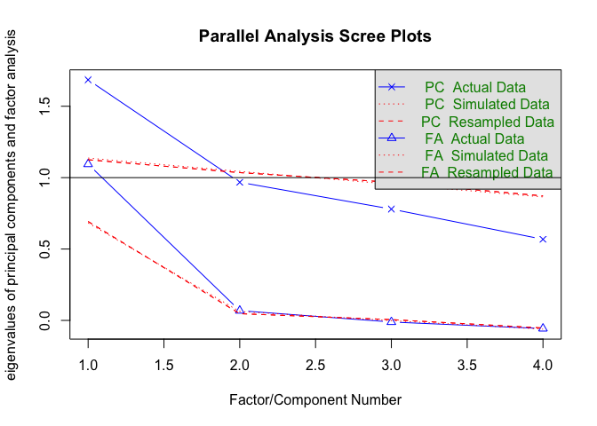
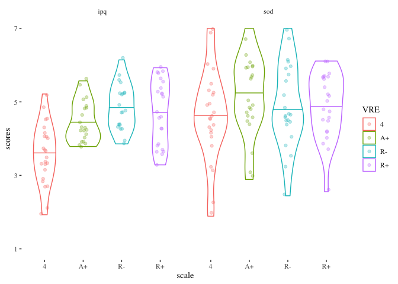
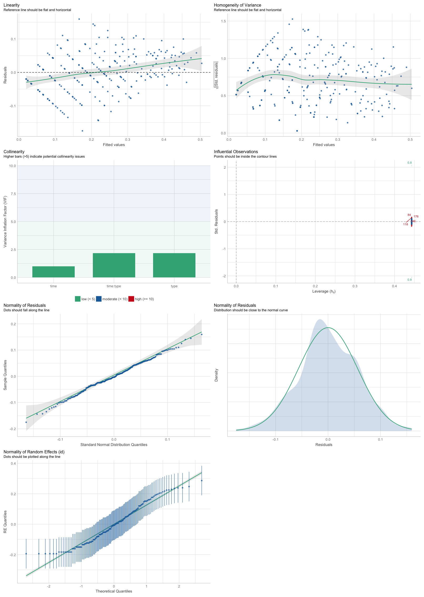
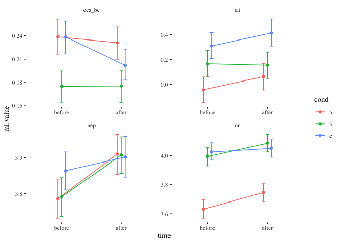

Analysis
================
Stefan P. Thoma
3/10/2020

# Setup

Install / load packages needed:

## Load Data

``` r
data <- read_csv("data/cleanData.csv") 
```

    ## Rows: 284 Columns: 131

    ## ── Column specification ────────────────────────────────────────────────────────
    ## Delimiter: ","
    ## chr    (9): id, sex, condition, Frage1, Frage2, Frage3, Leiter, Anmerkungen,...
    ## dbl  (121): time, iat, ccs1, ccs2, ccs3, ccs4, ccs5, ccs6, ccs7, ccs8, ccs9,...
    ## dttm   (1): StartDate

    ## 
    ## ℹ Use `spec()` to retrieve the full column specification for this data.
    ## ℹ Specify the column types or set `show_col_types = FALSE` to quiet this message.

``` r
data <- data %>% dplyr::select(
  id, time, iat, ccs, nr, nep, ipq, sod, ses, age, edu, sex, pol, vr_exp, vr_eval1, vr_eval2, vr_eval3,
  vr_eval4, vr_eval5, span, seen, condition, starts_with("Frage"), hr_mean, Leiter, Anmerkungen, Zeit
)

head(data)
```

    ## # A tibble: 6 × 29
    ##   id     time    iat   ccs    nr   nep   ipq   sod   ses   age   edu sex     pol
    ##   <chr> <dbl>  <dbl> <dbl> <dbl> <dbl> <dbl> <dbl> <dbl> <dbl> <dbl> <chr> <dbl>
    ## 1 2828…     1  0.179  1.08  3.48  4.07    NA    NA  1.76    54     5 W         3
    ## 2 2828…     2  0.409  1     3.10  4.2     NA    NA  1.71    54     5 W         3
    ## 3 7799…     1 -0.496  1.17  4.14  3.93    NA    NA  1.53    21     4 M         2
    ## 4 7799…     2 -0.362  1.08  4.38  4.27    NA    NA  1.35    21     4 M         2
    ## 5 4379…     1  0.517  1.33  3.43  3.73    NA    NA  1.59    25     5 W         2
    ## 6 4379…     2  0.634  1.33  3.38  3.93    NA    NA  1.53    25     5 W         2
    ## # … with 16 more variables: vr_exp <dbl>, vr_eval1 <dbl>, vr_eval2 <dbl>,
    ## #   vr_eval3 <dbl>, vr_eval4 <dbl>, vr_eval5 <dbl>, span <dbl>, seen <dbl>,
    ## #   condition <chr>, Frage1 <chr>, Frage2 <chr>, Frage3 <chr>, hr_mean <dbl>,
    ## #   Leiter <chr>, Anmerkungen <chr>, Zeit <chr>

``` r
# factor for vr or not
data <- data %>% group_by(id) %>% 
  mutate(
    vr = ifelse(condition %in% c("a", "b", "c"), TRUE, FALSE), 
    condition = factor(condition, levels = c("b", "a", "c", "video", "text.bild", "text"))
  )
```

Keep in mind the conditions coding:

a == abstract

b == realistic

c == realistic but badly so

## Check for multivariate outlier

``` r
# mvoutlier::chisq.plot(data[,c(3:6)])
# [1] 124 162 161  29  54

# removing three most extreme cases
rmId <- data$id[c(124, 161, 162)]

data <- data %>% filter(!id %in% rmId)
```

``` r
data$id[c(142,144,275)]
```

    ## [1] "90811768" "78489627" "04901439"

# Principal component analysis

We try to find an acceptable model for each DV.

First, I would like to calculate a principal component of all dependent
variables (dvs)

``` r
df_env <- data[c("iat", "ccs", "nr", "nep")]
psych::fa.parallel(df_env)
```

<!-- -->

    ## Parallel analysis suggests that the number of factors =  1  and the number of components =  1

``` r
prc_env <- princomp(df_env, cor = TRUE)
# Seems like one factor might just be enough. However, this may be more revealing when done
# on raw data
summary(prc_env)
```

    ## Importance of components:
    ##                           Comp.1    Comp.2    Comp.3    Comp.4
    ## Standard deviation     1.2980576 0.9835519 0.8829992 0.7536475
    ## Proportion of Variance 0.4212384 0.2418436 0.1949219 0.1419962
    ## Cumulative Proportion  0.4212384 0.6630819 0.8580038 1.0000000

``` r
data$env_pc <- prc_env$scores[,1]
```

Unidimensionality could be assumed. The scores of the first principal
component were stored in `data$env_pc`. This vector can now be used as a
dependent variable in further exploratory analyses.

This plot is not very useful I guess. Too crowded.

# Check Intervention

This section is concerned only with the VR conditions a, b, c.
Specifically with the variables vr\_eval 1:5 and with the sod and
presence scale IPQ.

Check for outliers on these scales:

``` r
#check.data <- data %>% dplyr::filter((vr == T & time == 1 ) & !is.na(ipq))
check.data <- data %>% dplyr::filter((time == 1 ) & !is.na(ipq))

#outlier.data <- data %>% ungroup() %>% dplyr::filter(vr == T & time == 1) %>% dplyr::select(starts_with("vr_eval"), sod, ipq) %>%
# drop_na()
#mvoutlier::chisq.plot(check.data %>% ungroup() %>% dplyr::select(starts_with("vr_eval"), sod, ipq))
# remove: 38  1 63
# which corresponds to the ids:
#remove.ids <- check.data$id[c(38,  1, 63)]
# "44466757" "32504483" "80688810"
```

## Plot

``` r
vars <-c("vr_eval1", "vr_eval2", "vr_eval3", "vr_eval4", "vr_eval5", "ipq", "sod")

desc_plot_data <- gather(data, specific, value, vars) %>%
 # filter(!is.na(ipq)) %>%
  arrange(id, specific) %>%
  mutate(specific = ifelse(specific=="vr_eval1", "excitement",
                        ifelse(specific=="vr_eval2", "graphically pleasing",
                               ifelse(specific=="vr_eval3", "pleasant",
                                      ifelse(specific=="vr_eval4", "realistic", 
                                             ifelse(specific=="vr_eval5", "enjoyment", specific))))),
         VRE = ifelse(condition == "b", "R+",
                      ifelse(condition=="c", "R-",
                             ifelse(condition=="a", "A+", condition)))) %>%
  dplyr::select(specific, value, id, VRE)
```

    ## Note: Using an external vector in selections is ambiguous.
    ## ℹ Use `all_of(vars)` instead of `vars` to silence this message.
    ## ℹ See <https://tidyselect.r-lib.org/reference/faq-external-vector.html>.
    ## This message is displayed once per session.

``` r
(vr_eval_plot <- ggplot(data = desc_plot_data, aes(x = VRE, y = value, color = VRE)) +
  facet_wrap( ~specific, nrow = 2)+
  geom_violin(draw_quantiles = .5) + #, position = position_jitterdodge(dodge.width = 0.8, jitter.width = 0, jitter.height = 0))+
  geom_point(alpha = .3, position = "jitter")+#, position = position_jitterdodge(dodge.width = 0, jitter.width = .2, jitter.height = .3)) +
  ggthemes::theme_tufte() +
  ylab("value") +
  xlab("question")+
  #labs(title="Evaluation of Virtual Environments")+
  scale_y_continuous(breaks = c(1,3,5,7)) +
  theme(legend.position = "bottom") )
```

    ## Warning: Removed 304 rows containing non-finite values (stat_ydensity).

    ## Warning: Removed 304 rows containing missing values (geom_point).

<!-- -->

``` r
ipq_sod_plot_data <- gather(data, scale, value, c("ipq", "sod")) %>%
  filter(time==1, condition %in% c("a", "b", "c", "video")) %>%
  arrange(id, scale) %>%
  mutate(VRE = ifelse(condition == "b", "R+",
                      ifelse(condition=="c", "R-", 
                             ifelse(condition == "a", "A+", condition)))) %>%
  dplyr::select(scale, value, id, VRE)


ipq_sod_plot <- ggplot(data = ipq_sod_plot_data, aes(x = VRE, y = value, color = VRE)) +
  facet_wrap(~scale, ncol = 2)+
  geom_violin(draw_quantiles = .5, position = position_jitterdodge(dodge.width = 0.8, jitter.width = 0, jitter.height = 0))+
  geom_point(alpha = .3, position = position_jitterdodge(dodge.width = 0.8, jitter.width = .2, jitter.height = .1)) +
  ggthemes::theme_tufte() +
  ylab("scores") +
  xlab("scale")+
  #labs(title="Presence (IPQ) and Suspension of Disbelief (SOD)")+
  scale_y_continuous(breaks = c(1,3,5,7), limits = c(1,7)); ipq_sod_plot
```

    ## Warning: Removed 4 rows containing non-finite values (stat_ydensity).

    ## Warning: Removed 5 rows containing missing values (geom_point).

<!-- -->

# HLM

So we will create two models for each dependent variables:

First, the model will have the formula:

`dv ~ condition * time + (time | id)`

This will be simplified to the following model if model fit is singular:

`dv ~ condition * time + (1 | id)`

This will estimate a random intercept for each participant. This model
will only take as input the vr conditions (`a`, `b` & `c`), or:
`vr == TRUE`.

The second model will have the formula:

`dv ~ vr * time + (time | condition) + (1 | id)`

Where a random slope for time is estimated per condition. Further, there
is a random intercept per condition, and per id.

Should model fit be singular, we would simplify the model to:

`dv ~ vr * time + (1 | condition) + (1 | id)`

If still singular, we would simplify to:

`dv ~ vr * time + (1 | id)`

## Helping function

``` r
fit.lme <- function(form, dat){
  lme4::lmer(formula = form, data = dat)
}
```

``` r
fit_models <- function(dv, dat){
# this function returns a function which fits a model based on a formula minus the predictors. 
# This function can be used in the next function which implements the conditions for reducing model complexity if model fit is singular.
  
  function(predictors){
    form <- formula(paste(dv, predictors, sep = " ~ "))
    print(form)
    fit <- fit.lme(form = form, dat = dat)
  }
}
```

``` r
predictors.vr <-  c("condition * time + (time | id)", "condition * time + (1 | id)")
predictors.all <- c("vr * time + (time | condition) + (1 | id)", "vr * time + (-1 + time | condition) + (1 | id)", "vr * time + (1 | id)")
predictors.all2 <- c("vr * time + (time | condition) + (1 | id)", "vr * time + (1 | condition) + (1 | id)", "vr * time + (1 | id)")
# function to fit various models based on different inputs of predictors
fit_many <- function(pred.vector, dat, dv){
  fit_model <- fit_models(dv, dat)
  
  sing <- TRUE
  i <- 1
  while((sing) & i<=length(pred.vector)){
    model <- try(fit_model(pred.vector[i])) 
    
    if(class(model)!="try-error"){
      sing <- isSingular(model)
    } 
    
    i <- i + 1
  }
  print(paste("is model singular: ", sing))
  model
}
```

Vector containing name of all dv’s

``` r
dvs <-  c("iat", "ccs", "nr", "nep", "env_pc")
```

## Initial model fitting

``` r
# split data frame:
data.vr <- data %>% filter(vr) 
```

``` r
vr.models <- lapply(dvs, FUN = function(dv) fit_many(pred.vector = predictors.vr, dat = data.vr, dv = dv))
```

    ## iat ~ condition * time + (time | id)
    ## <environment: 0x7faf8f2a77e0>
    ## Error : number of observations (=138) <= number of random effects (=138) for term (time | id); the random-effects parameters and the residual variance (or scale parameter) are probably unidentifiable
    ## iat ~ condition * time + (1 | id)
    ## <environment: 0x7faf9e85d938>
    ## [1] "is model singular:  FALSE"
    ## ccs ~ condition * time + (time | id)
    ## <environment: 0x7fafaa5e1b70>
    ## Error : number of observations (=138) <= number of random effects (=138) for term (time | id); the random-effects parameters and the residual variance (or scale parameter) are probably unidentifiable
    ## ccs ~ condition * time + (1 | id)
    ## <environment: 0x7fafa8f18320>
    ## [1] "is model singular:  FALSE"
    ## nr ~ condition * time + (time | id)
    ## <environment: 0x7faffa443a70>
    ## Error : number of observations (=138) <= number of random effects (=138) for term (time | id); the random-effects parameters and the residual variance (or scale parameter) are probably unidentifiable
    ## nr ~ condition * time + (1 | id)
    ## <environment: 0x7faffe1e7900>
    ## [1] "is model singular:  FALSE"
    ## nep ~ condition * time + (time | id)
    ## <environment: 0x7faffbaeabe0>
    ## Error : number of observations (=138) <= number of random effects (=138) for term (time | id); the random-effects parameters and the residual variance (or scale parameter) are probably unidentifiable
    ## nep ~ condition * time + (1 | id)
    ## <environment: 0x7faffb863970>
    ## [1] "is model singular:  FALSE"
    ## env_pc ~ condition * time + (time | id)
    ## <environment: 0x7faff95dbe60>
    ## Error : number of observations (=138) <= number of random effects (=138) for term (time | id); the random-effects parameters and the residual variance (or scale parameter) are probably unidentifiable
    ## env_pc ~ condition * time + (1 | id)
    ## <environment: 0x7faff92b2cf8>
    ## [1] "is model singular:  FALSE"

``` r
all.models  <-  lapply(dvs, FUN = function(dv) fit_many(pred.vector = predictors.all, dat = data, dv = dv))
```

    ## iat ~ vr * time + (time | condition) + (1 | id)
    ## <environment: 0x7fafe87893c8>

    ## boundary (singular) fit: see ?isSingular

    ## iat ~ vr * time + (-1 + time | condition) + (1 | id)
    ## <environment: 0x7fafe9582f10>
    ## [1] "is model singular:  FALSE"
    ## ccs ~ vr * time + (time | condition) + (1 | id)
    ## <environment: 0x7faf8eba2f98>

    ## boundary (singular) fit: see ?isSingular

    ## ccs ~ vr * time + (-1 + time | condition) + (1 | id)
    ## <environment: 0x7faf8dea09b0>

    ## boundary (singular) fit: see ?isSingular

    ## ccs ~ vr * time + (1 | id)
    ## <environment: 0x7faf8c98c130>
    ## [1] "is model singular:  FALSE"
    ## nr ~ vr * time + (time | condition) + (1 | id)
    ## <environment: 0x7faf8d6d69e8>

    ## boundary (singular) fit: see ?isSingular

    ## nr ~ vr * time + (-1 + time | condition) + (1 | id)
    ## <environment: 0x7fafa92a3b88>
    ## [1] "is model singular:  FALSE"
    ## nep ~ vr * time + (time | condition) + (1 | id)
    ## <environment: 0x7fafa91df1a0>

    ## boundary (singular) fit: see ?isSingular

    ## nep ~ vr * time + (-1 + time | condition) + (1 | id)
    ## <environment: 0x7fb00969b010>
    ## [1] "is model singular:  FALSE"
    ## env_pc ~ vr * time + (time | condition) + (1 | id)
    ## <environment: 0x7fafa9c53158>

    ## boundary (singular) fit: see ?isSingular

    ## env_pc ~ vr * time + (-1 + time | condition) + (1 | id)
    ## <environment: 0x7fb008dcf070>

    ## boundary (singular) fit: see ?isSingular

    ## env_pc ~ vr * time + (1 | id)
    ## <environment: 0x7faf8edb13c8>
    ## [1] "is model singular:  FALSE"

## Model diagnostics

I save model diagnostics as pdfs separately, for visibility reasons.

``` r
plot_diagn <- function(model){
  
  filename <- paste( model@call$formula[2], sub("\\ .*", "", model@call$formula[3]), sep = "_")
  png(filename = paste("analysisOutputs/diagnostics/", filename, ".png", sep = ""),   # The directory you want to save the file in
    #paper = "a3",
    height = 5900/4,
    width = 4200/4
    )

  print(performance::check_model(model)  )

  dev.off()
}
```

``` r
lapply(vr.models, FUN = plot_diagn)
```

    ## [[1]]
    ## quartz_off_screen 
    ##                 2 
    ## 
    ## [[2]]
    ## quartz_off_screen 
    ##                 2 
    ## 
    ## [[3]]
    ## quartz_off_screen 
    ##                 2 
    ## 
    ## [[4]]
    ## quartz_off_screen 
    ##                 2 
    ## 
    ## [[5]]
    ## quartz_off_screen 
    ##                 2

``` r
lapply(all.models, FUN = plot_diagn)
```

    ## [[1]]
    ## quartz_off_screen 
    ##                 2 
    ## 
    ## [[2]]
    ## quartz_off_screen 
    ##                 2 
    ## 
    ## [[3]]
    ## quartz_off_screen 
    ##                 2 
    ## 
    ## [[4]]
    ## quartz_off_screen 
    ##                 2 
    ## 
    ## [[5]]
    ## quartz_off_screen 
    ##                 2

I focus model diagnostic on the vr models. They include all data.
Residuals are slightly left skewed. However, this does not yet warrant a
transformation of the dv in my opinion.

### IAT

<div class="figure" style="text-align: center">


<p class="caption">
iat\_vr\_diagnostics
</p>

</div>

Some thoughts: Band of residuals increases as fitted values increase.
Homogeneity of variance seems acceptable. Random effects appear normal.

### CCS

<div class="figure" style="text-align: center">


<p class="caption">
ccs\_vr\_diagnostics
</p>

</div>

Some thoughts: Homogeneity of variance appears implausible. Residual
variance increases with larger fitted values.

Residuals are also not normally distributed. Random effects do not
appear normal.

The reason for this unexpected behaviour may well be the floor-effect of
the dv ccs. There was generally a very low ccs score for participants.
This is due to the relatively extreme nature of climate change
scepticism, especially in a relatively well educated sample.

Maybe a boxcox transformation may help:

``` r
#estimate lambda of the boxcox transformation
bc <- boxcox(ccs ~ vr * time, data = data)
```

<!-- -->

``` r
lambda_ccs <- bc$x[which.max(bc$y)]

# transform data according to the transformation
data <- data %>% 
  mutate(ccs_bc = (ccs^lambda_ccs-1)/lambda_ccs)


# refit the model
all.ccs2 <- fit_many(pred.vector = predictors.all, dat = data, dv = "ccs_bc")
```

    ## ccs_bc ~ vr * time + (time | condition) + (1 | id)
    ## <environment: 0x7fafa9b1bb00>

    ## boundary (singular) fit: see ?isSingular

    ## ccs_bc ~ vr * time + (-1 + time | condition) + (1 | id)
    ## <environment: 0x7fb008177510>

    ## boundary (singular) fit: see ?isSingular

    ## ccs_bc ~ vr * time + (1 | id)
    ## <environment: 0x7faffa5ab0b8>
    ## [1] "is model singular:  FALSE"

``` r
performance::check_model(all.ccs2)
```

<!-- -->

The situation has improved! All model assumptions appear plausible.

``` r
all.models[[2]] <- all.ccs2
```

For within the VE:

<div class="figure" style="text-align: center">


<p class="caption">
ccs\_condition\_diagnostics
</p>

</div>

And based on the transformed ccs:

``` r
data.vr <- data.vr %>% 
  mutate(ccs_bc = (ccs^lambda_ccs-1)/lambda_ccs)

vr.ccs2 <- fit_many(pred.vector = predictors.vr, dat = data.vr, dv = "ccs_bc")
```

    ## ccs_bc ~ condition * time + (time | id)
    ## <environment: 0x7faffa473568>
    ## Error : number of observations (=138) <= number of random effects (=138) for term (time | id); the random-effects parameters and the residual variance (or scale parameter) are probably unidentifiable
    ## ccs_bc ~ condition * time + (1 | id)
    ## <environment: 0x7faffe16eb20>
    ## [1] "is model singular:  FALSE"

``` r
performance::check_model(vr.ccs2)
```

<!-- -->

``` r
vr.models[[2]] <- vr.ccs2
```

### NR

<div class="figure" style="text-align: center">


<p class="caption">
nr\_vr\_diagnostics
</p>

</div>

Model assumptions are not too far off: Slight slope in the “fitted vs
residuals”. Homogeneity assumption is appropriate. Residual distribution
is slightly skewed with a heavy left tail. ID intercept distribution is
not quite normal, but not far from it. Slightly skewed as well.

Overall assumptions seem acceptable and warrant no further action.

### NEP

<div class="figure" style="text-align: center">


<p class="caption">
nep\_vr\_diagnostics
</p>

</div>

Model assumptions are not too far off: Slight slope in the “fitted vs
residuals”. Residuals appear normally distributed, slightly skewed to
the right.

Overall assumptions seem acceptable and warrant no further action.

### Principal component

<div class="figure" style="text-align: center">


<p class="caption">
env\_pc\_vr\_diagnostics
</p>

</div>

``` r
min(data$env_pc)
```

    ## [1] -4.954711

``` r
data$env_pc2 <- data$env_pc + 6

#estimate lambda of the boxcox transformation
bc <- boxcox(env_pc2 ~ vr * time, data = data)
```

<!-- -->

``` r
lambda_pc <- bc$x[which.max(bc$y)]

# transform data according to the transformation
data <- data %>% 
  mutate(env_pc_bc = (env_pc2^lambda_pc-1)/lambda_pc)


# refit the model
all.env_pc2 <- fit_many(pred.vector = predictors.all, dat = data, dv = "env_pc_bc")
```

    ## env_pc_bc ~ vr * time + (time | condition) + (1 | id)
    ## <environment: 0x7fb00926fd20>

    ## boundary (singular) fit: see ?isSingular

    ## env_pc_bc ~ vr * time + (-1 + time | condition) + (1 | id)
    ## <environment: 0x7faf9969f0e8>

    ## boundary (singular) fit: see ?isSingular

    ## env_pc_bc ~ vr * time + (1 | id)
    ## <environment: 0x7fafa8282028>
    ## [1] "is model singular:  FALSE"

``` r
performance::check_model(all.env_pc2)
```

<!-- -->

Transformation does not help much here. Lets not do it.

But let us save the final model diagnostics plots as well.

``` r
lapply(vr.models, FUN = plot_diagn)
```

    ## [[1]]
    ## quartz_off_screen 
    ##                 2 
    ## 
    ## [[2]]
    ## quartz_off_screen 
    ##                 2 
    ## 
    ## [[3]]
    ## quartz_off_screen 
    ##                 2 
    ## 
    ## [[4]]
    ## quartz_off_screen 
    ##                 2 
    ## 
    ## [[5]]
    ## quartz_off_screen 
    ##                 2

``` r
lapply(all.models, FUN = plot_diagn)
```

    ## [[1]]
    ## quartz_off_screen 
    ##                 2 
    ## 
    ## [[2]]
    ## quartz_off_screen 
    ##                 2 
    ## 
    ## [[3]]
    ## quartz_off_screen 
    ##                 2 
    ## 
    ## [[4]]
    ## quartz_off_screen 
    ##                 2 
    ## 
    ## [[5]]
    ## quartz_off_screen 
    ##                 2

## Inference

### vr vs control

``` r
lapply(vr.models, FUN = lmerTest:::summary.lmerModLmerTest)
```

    ## Coercing object to class 'lmerModLmerTest'
    ## Coercing object to class 'lmerModLmerTest'
    ## Coercing object to class 'lmerModLmerTest'
    ## Coercing object to class 'lmerModLmerTest'
    ## Coercing object to class 'lmerModLmerTest'

    ## [[1]]
    ## Linear mixed model fit by REML. t-tests use Satterthwaite's method [
    ## lmerModLmerTest]
    ## Formula: iat ~ condition * time + (1 | id)
    ##    Data: dat
    ## 
    ## REML criterion at convergence: 173.2
    ## 
    ## Scaled residuals: 
    ##      Min       1Q   Median       3Q      Max 
    ## -2.60384 -0.59622 -0.01456  0.55523  1.93986 
    ## 
    ## Random effects:
    ##  Groups   Name        Variance Std.Dev.
    ##  id       (Intercept) 0.1132   0.3365  
    ##  Residual             0.1068   0.3268  
    ## Number of obs: 138, groups:  id, 69
    ## 
    ## Fixed effects:
    ##                  Estimate Std. Error        df t value Pr(>|t|)
    ## (Intercept)       0.17718    0.16773 106.85910   1.056    0.293
    ## conditiona       -0.32465    0.23721 106.85910  -1.369    0.174
    ## conditionc        0.02806    0.23721 106.85910   0.118    0.906
    ## time             -0.01191    0.09636  66.00000  -0.124    0.902
    ## conditiona:time   0.11634    0.13627  66.00000   0.854    0.396
    ## conditionc:time   0.11535    0.13627  66.00000   0.846    0.400
    ## 
    ## Correlation of Fixed Effects:
    ##             (Intr) condtn cndtnc time   cndtn:t
    ## conditiona  -0.707                             
    ## conditionc  -0.707  0.500                      
    ## time        -0.862  0.609  0.609               
    ## conditin:tm  0.609 -0.862 -0.431 -0.707        
    ## conditnc:tm  0.609 -0.431 -0.862 -0.707  0.500 
    ## 
    ## [[2]]
    ## Linear mixed model fit by REML. t-tests use Satterthwaite's method [
    ## lmerModLmerTest]
    ## Formula: ccs_bc ~ condition * time + (1 | id)
    ##    Data: dat
    ## 
    ## REML criterion at convergence: -153.9
    ## 
    ## Scaled residuals: 
    ##      Min       1Q   Median       3Q      Max 
    ## -1.88848 -0.39218 -0.03104  0.48900  1.99181 
    ## 
    ## Random effects:
    ##  Groups   Name        Variance Std.Dev.
    ##  id       (Intercept) 0.022653 0.15051 
    ##  Residual             0.004976 0.07054 
    ## Number of obs: 138, groups:  id, 69
    ## 
    ## Fixed effects:
    ##                   Estimate Std. Error         df t value Pr(>|t|)    
    ## (Intercept)      1.747e-01  4.546e-02  1.316e+02   3.844 0.000188 ***
    ## conditiona       7.150e-02  6.429e-02  1.316e+02   1.112 0.268108    
    ## conditionc       1.003e-01  6.429e-02  1.316e+02   1.561 0.120977    
    ## time             4.354e-04  2.080e-02  6.600e+01   0.021 0.983363    
    ## conditiona:time -8.028e-03  2.942e-02  6.600e+01  -0.273 0.785799    
    ## conditionc:time -3.700e-02  2.942e-02  6.600e+01  -1.258 0.212892    
    ## ---
    ## Signif. codes:  0 '***' 0.001 '**' 0.01 '*' 0.05 '.' 0.1 ' ' 1
    ## 
    ## Correlation of Fixed Effects:
    ##             (Intr) condtn cndtnc time   cndtn:t
    ## conditiona  -0.707                             
    ## conditionc  -0.707  0.500                      
    ## time        -0.686  0.485  0.485               
    ## conditin:tm  0.485 -0.686 -0.343 -0.707        
    ## conditnc:tm  0.485 -0.343 -0.686 -0.707  0.500 
    ## 
    ## [[3]]
    ## Linear mixed model fit by REML. t-tests use Satterthwaite's method [
    ## lmerModLmerTest]
    ## Formula: nr ~ condition * time + (1 | id)
    ##    Data: dat
    ## 
    ## REML criterion at convergence: 98.5
    ## 
    ## Scaled residuals: 
    ##      Min       1Q   Median       3Q      Max 
    ## -1.74225 -0.50265 -0.03626  0.54439  1.71416 
    ## 
    ## Random effects:
    ##  Groups   Name        Variance Std.Dev.
    ##  id       (Intercept) 0.11846  0.3442  
    ##  Residual             0.04125  0.2031  
    ## Number of obs: 138, groups:  id, 69
    ## 
    ## Fixed effects:
    ##                  Estimate Std. Error        df t value Pr(>|t|)    
    ## (Intercept)       3.90269    0.11882 129.34427  32.847   <2e-16 ***
    ## conditiona       -0.38509    0.16803 129.34427  -2.292   0.0235 *  
    ## conditionc        0.09731    0.16803 129.34427   0.579   0.5635    
    ## time              0.09110    0.05989  66.00000   1.521   0.1330    
    ## conditiona:time   0.02277    0.08470  66.00000   0.269   0.7888    
    ## conditionc:time  -0.06625    0.08470  66.00000  -0.782   0.4369    
    ## ---
    ## Signif. codes:  0 '***' 0.001 '**' 0.01 '*' 0.05 '.' 0.1 ' ' 1
    ## 
    ## Correlation of Fixed Effects:
    ##             (Intr) condtn cndtnc time   cndtn:t
    ## conditiona  -0.707                             
    ## conditionc  -0.707  0.500                      
    ## time        -0.756  0.535  0.535               
    ## conditin:tm  0.535 -0.756 -0.378 -0.707        
    ## conditnc:tm  0.535 -0.378 -0.756 -0.707  0.500 
    ## 
    ## [[4]]
    ## Linear mixed model fit by REML. t-tests use Satterthwaite's method [
    ## lmerModLmerTest]
    ## Formula: nep ~ condition * time + (1 | id)
    ##    Data: dat
    ## 
    ## REML criterion at convergence: 93.9
    ## 
    ## Scaled residuals: 
    ##      Min       1Q   Median       3Q      Max 
    ## -1.32935 -0.59590 -0.04369  0.49713  1.85313 
    ## 
    ## Random effects:
    ##  Groups   Name        Variance Std.Dev.
    ##  id       (Intercept) 0.13842  0.3721  
    ##  Residual             0.03437  0.1854  
    ## Number of obs: 138, groups:  id, 69
    ## 
    ## Fixed effects:
    ##                   Estimate Std. Error         df t value Pr(>|t|)    
    ## (Intercept)       3.675362   0.116144 131.998743  31.645   <2e-16 ***
    ## conditiona       -0.014493   0.164253 131.998743  -0.088   0.9298    
    ## conditionc        0.150725   0.164253 131.998743   0.918   0.3605    
    ## time              0.115942   0.054666  66.000003   2.121   0.0377 *  
    ## conditiona:time   0.008696   0.077310  66.000003   0.112   0.9108    
    ## conditionc:time  -0.078261   0.077310  66.000003  -1.012   0.3151    
    ## ---
    ## Signif. codes:  0 '***' 0.001 '**' 0.01 '*' 0.05 '.' 0.1 ' ' 1
    ## 
    ## Correlation of Fixed Effects:
    ##             (Intr) condtn cndtnc time   cndtn:t
    ## conditiona  -0.707                             
    ## conditionc  -0.707  0.500                      
    ## time        -0.706  0.499  0.499               
    ## conditin:tm  0.499 -0.706 -0.353 -0.707        
    ## conditnc:tm  0.499 -0.353 -0.706 -0.707  0.500 
    ## 
    ## [[5]]
    ## Linear mixed model fit by REML. t-tests use Satterthwaite's method [
    ## lmerModLmerTest]
    ## Formula: env_pc ~ condition * time + (1 | id)
    ##    Data: dat
    ## 
    ## REML criterion at convergence: 367.7
    ## 
    ## Scaled residuals: 
    ##      Min       1Q   Median       3Q      Max 
    ## -1.61435 -0.42168  0.01546  0.43108  1.86555 
    ## 
    ## Random effects:
    ##  Groups   Name        Variance Std.Dev.
    ##  id       (Intercept) 1.2457   1.1161  
    ##  Residual             0.2474   0.4974  
    ## Number of obs: 138, groups:  id, 69
    ## 
    ## Fixed effects:
    ##                  Estimate Std. Error        df t value Pr(>|t|)  
    ## (Intercept)      -0.16537    0.32856 130.61147  -0.503   0.6156  
    ## conditiona       -0.74721    0.46465 130.61147  -1.608   0.1102  
    ## conditionc        0.10299    0.46465 130.61147   0.222   0.8249  
    ## time              0.25199    0.14668  66.00000   1.718   0.0905 .
    ## conditiona:time   0.07992    0.20744  66.00000   0.385   0.7013  
    ## conditionc:time  -0.05075    0.20744  66.00000  -0.245   0.8075  
    ## ---
    ## Signif. codes:  0 '***' 0.001 '**' 0.01 '*' 0.05 '.' 0.1 ' ' 1
    ## 
    ## Correlation of Fixed Effects:
    ##             (Intr) condtn cndtnc time   cndtn:t
    ## conditiona  -0.707                             
    ## conditionc  -0.707  0.500                      
    ## time        -0.670  0.474  0.474               
    ## conditin:tm  0.474 -0.670 -0.335 -0.707        
    ## conditnc:tm  0.474 -0.335 -0.670 -0.707  0.500

contrast analysis:

``` r
# iat
contrast( emmeans(vr.models[[1]],  ~ time | condition))
```

    ## condition = b:
    ##  contrast estimate     SE df t.ratio p.value
    ##  1 effect  0.00595 0.0482 66   0.124  0.9020
    ##  2 effect -0.00595 0.0482 66  -0.124  0.9020
    ## 
    ## condition = a:
    ##  contrast estimate     SE df t.ratio p.value
    ##  1 effect -0.05221 0.0482 66  -1.084  0.2824
    ##  2 effect  0.05221 0.0482 66   1.084  0.2824
    ## 
    ## condition = c:
    ##  contrast estimate     SE df t.ratio p.value
    ##  1 effect -0.05172 0.0482 66  -1.073  0.2870
    ##  2 effect  0.05172 0.0482 66   1.073  0.2870
    ## 
    ## Degrees-of-freedom method: kenward-roger 
    ## P value adjustment: fdr method for 2 tests

``` r
# ccs
contrast( emmeans(vr.models[[2]],  ~ time | condition))
```

    ## condition = b:
    ##  contrast  estimate     SE df t.ratio p.value
    ##  1 effect -0.000218 0.0104 66  -0.021  0.9834
    ##  2 effect  0.000218 0.0104 66   0.021  0.9834
    ## 
    ## condition = a:
    ##  contrast  estimate     SE df t.ratio p.value
    ##  1 effect  0.003796 0.0104 66   0.365  0.7163
    ##  2 effect -0.003796 0.0104 66  -0.365  0.7163
    ## 
    ## condition = c:
    ##  contrast  estimate     SE df t.ratio p.value
    ##  1 effect  0.018284 0.0104 66   1.758  0.0834
    ##  2 effect -0.018284 0.0104 66  -1.758  0.0834
    ## 
    ## Degrees-of-freedom method: kenward-roger 
    ## P value adjustment: fdr method for 2 tests

``` r
# nr
contrast( emmeans(vr.models[[3]],  ~ time | condition))
```

    ## condition = b:
    ##  contrast estimate     SE df t.ratio p.value
    ##  1 effect  -0.0455 0.0299 66  -1.521  0.1330
    ##  2 effect   0.0455 0.0299 66   1.521  0.1330
    ## 
    ## condition = a:
    ##  contrast estimate     SE df t.ratio p.value
    ##  1 effect  -0.0569 0.0299 66  -1.901  0.0616
    ##  2 effect   0.0569 0.0299 66   1.901  0.0616
    ## 
    ## condition = c:
    ##  contrast estimate     SE df t.ratio p.value
    ##  1 effect  -0.0124 0.0299 66  -0.415  0.6796
    ##  2 effect   0.0124 0.0299 66   0.415  0.6796
    ## 
    ## Degrees-of-freedom method: kenward-roger 
    ## P value adjustment: fdr method for 2 tests

``` r
# nep
contrast( emmeans(vr.models[[4]],  ~ time | condition))
```

    ## condition = b:
    ##  contrast estimate     SE df t.ratio p.value
    ##  1 effect  -0.0580 0.0273 66  -2.121  0.0377
    ##  2 effect   0.0580 0.0273 66   2.121  0.0377
    ## 
    ## condition = a:
    ##  contrast estimate     SE df t.ratio p.value
    ##  1 effect  -0.0623 0.0273 66  -2.280  0.0258
    ##  2 effect   0.0623 0.0273 66   2.280  0.0258
    ## 
    ## condition = c:
    ##  contrast estimate     SE df t.ratio p.value
    ##  1 effect  -0.0188 0.0273 66  -0.689  0.4931
    ##  2 effect   0.0188 0.0273 66   0.689  0.4931
    ## 
    ## Degrees-of-freedom method: kenward-roger 
    ## P value adjustment: fdr method for 2 tests

### Within the VEs (condition)

``` r
lapply(all.models, FUN = lmerTest:::summary.lmerModLmerTest)
```

    ## Coercing object to class 'lmerModLmerTest'
    ## Coercing object to class 'lmerModLmerTest'
    ## Coercing object to class 'lmerModLmerTest'
    ## Coercing object to class 'lmerModLmerTest'
    ## Coercing object to class 'lmerModLmerTest'

    ## [[1]]
    ## Linear mixed model fit by REML. t-tests use Satterthwaite's method [
    ## lmerModLmerTest]
    ## Formula: iat ~ vr * time + (-1 + time | condition) + (1 | id)
    ##    Data: dat
    ## 
    ## REML criterion at convergence: 312.4
    ## 
    ## Scaled residuals: 
    ##      Min       1Q   Median       3Q      Max 
    ## -3.00917 -0.60925  0.02082  0.59421  2.05824 
    ## 
    ## Random effects:
    ##  Groups    Name        Variance Std.Dev.
    ##  id        (Intercept) 0.098991 0.31463 
    ##  condition time        0.002013 0.04486 
    ##  Residual              0.094707 0.30775 
    ## Number of obs: 284, groups:  id, 142; condition, 6
    ## 
    ## Fixed effects:
    ##              Estimate Std. Error        df t value Pr(>|t|)    
    ## (Intercept)   0.38251    0.08856 225.15572   4.319 2.35e-05 ***
    ## vrTRUE       -0.30420    0.12704 225.15572  -2.394   0.0175 *  
    ## time         -0.08398    0.05715  19.60552  -1.470   0.1575    
    ## vrTRUE:time   0.14930    0.08174  20.39708   1.827   0.0824 .  
    ## ---
    ## Signif. codes:  0 '***' 0.001 '**' 0.01 '*' 0.05 '.' 0.1 ' ' 1
    ## 
    ## Correlation of Fixed Effects:
    ##             (Intr) vrTRUE time  
    ## vrTRUE      -0.697              
    ## time        -0.769  0.536       
    ## vrTRUE:time  0.538 -0.771 -0.699
    ## 
    ## [[2]]
    ## Linear mixed model fit by REML. t-tests use Satterthwaite's method [
    ## lmerModLmerTest]
    ## Formula: ccs_bc ~ vr * time + (1 | id)
    ##    Data: dat
    ## 
    ## REML criterion at convergence: -351.8
    ## 
    ## Scaled residuals: 
    ##      Min       1Q   Median       3Q      Max 
    ## -2.33016 -0.44377 -0.04596  0.56783  2.12335 
    ## 
    ## Random effects:
    ##  Groups   Name        Variance Std.Dev.
    ##  id       (Intercept) 0.018962 0.13770 
    ##  Residual             0.005645 0.07513 
    ## Number of obs: 284, groups:  id, 142
    ## 
    ## Fixed effects:
    ##               Estimate Std. Error         df t value Pr(>|t|)    
    ## (Intercept)   0.236218   0.025424 278.363625   9.291   <2e-16 ***
    ## vrTRUE       -0.004193   0.036472 278.363625  -0.115    0.909    
    ## time         -0.008953   0.012436 140.000002  -0.720    0.473    
    ## vrTRUE:time  -0.005622   0.017840 140.000002  -0.315    0.753    
    ## ---
    ## Signif. codes:  0 '***' 0.001 '**' 0.01 '*' 0.05 '.' 0.1 ' ' 1
    ## 
    ## Correlation of Fixed Effects:
    ##             (Intr) vrTRUE time  
    ## vrTRUE      -0.697              
    ## time        -0.734  0.511       
    ## vrTRUE:time  0.511 -0.734 -0.697
    ## 
    ## [[3]]
    ## Linear mixed model fit by REML. t-tests use Satterthwaite's method [
    ## lmerModLmerTest]
    ## Formula: nr ~ vr * time + (-1 + time | condition) + (1 | id)
    ##    Data: dat
    ## 
    ## REML criterion at convergence: 262.6
    ## 
    ## Scaled residuals: 
    ##      Min       1Q   Median       3Q      Max 
    ## -2.59554 -0.44842  0.02171  0.48568  1.76425 
    ## 
    ## Random effects:
    ##  Groups    Name        Variance  Std.Dev.
    ##  id        (Intercept) 0.2263312 0.47574 
    ##  condition time        0.0003591 0.01895 
    ##  Residual              0.0400008 0.20000 
    ## Number of obs: 284, groups:  id, 142; condition, 6
    ## 
    ## Fixed effects:
    ##               Estimate Std. Error         df t value Pr(>|t|)    
    ## (Intercept)   3.828441   0.076421 268.099977  50.097   <2e-16 ***
    ## vrTRUE       -0.021678   0.109631 268.099978  -0.198    0.843    
    ## time         -0.001225   0.034866   9.120707  -0.035    0.973    
    ## vrTRUE:time   0.077830   0.049948   9.573006   1.558    0.152    
    ## ---
    ## Signif. codes:  0 '***' 0.001 '**' 0.01 '*' 0.05 '.' 0.1 ' ' 1
    ## 
    ## Correlation of Fixed Effects:
    ##             (Intr) vrTRUE time  
    ## vrTRUE      -0.697              
    ## time        -0.617  0.430       
    ## vrTRUE:time  0.431 -0.618 -0.698
    ## 
    ## [[4]]
    ## Linear mixed model fit by REML. t-tests use Satterthwaite's method [
    ## lmerModLmerTest]
    ## Formula: nep ~ vr * time + (-1 + time | condition) + (1 | id)
    ##    Data: dat
    ## 
    ## REML criterion at convergence: 184.7
    ## 
    ## Scaled residuals: 
    ##      Min       1Q   Median       3Q      Max 
    ## -2.13567 -0.52383 -0.01767  0.49178  2.18200 
    ## 
    ## Random effects:
    ##  Groups    Name        Variance  Std.Dev.
    ##  id        (Intercept) 0.1427876 0.37787 
    ##  condition time        0.0001482 0.01217 
    ##  Residual              0.0352898 0.18786 
    ## Number of obs: 284, groups:  id, 142; condition, 6
    ## 
    ## Fixed effects:
    ##              Estimate Std. Error        df t value Pr(>|t|)    
    ## (Intercept)   3.79087    0.06613 276.21351  57.325   <2e-16 ***
    ## vrTRUE       -0.07009    0.09487 276.21351  -0.739    0.461    
    ## time          0.05487    0.03188  14.13761   1.721    0.107    
    ## vrTRUE:time   0.03788    0.04570  14.88848   0.829    0.420    
    ## ---
    ## Signif. codes:  0 '***' 0.001 '**' 0.01 '*' 0.05 '.' 0.1 ' ' 1
    ## 
    ## Correlation of Fixed Effects:
    ##             (Intr) vrTRUE time  
    ## vrTRUE      -0.697              
    ## time        -0.688  0.480       
    ## vrTRUE:time  0.480 -0.688 -0.698
    ## 
    ## [[5]]
    ## Linear mixed model fit by REML. t-tests use Satterthwaite's method [
    ## lmerModLmerTest]
    ## Formula: env_pc ~ vr * time + (1 | id)
    ##    Data: dat
    ## 
    ## REML criterion at convergence: 766.2
    ## 
    ## Scaled residuals: 
    ##      Min       1Q   Median       3Q      Max 
    ## -2.33852 -0.41115  0.01461  0.44995  1.90160 
    ## 
    ## Random effects:
    ##  Groups   Name        Variance Std.Dev.
    ##  id       (Intercept) 1.4722   1.2133  
    ##  Residual             0.2278   0.4773  
    ## Number of obs: 284, groups:  id, 142
    ## 
    ## Fixed effects:
    ##              Estimate Std. Error        df t value Pr(>|t|)  
    ## (Intercept)  -0.09543    0.18914 267.65387  -0.505   0.6143  
    ## vrTRUE       -0.28468    0.27133 267.65387  -1.049   0.2950  
    ## time          0.05577    0.07901 140.00000   0.706   0.4815  
    ## vrTRUE:time   0.20595    0.11334 140.00000   1.817   0.0713 .
    ## ---
    ## Signif. codes:  0 '***' 0.001 '**' 0.01 '*' 0.05 '.' 0.1 ' ' 1
    ## 
    ## Correlation of Fixed Effects:
    ##             (Intr) vrTRUE time  
    ## vrTRUE      -0.697              
    ## time        -0.627  0.437       
    ## vrTRUE:time  0.437 -0.627 -0.697

Follow up tests:

``` r
# iat
contrast( emmeans(all.models[[1]],  ~ time | vr))
```

    ## vr = FALSE:
    ##  contrast estimate     SE   df t.ratio p.value
    ##  1 effect   0.0420 0.0286 21.2   1.470  0.1563
    ##  2 effect  -0.0420 0.0286 21.2  -1.470  0.1563
    ## 
    ## vr =  TRUE:
    ##  contrast estimate     SE   df t.ratio p.value
    ##  1 effect  -0.0327 0.0292 23.0  -1.118  0.2753
    ##  2 effect   0.0327 0.0292 23.0   1.118  0.2753
    ## 
    ## Degrees-of-freedom method: kenward-roger 
    ## P value adjustment: fdr method for 2 tests

``` r
# ccs
contrast( emmeans(all.models[[2]],  ~ time | vr))
```

    ## vr = FALSE:
    ##  contrast estimate      SE  df t.ratio p.value
    ##  1 effect  0.00448 0.00622 140   0.720  0.4728
    ##  2 effect -0.00448 0.00622 140  -0.720  0.4728
    ## 
    ## vr =  TRUE:
    ##  contrast estimate      SE  df t.ratio p.value
    ##  1 effect  0.00729 0.00640 140   1.139  0.2565
    ##  2 effect -0.00729 0.00640 140  -1.139  0.2565
    ## 
    ## Degrees-of-freedom method: kenward-roger 
    ## P value adjustment: fdr method for 2 tests

``` r
# nr
contrast( emmeans(all.models[[3]],  ~ time | vr))
```

    ## vr = FALSE:
    ##  contrast  estimate     SE    df t.ratio p.value
    ##  1 effect  0.000613 0.0174  9.67   0.035  0.9727
    ##  2 effect -0.000613 0.0174  9.67  -0.035  0.9727
    ## 
    ## vr =  TRUE:
    ##  contrast  estimate     SE    df t.ratio p.value
    ##  1 effect -0.038302 0.0179 10.66  -2.142  0.0562
    ##  2 effect  0.038302 0.0179 10.66   2.142  0.0562
    ## 
    ## Degrees-of-freedom method: kenward-roger 
    ## P value adjustment: fdr method for 2 tests

``` r
# nep
contrast( emmeans(all.models[[4]],  ~ time | vr))
```

    ## vr = FALSE:
    ##  contrast estimate     SE   df t.ratio p.value
    ##  1 effect  -0.0274 0.0159 13.0  -1.721  0.1090
    ##  2 effect   0.0274 0.0159 13.0   1.721  0.1090
    ## 
    ## vr =  TRUE:
    ##  contrast estimate     SE   df t.ratio p.value
    ##  1 effect  -0.0464 0.0164 14.4  -2.833  0.0130
    ##  2 effect   0.0464 0.0164 14.4   2.833  0.0130
    ## 
    ## Degrees-of-freedom method: kenward-roger 
    ## P value adjustment: fdr method for 2 tests

#### Model comparisons

For the three VE conditions we need ot test the predictor `condition`
with model comparisons.

``` r
compare.models <- function(model){
  model0 <- update(model, .~. - time:condition)
  anova(model0, model)
}

lapply(vr.models, compare.models)
```

    ## refitting model(s) with ML (instead of REML)
    ## refitting model(s) with ML (instead of REML)
    ## refitting model(s) with ML (instead of REML)
    ## refitting model(s) with ML (instead of REML)
    ## refitting model(s) with ML (instead of REML)

    ## [[1]]
    ## Data: dat
    ## Models:
    ## model0: iat ~ condition + time + (1 | id)
    ## model: iat ~ condition * time + (1 | id)
    ##        npar    AIC    BIC  logLik deviance  Chisq Df Pr(>Chisq)
    ## model0    6 168.31 185.87 -78.155   156.31                     
    ## model     8 171.31 194.73 -77.655   155.31 1.0001  2     0.6065
    ## 
    ## [[2]]
    ## Data: dat
    ## Models:
    ## model0: ccs_bc ~ condition + time + (1 | id)
    ## model: ccs_bc ~ condition * time + (1 | id)
    ##        npar     AIC     BIC logLik deviance  Chisq Df Pr(>Chisq)
    ## model0    6 -172.93 -155.37 92.464  -184.93                     
    ## model     8 -170.74 -147.32 93.368  -186.74 1.8068  2     0.4052
    ## 
    ## [[3]]
    ## Data: dat
    ## Models:
    ## model0: nr ~ condition + time + (1 | id)
    ## model: nr ~ condition * time + (1 | id)
    ##        npar    AIC    BIC  logLik deviance  Chisq Df Pr(>Chisq)
    ## model0    6 90.456 108.02 -39.228   78.456                     
    ## model     8 93.220 116.64 -38.610   77.220 1.2358  2     0.5391
    ## 
    ## [[4]]
    ## Data: dat
    ## Models:
    ## model0: nep ~ condition + time + (1 | id)
    ## model: nep ~ condition * time + (1 | id)
    ##        npar    AIC    BIC  logLik deviance  Chisq Df Pr(>Chisq)
    ## model0    6 85.962 103.53 -36.981   73.962                     
    ## model     8 88.376 111.79 -36.188   72.376 1.5864  2     0.4524
    ## 
    ## [[5]]
    ## Data: dat
    ## Models:
    ## model0: env_pc ~ condition + time + (1 | id)
    ## model: env_pc ~ condition * time + (1 | id)
    ##        npar    AIC    BIC  logLik deviance  Chisq Df Pr(>Chisq)
    ## model0    6 371.07 388.63 -179.53   359.07                     
    ## model     8 374.64 398.06 -179.32   358.64 0.4205  2     0.8104

The condition:time interaction did not significantly add to the
explained variance.

<!-- # old code -->
<!-- #### HLM helper -->
<!-- ```{r} -->
<!-- rmlm <- function(dv, condition = "condition", cov = NULL, ...){ -->
<!--   ########## -->
<!--   #dv <- "nep" -->
<!--   #condition = "vr" -->
<!--   #cov = c("age", "gender") -->
<!--   ########## -->
<!--   iv <- numeric(4) -->
<!--   iv[1] <- "1" -->
<!--   iv[2] <- "time" -->
<!--   iv[3] <- paste(iv[2], condition, sep = " + ") -->
<!--   iv[4] <- paste(iv[3], paste("time", condition, sep = ":"), sep = " + ") -->
<!--   if(!is_null(cov)){ -->
<!--     models <- paste(paste(dv, " ~ ", sep = ""), iv," + ", paste(cov, collapse = " + ")," + (1|id)", sep = "") -->
<!--   } else { -->
<!--     if(condition == "vr"){ -->
<!--       models <- paste(paste(dv, " ~ ", sep = ""), iv," + (1|id) + (1|condition)", sep = "") -->
<!--     } else {models <- paste(paste(dv, " ~ ", sep = ""), iv," + (1|id)", sep = "")} -->
<!--     } -->
<!--   models <- lapply(models, as.formula) -->
<!--   fits <- lapply(models, fit.lme, ...) -->
<!--   names(fits) <- models -->
<!--   summaries <- lapply(fits, summary) -->
<!--   names(summaries) <- models -->
<!--   anova.list <- anova(fits[[1]], fits[[2]], fits[[3]], fits[[4]]) -->
<!--   ret.list <- list("fits" = fits, "summaries" = summaries, "model.comp" = anova.list) -->
<!--   return(ret.list) -->
<!-- } -->
<!-- ``` -->
<!-- ```{r} -->
<!-- # get model comp -->
<!-- get.comp <- function(rmlm.list, type = "comp"){ -->
<!--   if(type == "comp"){ -->
<!--     for(i in 1:length(rmlm.list)){ -->
<!--       print(rmlm.list[[i]]$model.comp) -->
<!--     } -->
<!--   } -->
<!--   if(type == "fit"){ -->
<!--     models <- list() -->
<!--     for(i in 1:length(rmlm.list)){ -->
<!--       models[[i]] <- rmlm.list[[i]]$fits -->
<!--     } -->
<!--     return(models) -->
<!--   } -->
<!-- } -->
<!-- ``` -->
<!-- ### Fit -->
<!-- Here, we will see a lot of model comparisons. -->
<!-- This indicates, whether including the interaction effect makes sense and thus whether there was an effect of `condition` on the dv. -->
<!-- #### Separate for vr == TRUE -->
<!-- ```{r} -->
<!-- dvs <-  c("iat", "ccs", "nr", "nep", "env_pc") -->
<!-- vr.res <- lapply(dvs, rmlm, dat = data %>% filter(vr == TRUE)) -->
<!-- get.comp(vr.res) -->
<!-- ``` -->
<!-- So what we saw here:  -->
<!-- *IAT* -->
<!-- Df    AIC    BIC  logLik deviance  Chisq Chi Df Pr(>Chisq) -->
<!-- iat ~ time + condition + (1 | id) -->
<!-- 6 167.01 184.49 -77.508   155.01 7.8935      2    0.01932 -->
<!-- *CCS* -->
<!-- ccs ~ 1 + (1 | id) -->
<!-- 3 104.85 113.59 -49.427   98.853   -->
<!--  *NEP* -->
<!-- nep ~ time + (1 | id) -->
<!-- 4 74.880  86.530 -33.440   66.880 8.3113      1    0.00394 -->
<!--  *NR* -->
<!-- nr ~ time + condition + (1 | id) -->
<!-- 6  91.087 108.56 -39.543   79.087 12.7669      2   0.001689  -->
<!-- There seems to be no significant interaction effect between condition and time. -->
<!-- ```{r} -->
<!-- control.res <- lapply(dvs, rmlm, dat = data %>% filter(vr == FALSE)) -->
<!-- get.comp(control.res) -->
<!-- ``` -->
<!-- RM-Anova shows that for all dependent variables, the control group conditions likely did not have any effect.  -->
<!-- This result is without including any covariates.  -->
<!-- #### Effect of VR -->
<!-- ```{r} -->
<!-- ## VR vs non-VR -->
<!-- vr.vs.nonvr.res <- lapply(dvs, rmlm, dat = data, condition = "vr") -->
<!-- lapply(vr.vs.nonvr.res[[2]]$fits, anova) -->
<!-- get.comp(vr.vs.nonvr.res) -->
<!-- ``` -->
<!-- When looking at the IAT and the first component score, the interaction of time and VR might have an effect.  -->
<!-- However, this is without adjusting for multiple testing and again without incorporating covariates. -->
<!-- ## Best models: -->
<!-- ```{r} -->
<!-- # first for condition: -->
<!-- cond.models <- lapply(dvs, rmlm, dat = data) -->
<!-- vr.models <- lapply(dvs, rmlm, dat = data, cond = "vr") -->
<!-- # best models according to get.comp(cond.models) -->
<!-- best.cond <- list("IAT" = cond.models[[1]]$fits[[2]], "CCS" = cond.models[[2]]$fits[[1]], "NEP" = cond.models[[3]]$fits[[1]], "NR" = cond.models[[4]]$fits[[2]]) -->
<!-- # best models according to get.comp(vr.models) -->
<!-- best.vr <- list("IAT" = vr.models[[1]]$fits[[3]], "CCS" = vr.models[[2]]$fits[[1]], "NEP" = vr.models[[3]]$fits[[1]], "NR" = vr.models[[4]]$fits[[1]]) -->
<!-- best.models <- list("Condition" = best.cond, "VR" = best.vr) -->
<!-- ``` -->
<!-- # Some Plots -->
<!-- ```{r} -->
<!-- data <- data %>%  -->
<!--   group_by(id) %>%  -->
<!--   mutate(iat_diff = iat[time == 2]- iat[time == 1], -->
<!--          ccs_diff = ccs[time == 2]- ccs[time == 1], -->
<!--          nep_diff = nep[time == 2]- nep[time == 1], -->
<!--          nr_diff  = nr [time == 2]- nr [time == 1] -->
<!--          ) -->
<!-- data.plot <- data %>%  -->
<!--   gather(key = dv, value = value, iat_diff:nr_diff) %>% -->
<!--   filter(time == 1) -->
<!-- label <- paste(rep(c("ccs", "iat", "nep", "nr"), each = 2), c(" 2D", " vr"), sep = "") -->
<!-- ggplot(data = data.plot, aes(y = value, x = interaction(vr, dv), col = vr, shape = vr)) + -->
<!--   geom_jitter(width = .05) +  -->
<!--   geom_boxplot() + -->
<!--   scale_x_discrete(labels  =  label) -->
<!-- ``` -->
<!-- ```{r} -->
<!-- data.plot2 <- data %>%  -->
<!--   filter(time == 1) -->
<!-- plotcond <- function(dv, data2 = data.plot2){ -->
<!--   #data2 <- data.plot2 -->
<!--   data2$dv <- data2[[dv]] -->
<!--   ggplot(data = data2, aes(y = `$`(data2, dv), x = condition, col = condition, shape = vr)) + -->
<!--   geom_jitter(width = .05) +  -->
<!--   geom_boxplot(fill = NA)+ -->
<!--   geom_abline(intercept = 0, slope = 0, size = .1)+ -->
<!--   ylab(dv) +  -->
<!--   ggthemes::theme_tufte() +  -->
<!--   ggtitle(paste("Difference of ", dv, " values by condition", sep = "")) -->
<!--   } -->
<!-- diff_dvs <- colnames(data %>% dplyr::select(ends_with("diff")))[-1] -->
<!-- lapply(diff_dvs, plotcond) -->
<!-- ``` -->

# Export

## Tables for models

First, we define a couple of helping functions

``` r
make.x.table <- function(lmermods, save = TRUE, add = ""){
  lapply(lmermods, function(x) formula(x)[2])
  dvs <- as.character(lapply(lmermods, function(x) as.character(formula(x)[2])))
  iv <- sub("\\ .*", "", lmermods[[1]]@call$formula[3])

  
  
  helpf <- function(x){
    # get fixed effects table
    fix.temp <- round(as.data.frame(summary(x)$coefficients), 3)

    # calculate and round confidence intervals
    conf.temp <- as.data.frame(confint(x, method = "profile"))
    conf.temp <- round(conf.temp, 3)
    conf.temp$CI <- paste("[", conf.temp[,1], "; ", conf.temp[,2],"]", sep = "")

    # put together
    fix.temp$CI <- conf.temp$CI[!startsWith(rownames(conf.temp), ".")]

   fix.temp["DV"] <- ""
   #fix.temp[paste(dv, " ~", sep = "")][1,] <-paste(formula(x))[3]
   fix.temp["DV"][1,] <- "deleteme"

    fix.temp <- rownames_to_column(fix.temp, var = "Coef")
    fix.temp <- fix.temp[, c(6, 1, 2, 5, 3, 4)]

    # return value
    return(fix.temp)
  }
  
  
  
  # confidence intervals:
  fixed.effects.list <- lapply(lmermods, FUN = helpf)


  fixed.effects.df <- do.call("rbind", fixed.effects.list)
  fixed.effects.df$DV[fixed.effects.df$DV=="deleteme"] <- dvs
  
  #l.temp <- length(rownames(fixed.effects.df))
  #cond <- toupper(strsplit(rownames(fixed.effects.df)[l.temp], split = " ")[[1]][5])

  rownames(fixed.effects.df) <- NULL
  tabl <- xtable(fixed.effects.df[-6],
                 caption = paste(toupper(iv), "Models",  add),
                 label = paste("tab:",add , iv, "-models", sep = ""))

  if(save){

  print.xtable(tabl, file = paste("analysisOutputs/tables/", add, iv, "-modeltable.tex", sep = ""),
               include.rownames=FALSE,
               hline.after = c(-1, c(which(fixed.effects.df[1]!="")-1), nrow(tabl))#,
               #add.to.row = list(list(-1), c(paste("\\hspace{-3mm}", toupper(dv), "$\\sim$%")))
               )
  }else{
  print.xtable(tabl, #file = paste("analysisOutputs/tables/", add, dv, "-by", cond, "-modeltable.tex", sep = ""),
               include.rownames=FALSE,
               hline.after = c(-1, c(which(fixed.effects.df[1]!="")-1), nrow(tabl))#,
               #add.to.row = list(list(-1), c(paste("\\hspace{-3mm}", toupper(dv), "$\\sim$%")))
               )}

  # which(fixed.effects.df[2]!="")-1
  # this saves directly into my .tex folder
}
```

Then we create and save the tables:

``` r
make.x.table(all.models, save = FALSE)
```

    ## Computing profile confidence intervals ...
    ## Computing profile confidence intervals ...
    ## Computing profile confidence intervals ...
    ## Computing profile confidence intervals ...

    ## Warning in nextpar(mat, cc, i, delta, lowcut, upcut): Last two rows have
    ## identical or NA .zeta values: using minstep

    ## Warning in nextpar(mat, cc, i, delta, lowcut, upcut): Last two rows have
    ## identical or NA .zeta values: using minstep

    ## Warning in zetafun(np, ns): slightly lower deviances (diff=-2.27374e-13)
    ## detected

    ## Warning in FUN(X[[i]], ...): non-monotonic profile for .sig02

    ## Warning in confint.thpr(pp, level = level, zeta = zeta): bad spline fit
    ## for .sig02: falling back to linear interpolation

    ## Warning in regularize.values(x, y, ties, missing(ties), na.rm = na.rm):
    ## collapsing to unique 'x' values

    ## Computing profile confidence intervals ...

    ## % latex table generated in R 4.1.2 by xtable 1.8-4 package
    ## % Sat Feb 12 00:32:14 2022
    ## \begin{table}[ht]
    ## \centering
    ## \begin{tabular}{llrlr}
    ##   \hline
    ## DV & Coef & Estimate & CI & Std. Error \\ 
    ##   \hline
    ## iat & (Intercept) & 0.38 & [0.209; 0.556] & 0.09 \\ 
    ##    & vrTRUE & -0.30 & [-0.553; -0.056] & 0.13 \\ 
    ##    & time & -0.08 & [-0.19; 0.022] & 0.06 \\ 
    ##    & vrTRUE:time & 0.15 & [-0.002; 0.301] & 0.08 \\ 
    ##    \hline
    ## ccs\_bc & (Intercept) & 0.24 & [0.187; 0.286] & 0.03 \\ 
    ##    & vrTRUE & -0.00 & [-0.075; 0.067] & 0.04 \\ 
    ##    & time & -0.01 & [-0.033; 0.015] & 0.01 \\ 
    ##    & vrTRUE:time & -0.01 & [-0.041; 0.029] & 0.02 \\ 
    ##    \hline
    ## nr & (Intercept) & 3.83 & [3.679; 3.978] & 0.08 \\ 
    ##    & vrTRUE & -0.02 & [-0.236; 0.193] & 0.11 \\ 
    ##    & time & -0.00 & [-0.067; 0.065] & 0.04 \\ 
    ##    & vrTRUE:time & 0.08 & [-0.017; 0.172] & 0.05 \\ 
    ##    \hline
    ## nep & (Intercept) & 3.79 & [3.662; 3.92] & 0.07 \\ 
    ##    & vrTRUE & -0.07 & [-0.255; 0.115] & 0.10 \\ 
    ##    & time & 0.06 & [-0.006; 0.116] & 0.03 \\ 
    ##    & vrTRUE:time & 0.04 & [-0.049; 0.125] & 0.05 \\ 
    ##    \hline
    ## env\_pc & (Intercept) & -0.10 & [-0.465; 0.274] & 0.19 \\ 
    ##    & vrTRUE & -0.28 & [-0.815; 0.245] & 0.27 \\ 
    ##    & time & 0.06 & [-0.099; 0.211] & 0.08 \\ 
    ##    & vrTRUE:time & 0.21 & [-0.016; 0.428] & 0.11 \\ 
    ##    \hline
    ## \end{tabular}
    ## \caption{VR Models } 
    ## \label{tab:vr-models}
    ## \end{table}

``` r
make.x.table(vr.models, save = FALSE)
```

    ## Computing profile confidence intervals ...
    ## Computing profile confidence intervals ...
    ## Computing profile confidence intervals ...
    ## Computing profile confidence intervals ...
    ## Computing profile confidence intervals ...

    ## % latex table generated in R 4.1.2 by xtable 1.8-4 package
    ## % Sat Feb 12 00:32:18 2022
    ## \begin{table}[ht]
    ## \centering
    ## \begin{tabular}{llrlr}
    ##   \hline
    ## DV & Coef & Estimate & CI & Std. Error \\ 
    ##   \hline
    ## iat & (Intercept) & 0.18 & [-0.147; 0.502] & 0.17 \\ 
    ##    & conditiona & -0.33 & [-0.783; 0.134] & 0.24 \\ 
    ##    & conditionc & 0.03 & [-0.431; 0.487] & 0.24 \\ 
    ##    & time & -0.01 & [-0.199; 0.175] & 0.10 \\ 
    ##    & conditiona:time & 0.12 & [-0.149; 0.381] & 0.14 \\ 
    ##    & conditionc:time & 0.12 & [-0.15; 0.38] & 0.14 \\ 
    ##    \hline
    ## ccs\_bc & (Intercept) & 0.17 & [0.087; 0.262] & 0.04 \\ 
    ##    & conditiona & 0.07 & [-0.053; 0.196] & 0.06 \\ 
    ##    & conditionc & 0.10 & [-0.024; 0.224] & 0.06 \\ 
    ##    & time & 0.00 & [-0.04; 0.041] & 0.02 \\ 
    ##    & conditiona:time & -0.01 & [-0.065; 0.049] & 0.03 \\ 
    ##    & conditionc:time & -0.04 & [-0.094; 0.02] & 0.03 \\ 
    ##    \hline
    ## nr & (Intercept) & 3.90 & [3.673; 4.132] & 0.12 \\ 
    ##    & conditiona & -0.39 & [-0.709; -0.061] & 0.17 \\ 
    ##    & conditionc & 0.10 & [-0.227; 0.422] & 0.17 \\ 
    ##    & time & 0.09 & [-0.025; 0.208] & 0.06 \\ 
    ##    & conditiona:time & 0.02 & [-0.142; 0.187] & 0.09 \\ 
    ##    & conditionc:time & -0.07 & [-0.231; 0.098] & 0.09 \\ 
    ##    \hline
    ## nep & (Intercept) & 3.67 & [3.451; 3.9] & 0.12 \\ 
    ##    & conditiona & -0.01 & [-0.332; 0.303] & 0.16 \\ 
    ##    & conditionc & 0.15 & [-0.166; 0.468] & 0.16 \\ 
    ##    & time & 0.12 & [0.01; 0.222] & 0.06 \\ 
    ##    & conditiona:time & 0.01 & [-0.142; 0.159] & 0.08 \\ 
    ##    & conditionc:time & -0.08 & [-0.229; 0.072] & 0.08 \\ 
    ##    \hline
    ## env\_pc & (Intercept) & -0.17 & [-0.8; 0.469] & 0.33 \\ 
    ##    & conditiona & -0.75 & [-1.644; 0.15] & 0.47 \\ 
    ##    & conditionc & 0.10 & [-0.794; 1] & 0.47 \\ 
    ##    & time & 0.25 & [-0.033; 0.537] & 0.15 \\ 
    ##    & conditiona:time & 0.08 & [-0.323; 0.483] & 0.21 \\ 
    ##    & conditionc:time & -0.05 & [-0.454; 0.352] & 0.21 \\ 
    ##    \hline
    ## \end{tabular}
    ## \caption{CONDITION Models } 
    ## \label{tab:condition-models}
    ## \end{table}

``` r
make.x.table(all.models, save = TRUE)
```

    ## Computing profile confidence intervals ...
    ## Computing profile confidence intervals ...
    ## Computing profile confidence intervals ...
    ## Computing profile confidence intervals ...

    ## Warning in nextpar(mat, cc, i, delta, lowcut, upcut): Last two rows have
    ## identical or NA .zeta values: using minstep

    ## Warning in nextpar(mat, cc, i, delta, lowcut, upcut): Last two rows have
    ## identical or NA .zeta values: using minstep

    ## Warning in zetafun(np, ns): slightly lower deviances (diff=-2.27374e-13)
    ## detected

    ## Warning in FUN(X[[i]], ...): non-monotonic profile for .sig02

    ## Warning in confint.thpr(pp, level = level, zeta = zeta): bad spline fit
    ## for .sig02: falling back to linear interpolation

    ## Warning in regularize.values(x, y, ties, missing(ties), na.rm = na.rm):
    ## collapsing to unique 'x' values

    ## Computing profile confidence intervals ...

``` r
make.x.table(vr.models, save = TRUE)
```

    ## Computing profile confidence intervals ...
    ## Computing profile confidence intervals ...
    ## Computing profile confidence intervals ...
    ## Computing profile confidence intervals ...
    ## Computing profile confidence intervals ...

## Plots

<!-- ```{r} -->
<!-- # make anova table for latex -->
<!-- make.x.table.anova <- function(anv.comp, add = ""){ -->
<!-- # get dependent variable name and condition name -->
<!-- lng <- length(attributes(anv.comp)$heading) -->
<!-- attributes(anv.comp)$heading[c(3:lng)] -->
<!-- strg.temp <- attributes(anv.comp)$heading[lng] -->
<!-- strg.temp.2 <- strsplit(strg.temp, " ", fixed = FALSE, perl = FALSE, useBytes = FALSE)[[1]] -->
<!-- dv <- strg.temp.2[2] -->
<!-- cond <- strg.temp.2[6] -->
<!-- # save some strings for later use -->
<!-- lab <- paste( add, dv, "-by-", cond, "-anova", sep = "") -->
<!-- label <- paste("tab:",lab, sep = "") -->
<!-- tex.file <- paste(lab, ".tex", sep = "") -->
<!-- # make attributes nicer, so the table looks good in the end. Especially the rownames.  -->
<!-- attr(anv.comp, which = "row.names") <- c(strg.temp.2[4], paste(strg.temp.2[4:6], collapse = ""), paste(strg.temp.2[4], "*", strg.temp.2[6], sep = "")) -->
<!-- # make xtable -->
<!-- xtab <- xtable(anv.comp, -->
<!--              label = label, -->
<!--              caption = paste( -->
<!--                "Model comparison table for", -->
<!--                toupper(dv), -->
<!--                "for the predictor", -->
<!--                toupper(cond), -->
<!--                add, -->
<!--                sep = " ")) -->
<!-- # one other version of the table, not so good maybe -->
<!-- #print.xtable(xtab,  -->
<!-- #             add.to.row = list(list(0, c(0,1,2)), c(paste("\\hline", dv, "\\\\"), "\\hspace{3mm}"))) -->
<!-- # save this one -->
<!-- print.xtable(xtab, -->
<!--              add.to.row = list(list(-1), c(paste("\\hspace{-3mm}", toupper(dv), "$\\sim$%"))), -->
<!--              file = paste("../tex/tables/", tex.file, sep = ""))  -->
<!-- # return this one (sometimes maybe) -->
<!-- #print.xtable(xtab, -->
<!-- #             add.to.row = list(list(-1), c(paste("\\hspace{-3mm}", toupper(dv), "$\\sim$%")))) -->
<!-- } -->
<!-- ``` -->
<!-- Make xtable latex table for the best models only. -->
<!-- ```{r create model table} -->
<!-- #x <- lmermods[[2]]$IAT -->
<!-- create.model.table <- function(x){ -->
<!--     # get fixed effects table -->
<!--     fix.temp <- round(as.data.frame(summary(x)$coefficients), 3) -->
<!--     # calculate and round confidence intervals -->
<!--     conf.temp <- as.data.frame(confint(x, method = "profile")) -->
<!--     conf.temp <- round(conf.temp, 3) -->
<!--     conf.temp$CI <- paste("[", conf.temp[,1], "; ", conf.temp[,2],"]", sep = "") -->
<!--     # put together -->
<!--       conf.temp <- conf.temp[!(startsWith(rownames(conf.temp), ".")),] -->
<!--     fix.temp$CI <- conf.temp$CI -->
<!--     fix.temp <- rownames_to_column(fix.temp, var = " ") -->
<!--     fix.temp <- fix.temp[, c(1, 2, 5, 3, 4)] -->
<!--     # return value -->
<!--     return(fix.temp) -->
<!--   } -->
<!-- ``` -->
<!-- ```{r final models x table} -->
<!-- #lmermods <- best.models -->
<!-- make.best.x.table <- function(lmermods, save = T){ -->
<!--   overnames <- names(lmermods) -->
<!--   dvs <- names(lmermods[[overnames[1]]]) -->
<!--   fixed.effects.list <- list() -->
<!--   for(i in 1:length(overnames)){ -->
<!--   # confidence intervals: -->
<!--   fixed.effects.list[[overnames[i]]] <- lapply(lmermods[[i]], FUN = create.model.table) -->
<!--   } -->
<!--   fixed.effects.df.list <- list() -->
<!--   for(i in overnames){ -->
<!--   fixed.effects.df.list[[i]] <- do.call("rbind", fixed.effects.list[[i]]) -->
<!--   fixed.effects.df.list[[i]] <- fixed.effects.df.list[[i]] %>%  -->
<!--     rownames_to_column(var = "DV") %>% -->
<!--     mutate(DV = ifelse(endsWith(DV, suffix = ".1"), DV, "")) -->
<!--   } -->
<!--   f.e <- do.call("rbind", fixed.effects.df.list) -->
<!--   after <- lapply(fixed.effects.df.list, nrow) -->
<!--   after.names <- names(after) -->
<!--   #names(after) <- NULL -->
<!--   caption <- "Best fitting models" -->
<!--   label <- "tab:best-models" -->
<!--   x.f.e <- xtable(f.e, -->
<!--                   label = label,  -->
<!--                   caption = caption) -->
<!--   after$VR <- after$Condition  -->
<!--   after$Condition <- 0 -->
<!--   text.after <- paste("\\hline", "\\hspace{-5mm}", after[[1]],"\\\\" ) -->
<!--   tex.file <- "best.models.tex" -->
<!--   print.xtable(x.f.e, include.rownames = F, hline.after = c(-1, c(which(f.e["DV"]!="")-1), nrow(f.e)), -->
<!--                add.to.row = list(after, text.after), -->
<!--                file = paste("../tex/tables/", tex.file, sep = "")) -->
<!-- } -->
<!-- ``` -->
<!-- ```{r} -->
<!-- cond.res  <- lapply(dvs, rmlm, dat = data) -->
<!-- res.only.vr <- lapply(dvs, rmlm, dat = subset(data, subset = vr==TRUE)) -->
<!-- ``` -->
<!-- ```{r, eval = F} -->
<!-- make.best.x.table(best.models) -->
<!-- for(i in 1:4){ -->
<!--   print("jetzt less ppl ") -->
<!--  print(res.only.vs[i][[1]]$model.comp) -->
<!--  print("jetzt all ppl ") -->
<!--   print(cond.res[i][[1]]$model.comp) -->
<!-- } -->
<!-- for( i in 1:4){ -->
<!--   # VR vs NON-VR -->
<!--   print(i) -->
<!--   make.x.table(vr.vs.nonvr.res[i][[1]]$fits) -->
<!--   make.x.table.anova(vr.vs.nonvr.res[i][[1]]$model.comp) -->
<!--   # various conds -->
<!--   make.x.table(cond.res[i][[1]]$fits) -->
<!--   make.x.table.anova(cond.res[i][[1]]$model.comp) -->
<!--   # only vr==TRUE participants -->
<!--   make.x.table(res.only.vr[i][[1]]$fits, "only-intervention") -->
<!--   make.x.table.anova(res.only.vr[i][[1]]$model.comp, "only-intervention") -->
<!-- } -->
<!-- ``` -->
<!-- ```{r} -->
<!-- best.cond.onlyvr <- list("IAT" = res.only.vr[[1]]$fits[[2]], "CCS" = res.only.vr[[2]]$fits[[1]], "NEP" = res.only.vr[[3]]$fits[[1]], "NR" = res.only.vr[[4]]$fits[[2]]) -->
<!-- ``` -->
<!-- ```{r, eval = F} -->
<!-- best.onlyvr.cond.xtable <- function(lmermods){ -->
<!--   dvs <- names(lmermods) -->
<!--   # confidence intervals: -->
<!--   fixed.effects.list <- lapply(lmermods, FUN = create.model.table) -->
<!--   f.e <- do.call("rbind", fixed.effects.list) -->
<!--   f.e <- f.e %>% rownames_to_column(var = "dv") %>% -->
<!--     mutate(dv = ifelse(endsWith(dv, ".1"), gsub("\\..*","", dv ), "")) -->
<!--   which.first <- which(f.e$dv!="")-1 -->
<!--   which.first.list <- as.list(which.first) -->
<!--   f.e$dv <- NULL -->
<!--   caption <- "Best fitting models for VR conditions" -->
<!--   label <- "tab:best-models-only-vr" -->
<!--   x.f.e <- xtable(f.e, -->
<!--                   label = label,  -->
<!--                   caption = caption) -->
<!--   addtorow.text <- paste("\\hline \\\\ \\hspace{-5mm}", dvs, "$\\sim$ \\\\ ", c("%", "", "", "")) -->
<!--   tex.file <- "only-vr.best.models.tex" -->
<!--   print.xtable(x.f.e, include.rownames = F, -->
<!--                add.to.row = list(which.first.list, addtorow.text)#, -->
<!--                #file = paste("../tex/tables/", tex.file, sep = "") -->
<!--                ) -->
<!-- } -->
<!-- best.onlyvr.cond.xtable(best.cond.onlyvr) -->
<!-- ``` -->
<!-- # For Publication -->
<!-- ## Some descr. stats -->
<!-- ```{r} -->
<!-- data$span -->
<!-- ``` -->

I would like to get a table / data structure that gives me the mean
values for each combination of relevant time and condition \#\#\# CI
plot helping functions

``` r
ci.plot <- function(colorby = "condition"){
#colorby = "condition"
#df <- vr.res.md.comp.mean
  pos <- ifelse(colorby=="condition", "dodge2", "identity")

  function(df){
    df$cond <- df[[colorby]]

  if(colorby != "condition"){
    df <- df %>% dplyr::filter(condition=="a"|condition=="text" )

  }

    ggplot(df, aes(x = time, y = ml.value, color = cond)) +
      facet_wrap(~dv, scales = "free") +

      geom_line(position = position_jitterdodge(dodge.width = 0.2, jitter.width = 0, jitter.height = 0)) +
      geom_point(position = position_jitterdodge(dodge.width = 0.2, jitter.width = 0, jitter.height = 0)) +

      geom_errorbar(aes(ymin = df$`2.5 %`, ymax = df$`97.5 %`), position = "dodge2", width = 0.2) +
      ggthemes::theme_tufte() +
      scale_x_discrete() +
      xlim(c("before", "after"))
    }
}

ci.plot.vr <- ci.plot("vr")
ci.plot.condition <- ci.plot("condition")

#ci.plot.condition(vr.res.md.comp.mean)
#ci.plot.vr(vr.nonvr.mean)
```

<!-- ## Example DV -->
<!-- lets do IAT -->
<!-- not very good. -->
<!-- ```{r} -->
<!-- summary.function <- function(x){ -->
<!--   res <- numeric(3) -->
<!--   res[1] <- mean(x) -->
<!--   res[2] <- sd(x) -->
<!--   res[3] <- median(x) -->
<!--   names(res) <- c("mean", "sd", "median") -->
<!--   return(res) -->
<!-- } -->
<!-- sds <- unlist(tapply(data$iat, interaction(data$time, data$condition), mean, simplify = T)) -->
<!-- sdss <- sds -->
<!-- dim(sds) <- c(2, 6) -->
<!-- data$condition -->
<!-- sds <- as.data.frame(sds, row.names = c("t1", "t2"), col.names = c("a", "b", "c", "text", "text.bild", "video")) -->
<!-- ``` -->

``` r
cond.mean.ci <- function(data.temp){
  predict.fun <- function(my.lmm) {
   # my.lmm <- md
  #data.temp <- df.predicted.vr
    predict(my.lmm, newdata = data.temp, re.form = NA)   # This is predict.merMod
    #data.temp$x <- x
    #data.temp$y <- rep(x[data.temp$time==1]-x[data.temp$time==2], each = 2)
    #y <- x
  }

  function(md){
    data.temp$ml.value <- predict.fun(md)
    # Make predictions in 100 bootstraps of the LMM. Use these to get confidence
    # intervals.
    dv <- as.character(formula(md))[2]
    lmm.boots <- bootMer(md, predict.fun, nsim = 1000,
                         #parallel = "multicore",
                         ncpus = (detectCores(all.tests = FALSE, logical = TRUE)-1),
                         type = "semiparametric",
                         use.u = T)

    data.temp <- cbind("dv" = dv, data.temp, confint(lmm.boots))
    return(data.temp)
  }
}
```

``` r
df.predicted.all <- data.frame(
  id = rep(as.factor(1:6), each = 2),
  time = rep(1:2, times = 6),
  condition = rep(levels(as.factor(data$condition)), each = 2),
  vr = rep(c(T, F), each = 6)
)

df.predicted.vr <- df.predicted.all %>% filter(vr)
```

Create function for each option:

``` r
cond.mean.ci.all <- cond.mean.ci(data = df.predicted.all)
cond.mean.ci.vr <- cond.mean.ci(data = df.predicted.vr)
```

<!-- ## For most complex Models -->
<!-- ```{r} -->
<!-- vr.res.md <- get.comp(vr.res, type = "fit") -->
<!-- vr.res.md.comp <- list(vr.res.md[[1]][[4]], vr.res.md[[2]][[4]], vr.res.md[[3]][[4]], vr.res.md[[4]][[4]]) -->
<!-- ``` -->
<!-- ```{r} -->
<!-- vr.res.md.comp.mean.list <- lapply(vr.res.md.comp, cond.mean.ci.vr) -->
<!-- vr.res.md.comp.mean <- do.call("rbind", vr.res.md.comp.mean.list) -->
<!-- ``` -->
<!-- ```{r} -->
<!-- ci.plot.condition(vr.res.md.comp.mean) -->
<!-- ``` -->
<!-- ## All models together -->

### Creating the plots

First comparing VE to control conditions

``` r
# Bootstrap CI's
vr.nonvr.mean.list <- lapply(all.models[1:4], cond.mean.ci.all)
vr.nonvr.mean <- do.call("rbind", vr.nonvr.mean.list)
```

<!-- ```{r, include = FALSE} -->
<!-- vr.nonvr.mean.table <- vr.nonvr.mean %>% filter(vr.nonvr.mean$condition %in% c("a", "text")) %>% -->
<!--   dplyr::select(!c(id, condition)) %>% -->
<!--   group_by(dv, vr) %>% -->
<!--   mutate(diff = ml.value[time == 2]-ml.value[time==1]) %>% -->
<!--   ungroup %>% -->
<!--   group_by(dv, time) %>% -->
<!--   mutate(diffdiff = diff[vr == F]-diff[vr==T]) -->
<!-- vr.nonvr.mean.table[,4:7] <- round(vr.nonvr.mean.table[,4:7], 3) -->
<!-- vr.nonvr.mean.table -->
<!-- ``` -->

``` r
(vr.ci.plot <- ci.plot.vr(vr.nonvr.mean) +
  guides(color=guide_legend(title="VR")))
```

    ## Scale for 'x' is already present. Adding another scale for 'x', which will
    ## replace the existing scale.

    ## Warning: Use of `df$`2.5 %`` is discouraged. Use `2.5 %` instead.

    ## Warning: Use of `df$`97.5 %`` is discouraged. Use `97.5 %` instead.

<!-- -->

Then for only between the VE conditions:

``` r
onlyvr.cond.mean.list <- lapply(vr.models[1:4], cond.mean.ci.vr)
onlyvr.cond.mean <- do.call("rbind", onlyvr.cond.mean.list)
```

``` r
(cond.ci.plot <- ci.plot.condition(onlyvr.cond.mean))
```

    ## Scale for 'x' is already present. Adding another scale for 'x', which will
    ## replace the existing scale.

    ## Warning: Use of `df$`2.5 %`` is discouraged. Use `2.5 %` instead.

    ## Warning: Use of `df$`97.5 %`` is discouraged. Use `97.5 %` instead.

<!-- -->

save plots

``` r
pdf(file = "analysisOutputs/plots/vr_ci_plot.pdf", width = 7, height = 5)
vr.ci.plot
```

    ## Warning: Use of `df$`2.5 %`` is discouraged. Use `2.5 %` instead.

    ## Warning: Use of `df$`97.5 %`` is discouraged. Use `97.5 %` instead.

``` r
dev.off()
```

    ## quartz_off_screen 
    ##                 2

``` r
pdf(file = "analysisOutputs/plots/cond_ci_plot.pdf", width = 7, height = 5)
cond.ci.plot
```

    ## Warning: Use of `df$`2.5 %`` is discouraged. Use `2.5 %` instead.

    ## Warning: Use of `df$`97.5 %`` is discouraged. Use `97.5 %` instead.

``` r
dev.off()
```

    ## quartz_off_screen 
    ##                 2

<!-- ```{r} -->
<!-- confint(vr.vs.nonvr.res[[3]]$fits$`nr ~ time + vr + time:vr + (1 | id) + (1 | condition)`) -->
<!-- ``` -->
<!-- IAT vr-vs-nonvr Table -->
<!-- ```{r} -->
<!-- table.me <- function(dv){ -->
<!--   dv <- "iat" -->
<!--   tmp <- vr.nonvr.mean[vr.nonvr.mean$dv == dv,] -->
<!--   tmp[,6:8] <- round(tmp[,6:8], 3) -->
<!--   tmp["str"] <- paste(tmp[,6], ", CI[", tmp[,7], ";",tmp[,8],"]", sep = "") -->
<!--   tmp <- tmp %>% dplyr::filter(tmp$condition %in% c("a", "text")) -->
<!--   xt <- xtabs(tmp, formula = ml.value ~ vr + time) -->
<!--   as.character(xt) == "0.302" -->
<!--   for(i in 1:length(unique(tmp$vr))){ -->
<!--   } -->
<!-- } -->
<!-- ``` -->
<!-- ```{r} -->
<!-- desc_plot_data <- gather(data, specific, value, vr_eval1:vr_eval5) %>% -->
<!--   filter(time==1) %>% -->
<!--   arrange(id, specific) %>% -->
<!--   mutate(specific = ifelse(specific=="vr_eval1", "excitement", -->
<!--                         ifelse(specific=="vr_eval2", "graphically pleasing", -->
<!--                                ifelse(specific=="vr_eval3", "pleasant", -->
<!--                                       ifelse(specific=="vr_eval4", "realistic", "enjoyment")))), -->
<!--          VRE = ifelse(condition == "b", "R+", -->
<!--                       ifelse(condition=="c", "R-", condition))) %>% -->
<!--   dplyr::select(specific, value, id, VRE, vr) %>% -->
<!--   ungroup() -->
<!-- vr_eval_plot_all <- ggplot(data = desc_plot_data, aes(x = specific, y = value, color = VRE, fill = vr)) + -->
<!--   geom_violin(draw_quantiles = .5, position = position_jitterdodge(dodge.width = 0.8, jitter.width = 0, jitter.height = 0))+ -->
<!--   geom_point(alpha = .3, position = position_jitterdodge(dodge.width = 0.8, jitter.width = .2, jitter.height = .3)) + -->
<!--   ggthemes::theme_tufte() + -->
<!--   ylab("value") + -->
<!--   xlab("question")+ -->
<!--   #labs(title="Evaluation of Virtual Environments")+ -->
<!--   scale_y_continuous(breaks = c(1,3,5,7)) + -->
<!--   theme(legend.position = "bottom"); vr_eval_plot_all -->
<!-- ipq_sod_plot_data <- gather(data, scale, value, c("ipq", "sod")) %>% -->
<!--   filter(time==1,  !id %in% remove.ids, !condition %in% c("text", "text.bild")) %>% -->
<!--   arrange(id, scale) %>% -->
<!--   mutate(VRE = ifelse(condition == "b", "R+", -->
<!--                       ifelse(condition=="c", "R-", -->
<!--                              ifelse(condition == "a", "A+", condition)))) %>% -->
<!--   dplyr::select(scale, value, id, VRE) -->
<!-- ipq_sod_plot_all <- ggplot(data = ipq_sod_plot_data, aes(x = scale, y = value, color = VRE)) + -->
<!--   geom_violin(draw_quantiles = .5, position = position_jitterdodge(dodge.width = 0.8, jitter.width = 0, jitter.height = 0))+ -->
<!--   geom_point(alpha = .3, position = position_jitterdodge(dodge.width = 0.8, jitter.width = .2, jitter.height = .1)) + -->
<!--   ggthemes::theme_tufte() + -->
<!--   ylab("scores") + -->
<!--   xlab("scale")+ -->
<!--   #labs(title="Presence (IPQ) and Suspension of Disbelief (SOD)")+ -->
<!--   scale_y_continuous(breaks = c(1,3,5,7), limits = c(1,7)); ipq_sod_plot_all -->
<!-- ``` -->

``` r
# save the plots
tikz(file = "analysisOutputs/plots/check.tex", width = 7, height = 5)
grid::grid.draw(shift_legend(vr_eval_plot))
```

    ## Warning: Removed 304 rows containing non-finite values (stat_ydensity).

    ## Warning: Removed 304 rows containing missing values (geom_point).

``` r
dev.off()
```

    ## quartz_off_screen 
    ##                 2

<!-- tikz(file = "../tex/plots/ipqsod_all.tex", width = 7, height = 5) -->
<!-- ipq_sod_plot_all -->
<!-- dev.off() -->
<!-- tikz(file = "../tex/plots/vr_eval.tex", width = 7, height = 5) -->
<!-- vr_eval_plot -->
<!-- dev.off() -->
<!-- tikz(file = "../tex/plots/ipqsod.tex", width = 7, height = 5) -->
<!-- ipq_sod_plot -->
<!-- dev.off() -->
<!-- ``` -->
<!-- stats: -->

``` r
data.desc <- subset(data, subset =( vr & time==1) ) %>%
  ungroup()

scls <- c("excitement", "graphically pleasing", "pleasant", "realistic", "enjoyment")


forms <- paste("vr_eval",1:5, " ~ condition", sep = "")
vr_evals <- list()
for(i in 1:5){
  paste("vr_eval", i, " ~ condition", sep = "")
  formul <- as.formula(paste("vr_eval", i, " ~ condition", sep = ""))
  vr_evals[["lm"]][[paste("vr_eval", i, ": ", scls[i])]] <- lm.temp <- lm(data.desc, formula  = formul)
  vr_evals[["comparisons"]][[scls[i]]] <- anova(lm.temp)

}
vr_evals
```

    ## $lm
    ## $lm$`vr_eval 1 :  excitement`
    ## 
    ## Call:
    ## lm(formula = formul, data = data.desc)
    ## 
    ## Coefficients:
    ## (Intercept)   conditiona   conditionc  
    ##     6.34783     -0.17391      0.08696  
    ## 
    ## 
    ## $lm$`vr_eval 2 :  graphically pleasing`
    ## 
    ## Call:
    ## lm(formula = formul, data = data.desc)
    ## 
    ## Coefficients:
    ## (Intercept)   conditiona   conditionc  
    ##      5.9565      -1.0435      -0.6087  
    ## 
    ## 
    ## $lm$`vr_eval 3 :  pleasant`
    ## 
    ## Call:
    ## lm(formula = formul, data = data.desc)
    ## 
    ## Coefficients:
    ## (Intercept)   conditiona   conditionc  
    ##      6.0000      -0.1739       0.1739  
    ## 
    ## 
    ## $lm$`vr_eval 4 :  realistic`
    ## 
    ## Call:
    ## lm(formula = formul, data = data.desc)
    ## 
    ## Coefficients:
    ## (Intercept)   conditiona   conditionc  
    ##      5.4348      -1.0000      -0.3478  
    ## 
    ## 
    ## $lm$`vr_eval 5 :  enjoyment`
    ## 
    ## Call:
    ## lm(formula = formul, data = data.desc)
    ## 
    ## Coefficients:
    ## (Intercept)   conditiona   conditionc  
    ##     6.30435     -0.08696      0.17391  
    ## 
    ## 
    ## 
    ## $comparisons
    ## $comparisons$excitement
    ## Analysis of Variance Table
    ## 
    ## Response: vr_eval1
    ##           Df Sum Sq Mean Sq F value Pr(>F)
    ## condition  2  0.812  0.4058  0.6667 0.5168
    ## Residuals 66 40.174  0.6087               
    ## 
    ## $comparisons$`graphically pleasing`
    ## Analysis of Variance Table
    ## 
    ## Response: vr_eval2
    ##           Df  Sum Sq Mean Sq F value  Pr(>F)  
    ## condition  2  12.638  6.3188   3.208 0.04682 *
    ## Residuals 66 130.000  1.9697                  
    ## ---
    ## Signif. codes:  0 '***' 0.001 '**' 0.01 '*' 0.05 '.' 0.1 ' ' 1
    ## 
    ## $comparisons$pleasant
    ## Analysis of Variance Table
    ## 
    ## Response: vr_eval3
    ##           Df  Sum Sq Mean Sq F value Pr(>F)
    ## condition  2   1.391 0.69565  0.4307 0.6519
    ## Residuals 66 106.609 1.61528               
    ## 
    ## $comparisons$realistic
    ## Analysis of Variance Table
    ## 
    ## Response: vr_eval4
    ##           Df Sum Sq Mean Sq F value  Pr(>F)  
    ## condition  2 11.855  5.9275    4.49 0.01485 *
    ## Residuals 66 87.130  1.3202                  
    ## ---
    ## Signif. codes:  0 '***' 0.001 '**' 0.01 '*' 0.05 '.' 0.1 ' ' 1
    ## 
    ## $comparisons$enjoyment
    ## Analysis of Variance Table
    ## 
    ## Response: vr_eval5
    ##           Df Sum Sq Mean Sq F value Pr(>F)
    ## condition  2  0.812 0.40580   0.552 0.5784
    ## Residuals 66 48.522 0.73518

``` r
summary(vr_evals$lm$`vr_eval 2 :  graphically pleasing`)
```

    ## 
    ## Call:
    ## lm(formula = formul, data = data.desc)
    ## 
    ## Residuals:
    ##     Min      1Q  Median      3Q     Max 
    ## -3.3478 -0.9565  0.0870  1.0435  2.0870 
    ## 
    ## Coefficients:
    ##             Estimate Std. Error t value Pr(>|t|)    
    ## (Intercept)   5.9565     0.2926  20.354   <2e-16 ***
    ## conditiona   -1.0435     0.4139  -2.521   0.0141 *  
    ## conditionc   -0.6087     0.4139  -1.471   0.1461    
    ## ---
    ## Signif. codes:  0 '***' 0.001 '**' 0.01 '*' 0.05 '.' 0.1 ' ' 1
    ## 
    ## Residual standard error: 1.403 on 66 degrees of freedom
    ## Multiple R-squared:  0.0886, Adjusted R-squared:  0.06098 
    ## F-statistic: 3.208 on 2 and 66 DF,  p-value: 0.04682

``` r
summary(vr_evals$lm$`vr_eval 4 :  realistic`)
```

    ## 
    ## Call:
    ## lm(formula = formul, data = data.desc)
    ## 
    ## Residuals:
    ##     Min      1Q  Median      3Q     Max 
    ## -3.0870 -0.4348  0.5652  0.5652  1.9130 
    ## 
    ## Coefficients:
    ##             Estimate Std. Error t value Pr(>|t|)    
    ## (Intercept)   5.4348     0.2396  22.685  < 2e-16 ***
    ## conditiona   -1.0000     0.3388  -2.951  0.00438 ** 
    ## conditionc   -0.3478     0.3388  -1.027  0.30836    
    ## ---
    ## Signif. codes:  0 '***' 0.001 '**' 0.01 '*' 0.05 '.' 0.1 ' ' 1
    ## 
    ## Residual standard error: 1.149 on 66 degrees of freedom
    ## Multiple R-squared:  0.1198, Adjusted R-squared:  0.09309 
    ## F-statistic:  4.49 on 2 and 66 DF,  p-value: 0.01485

Here we see that only the realism was rated clearly differently between
the conditions, although excitement and graphical pleasantness are
borderline.

### Now sod and presence

``` r
vars <- c("sod", "ipq")

forms <- paste(vars, " ~ condition", sep = "")
sod_ipq_list <- list()
for(i in 1:2){
  formul <- as.formula(forms[i])
  sod_ipq_list[["lm"]][[vars[i]]] <- lm.temp <- lm(data.desc, formula  = formul)
  sod_ipq_list[["comparisons"]][[scls[i]]] <- anova(lm.temp)

}
sod_ipq_list
```

    ## $lm
    ## $lm$sod
    ## 
    ## Call:
    ## lm(formula = formul, data = data.desc)
    ## 
    ## Coefficients:
    ## (Intercept)   conditiona   conditionc  
    ##    4.888889     0.280193    -0.009662  
    ## 
    ## 
    ## $lm$ipq
    ## 
    ## Call:
    ## lm(formula = formul, data = data.desc)
    ## 
    ## Coefficients:
    ## (Intercept)   conditiona   conditionc  
    ##      4.7112      -0.2554       0.1324  
    ## 
    ## 
    ## 
    ## $comparisons
    ## $comparisons$excitement
    ## Analysis of Variance Table
    ## 
    ## Response: sod
    ##           Df Sum Sq Mean Sq F value Pr(>F)
    ## condition  2  1.247 0.62337  0.5808 0.5623
    ## Residuals 66 70.834 1.07324               
    ## 
    ## $comparisons$`graphically pleasing`
    ## Analysis of Variance Table
    ## 
    ## Response: ipq
    ##           Df Sum Sq Mean Sq F value Pr(>F)
    ## condition  2  1.635 0.81748   1.632 0.2038
    ## Residuals 62 31.057 0.50092

Now comparing vr to non-vr

``` r
vars <- c("sod", "ipq")

forms <- paste(vars, " ~ vr", sep = "")
sod_ipq_vr_list <- list()
for(i in 1:2){
  formul <- as.formula(forms[i])
  sod_ipq_vr_list[["lm"]][[vars[i]]] <- lm.temp <- lm(data, formula  = formul, subset = time == 1)
  sod_ipq_vr_list[["comparisons"]][[scls[i]]] <- anova(lm.temp)

}
sod_ipq_vr_list
```

    ## $lm
    ## $lm$sod
    ## 
    ## Call:
    ## lm(formula = formul, data = data, subset = time == 1)
    ## 
    ## Coefficients:
    ## (Intercept)       vrTRUE  
    ##      4.6250       0.3541  
    ## 
    ## 
    ## $lm$ipq
    ## 
    ## Call:
    ## lm(formula = formul, data = data, subset = time == 1)
    ## 
    ## Coefficients:
    ## (Intercept)       vrTRUE  
    ##       3.586        1.085  
    ## 
    ## 
    ## 
    ## $comparisons
    ## $comparisons$excitement
    ## Analysis of Variance Table
    ## 
    ## Response: sod
    ##           Df  Sum Sq Mean Sq F value Pr(>F)
    ## vr         1   2.232  2.2323   1.886  0.173
    ## Residuals 91 107.706  1.1836               
    ## 
    ## $comparisons$`graphically pleasing`
    ## Analysis of Variance Table
    ## 
    ## Response: ipq
    ##           Df Sum Sq Mean Sq F value    Pr(>F)    
    ## vr         1 20.639  20.639  37.323 2.739e-08 ***
    ## Residuals 87 48.110   0.553                      
    ## ---
    ## Signif. codes:  0 '***' 0.001 '**' 0.01 '*' 0.05 '.' 0.1 ' ' 1

``` r
data.desc.all <- subset(data, subset = time==1) %>%
  ungroup()


scls <- c("excitement", "graphically pleasing", "pleasant", "realistic", "enjoyment")


forms <- paste("vr_eval",1:5, " ~ condition", sep = "")
vr_evals_all <- list("lm" = list(), "comparisons" = list())
for(i in 1:5){
#i <- 1
    paste("vr_eval", i, " ~ condition", sep = "")
  formul <- as.formula(paste("vr_eval", i, " ~ vr + (1|condition)", sep = ""))
  vr_evals_all[["lm"]][[scls[i]]] <- mem.temp <- lmer(data.desc.all, formula  = formul)
  vr_evals_all[["comparisons"]][[scls[i]]] <- anova(mem.temp)

}
```

    ## boundary (singular) fit: see ?isSingular

``` r
summary(lm(data.desc.all, formula = ipq ~ vr))
```

    ## 
    ## Call:
    ## lm(formula = ipq ~ vr, data = data.desc.all)
    ## 
    ## Residuals:
    ##      Min       1Q   Median       3Q      Max 
    ## -1.65774 -0.52857 -0.02857  0.54286  1.62798 
    ## 
    ## Coefficients:
    ##             Estimate Std. Error t value Pr(>|t|)    
    ## (Intercept)   3.5863     0.1518  23.626  < 2e-16 ***
    ## vrTRUE        1.0851     0.1776   6.109 2.74e-08 ***
    ## ---
    ## Signif. codes:  0 '***' 0.001 '**' 0.01 '*' 0.05 '.' 0.1 ' ' 1
    ## 
    ## Residual standard error: 0.7436 on 87 degrees of freedom
    ##   (53 observations deleted due to missingness)
    ## Multiple R-squared:  0.3002, Adjusted R-squared:  0.2922 
    ## F-statistic: 37.32 on 1 and 87 DF,  p-value: 2.739e-08

``` r
summary(lm(data.desc.all, formula = sod ~ vr))
```

    ## 
    ## Call:
    ## lm(formula = sod ~ vr, data = data.desc.all)
    ## 
    ## Residuals:
    ##      Min       1Q   Median       3Q      Max 
    ## -2.73611 -0.53462 -0.09018  0.70833  2.37500 
    ## 
    ## Coefficients:
    ##             Estimate Std. Error t value Pr(>|t|)    
    ## (Intercept)   4.6250     0.2221  20.827   <2e-16 ***
    ## vrTRUE        0.3541     0.2578   1.373    0.173    
    ## ---
    ## Signif. codes:  0 '***' 0.001 '**' 0.01 '*' 0.05 '.' 0.1 ' ' 1
    ## 
    ## Residual standard error: 1.088 on 91 degrees of freedom
    ##   (49 observations deleted due to missingness)
    ## Multiple R-squared:  0.0203, Adjusted R-squared:  0.009539 
    ## F-statistic: 1.886 on 1 and 91 DF,  p-value: 0.173

Looks like VR has an impact on enjoyment and on excitement. It seems to
be a positive impact! VR also leads to larger presence, but not to
larger suspension of disbelief than video.

<!-- # Bayes analysis (not ready) -->
<!-- ```{r} -->
<!-- priors <- c(prior(normal(200, 1), class = Intercept), # intercept prior -->
<!--             prior(normal(0, 10), class = b), # slope prior -->
<!--             prior(normal(0, 100), class = sigma), # population variance -->
<!--             prior(normal(0, 10), class = sd) # tau0, group variance -->
<!--             ) -->
<!-- # Fit model -->
<!-- model <- brm(iat ~ 1 + condition*time + (1|id), -->
<!--              data = data %>% dplyr::filter(vr==T), -->
<!--              prior = priors, -->
<!--              family = gaussian(), -->
<!--              warmup = 1000, # burn-in -->
<!--              iter = 5000, # number of iterations -->
<!--              chains = 2,  # number of MCMC chains -->
<!--              control = list(adapt_delta = 0.95)) # advanced MC settings -->
<!-- model2 <- brm(iat ~ 1 + condition + time + (1|id), -->
<!--              data = data %>% dplyr::filter(vr==T), -->
<!--              prior = priors, -->
<!--              family = gaussian(), -->
<!--              warmup = 1000, # burn-in -->
<!--              iter = 5000, # number of iterations -->
<!--              chains = 2,  # number of MCMC chains -->
<!--              control = list(adapt_delta = 0.95)) # advanced MC settings -->
<!-- loo_compare(model, model2) -->
<!-- # Example summary                      -->
<!-- summary(model) -->
<!-- posterior_summary(model) -->
<!-- ``` -->
